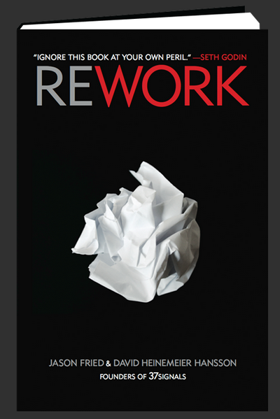
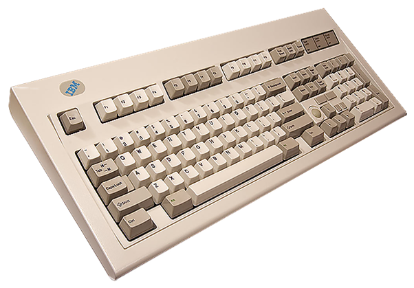

# Well-Used Simple Tools

*A [short talk](http://www.meetup.com/Design-Thinking-DC/events/216029412/) for [Design Thinking DC](http://www.meetup.com/Design-Thinking-DC/).*

I work with data, and the tools that are unique to what I do may or may not be interesting to you. I have some tools, however, that can be applied across many domains, and some ideas for maximizing their effectiveness.

-----

image of big post-it

-----

This is an image from the drafting process for this talk. Paper is my favorite invention. [1] You could read the following books on paper if you would like.

[1] *The [Bard Institute for Writing and Thinking](http://www.bard.edu/iwt/) brought me back to the immediacy of physical artifacts and influenced how I think about the creative process.*

-----

-----

My thoughts on email and to-do management come directly from [Bit Literacy](http://bitliteracy.com/), which you can get for free at [bitliteracy.com](http://bitliteracy.com/).

-----

-----

My thoughts on text and separation of concerns, among other things, were certainly influenced by [The Pragmatic Programmer](https://pragprog.com/the-pragmatic-programmer).

-----

-----

[ReWork](http://37signals.com/rework/), which is largely the same as the freely available [Getting Real](http://gettingreal.37signals.com/), brings ideas for working effectively to working at work.

I'm going to start talking about specific simple tools now. I will be very specific, and the tools will be very simple.

-----

-----

Tool number one is a keyboard. You use a keyboard a lot, and you should probably use it more.

Steve Yegge has a 2008 [blog post](http://steve-yegge.blogspot.com/2008/09/programmings-dirtiest-little-secret.html) about programmers who can't touch type. You wouldn't think such people existed. But just this year, in 2014, I met such a person.

A keyboard is probably the tool you use more than any other. You need to be good at it. And once you're good at it, you can use it to be better at so many other things, through the magic of keyboard shortcuts, which you should use aggressively.

-----

-----

Tool number two is a browser. I usually use [Chrome](http://www.google.com/chrome/). I want to use [Firefox](http://firefox.com/), but the keyboard bindings are broken for switching tabs when you have a YouTube video up.

Often, you don't have to reach for the mouse to use your browser. I'll call out key combinations that work on my Mac; on other systems they're typically similar.

`command`+`tab` switches applications. `command`+`l` gives us the address bar. I'll type in my blog's domain, `planspace.org`. `command`+`f` finds in page. I want the post on `pca`. `esc` to leave the search. `return` to follow the link. `space` to page down a little.

Let's do it again, another way. `command`+`t` for a new tab. We want to search for `pca 3d`. `return` to search. `tab` to start exploring links. `down` to get the result we want. `return` to follow the link. `space` to page down a little.

`alt`+`command`+`left` to change tabs. `command`+`w` to close the tab. `command`+`l` to get the address bar. `control`+`a` to go to the beginning of the line. `control`+`k` to kill the line. `control`+`y` to yank it back. `control`+`f` to more forward, `control`+`b` to move back.

-----

-----

Tool number three is email. [Gmail](https://gmail.com/) has been getting progressively worse, but I think it's still the best option. You can turn off some of the bad new features, and turn on keyboard shortcuts.

A pass through email should not take a long time. It should be distinct from work, but will integrate with task management, the next tool, which is [Good Todo](https://goodtodo.com/) for me.

Move through emails with `j` and `k`, open and email with `o`. `r` to reply, and do it immediately if it's a brief request. `[` to archive an email and move to the next one. Some emails don't require a response.

Sometimes an email represents a task, but you can't work on it until some point in the future. This is where task management is useful. I can forward (`f`) to a future date like `thursday@goodtodo.com` and the task will be tracked in the system then, so I won't see it until Thursday.

Tasks that will take longer than two minutes get moved to task management, even if they're for today.

After a pass through email, the inbox should be empty, and it's time to start doing some work.

-----

-----

Tool number four is [Good Todo](https://goodtodo.com/), which is a calendared to-do list app that integrates with email. It supplements my memory by keeping track of when I need to do things, and lets me focus on just the tasks that I'll be able to accomplish in a given day. It is way better than every other to-do application I've ever seen.

I include brief tasks that just need to be remembered and crossed off, as well as more substantial tasks. By looking at the list for the day I can decide what to work on first and what to reschedule or reconsider. Right now, I'll work on this "Friday sales report" task.

For more about Emacs, see my recent talk at DC Python.
