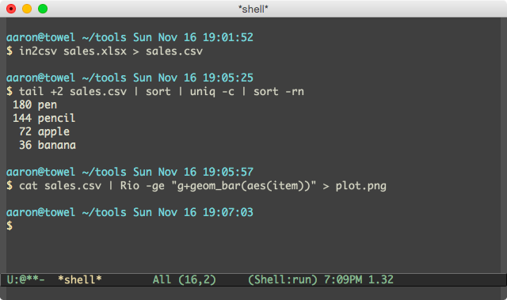
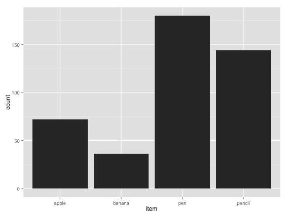
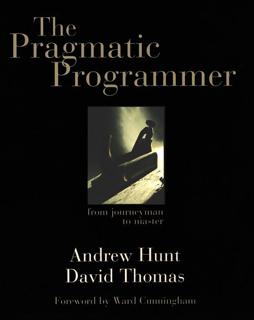

# Well-Used Simple Tools

*A [short talk](http://www.meetup.com/Design-Thinking-DC/events/216029412/) for [Design Thinking DC](http://www.meetup.com/Design-Thinking-DC/).*


I work with data, and the tools that are unique to what I do may or may not be interesting to you. So I'm going to show four tools that are useful for everyone.


-----

[](http://www.usporedi.hr/novosti/je-li-ovo-najbolja-tipkovnica-svih-vremena)

-----

Tool number one is a keyboard. You use a keyboard a lot, and you should probably use it more.

Steve Yegge has a 2008 [blog post](http://steve-yegge.blogspot.com/2008/09/programmings-dirtiest-little-secret.html) about programmers who can't touch type. You wouldn't think such people existed. But just this year, in 2014, I met such a person.

A keyboard is probably the tool you use more than any other. Improve your typing. Then, use keyboard shortcuts so that more things become just typing.


-----

[](http://www.google.com/chrome/)

-----

Tool number two is a browser. I usually use [Chrome](http://www.google.com/chrome/). I want to use [Firefox](http://firefox.com/) more, but the keyboard bindings are broken for switching tabs when you have a YouTube video up.

Often, you don't have to reach for the mouse to use your browser. I'll call out key combinations that work on my Mac; on other systems they're often similar.

`command`+`tab` switches applications. `command`+`l` gives us the address bar. I'll type in my blog's domain, `planspace.org`. `command`+`f` finds in page. I want the post on `pca`. `esc` to leave the search. `return` to follow the link. `space` to page down a little.

Let's do it again, another way. `command`+`t` for a new tab. We want to search for `pca 3d`. `return` to search. `tab` to start exploring links. `down` to get the result we want. `return` to follow the link.

`alt`+`command`+`left` to change tabs. `command`+`w` to close the tab. `command`+`l` to get the address bar. `control`+`a` to go to the beginning of the line. `control`+`k` to kill the line. `control`+`y` to yank it back. `control`+`f` to move forward, `control`+`b` to move back.

These commands are stock - I'm not using any special accessibility tools. They work not just in the browser but across many different settings. Learn them once, and you can speed up many common operations.


-----

[](https://gmail.com/)

-----

Tool number three is email. [Gmail](https://gmail.com/) has been getting progressively worse, but it's still the best option. You can turn off some of the bad features, and turn on keyboard shortcuts.

A pass through email should not take a long time. It should be distinct from work, but will integrate with task management.

Move through emails with `j` and `k`, open an email with `o`. `r` to reply, and do it immediately if it's a brief request. `[` to archive an email and move to the next one. Some emails don't require a response.

Sometimes an email represents a task, but you can't work on it until some point in the future. This is where task management is useful. I can forward (`f`) to a future date like `thursday@goodtodo.com` and the task will be tracked in the system, so I won't see it until Thursday.

Tasks that will take longer than two minutes get moved to task management, even if they're for today.

After a pass through email, the inbox should be empty, and it's time to start doing some work.


-----

[](https://goodtodo.com/)

-----

Tool number four is [Good Todo](https://goodtodo.com/), which is a calendared to-do list app that integrates with email. It supplements my memory by keeping track of when I need to do things, and lets me focus on just the tasks that I'll be able to accomplish in a given day. It is way better than any other to-do application I've ever seen.

I include brief tasks that just need to be remembered and crossed off, as well as more substantial tasks. By looking at the list for the day I can decide what to work on first and what to reschedule or reconsider.


-----

Unix philosophy

-----

The Unix philosophy describes a way of building an effective system of tools. To paraphrase Doug McIlroy:

> * Use tools that do one thing well.
> * Use tools that work together.
> * Use tools that work with text, because text is universal.

I think my four simple tools follow this fairly well, but they aren't ideal examples. I'll use an example task to demonstrate further. [1]

[1] *For more on this family of tools, see [Data Science at the Command Line](http://datascienceatthecommandline.com/) by Jeroen Janssens.*


-----



-----

Right now, I'll work on this "Friday sales report" task. I'll download the Excel file. Then I'll go to the command line.

Step one is getting the data out of Excel format and into text. Luckily there's a package called [csvkit](https://csvkit.readthedocs.org/), which includes `in2csv`, which will make short work of this simple file.

```html
in2csv sales.xlsx > sales.csv
```

Now that we have text, a whole world of tools are available. I'll take off the header row with `tail`, `sort` the rows, reduce to the unique terms and count occurrences with `uniq`, then do another sort to see things in a nice order.

```html
tail +2 sales.csv | sort | uniq -c | sort -rn
```

Notice the input and output are both text. I could work with this text further.

I'll use `R` to make a quick bar graph.

```bash
cat sales.csv | Rio -ge "g+geom_bar(aes(item))" > plot.png
```

-----



-----

In three lines, I've done fairly much, and I've done it repeatably.

I'm using my command line from inside [Emacs](http://www.gnu.org/software/emacs/), which is a text editor. [2] I'll take my three lines and make them a script. Now I can repeat what I've done whenever there's new data.

[2] *For more about Emacs, see my [Emacs and Python](/20141007-emacs_python/) talk.*


-----

what are good tools?

-----

Good tools have low or negative cognitive load. They are simple in what they do, and how they do it. They avoid hidden state.

Good tools are pure, in that they are distinct from what they operate on. They don't lock you into a closed format. They are tools, not kits.

Good tools are textual, programmable, repeatable, inspectable, automatable: anything you do once can be examined and repeated later non-interactively.

These are some of my thoughts on tooling, and I'd invite you to consider them. You could also read some of the books that have influenced me.


-----

[](http://bitliteracy.com/)

-----

My thoughts on email and to-do management come directly from [Bit Literacy](http://bitliteracy.com/), which you can get for free at [bitliteracy.com](http://bitliteracy.com/).


-----

[](https://pragprog.com/the-pragmatic-programmer)

-----

My thoughts on text and separation of concerns, among other things, were certainly influenced by [The Pragmatic Programmer](https://pragprog.com/the-pragmatic-programmer).


-----

[](http://37signals.com/rework/)

-----

[ReWork](http://37signals.com/rework/), which is largely the same as the freely available [Getting Real](http://gettingreal.37signals.com/), has a lot of good ideas for working effectively. "Do everything you can to remove layers of abstraction" is one quote I like.


-----


-----

This is an image from the drafting process for this talk. I've been strongly influenced by the [Bard Institute for Writing and Thinking](http://www.bard.edu/iwt/), and paper is my favorite invention. I mention this to emphasize that while I've shown certain kinds of tools, thinking in many different ways is important to everyone and multiple types of process can be useful in supporting various stages of work.


-----

thank you!

-----
