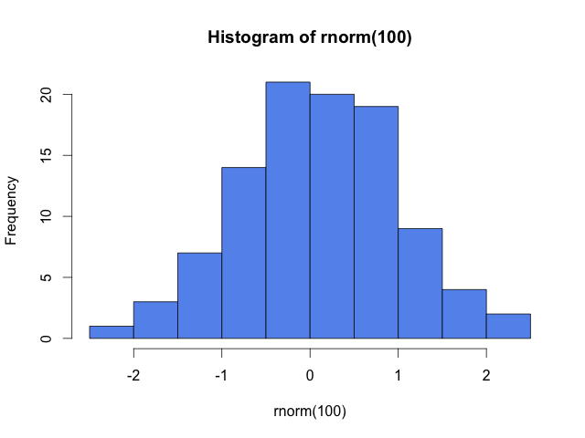
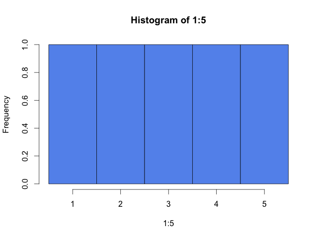
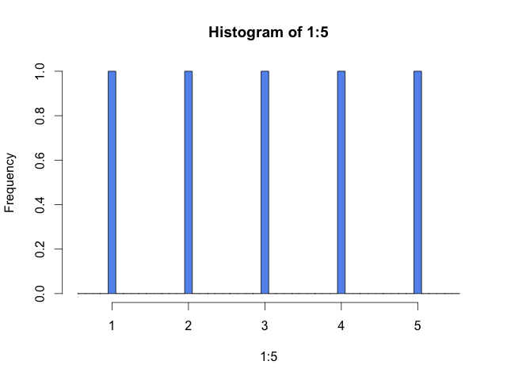

# How does R calculate histogram break points?

Break points make (or break) your histogram. [R](http://www.r-project.org/)'s default algorithm for calculating histogram break points is a little interesting. Tracing it includes an unexpected dip into R's [C](http://en.wikipedia.org/wiki/C_%28programming_language%29) implementation.

```r
# set seed so "random" numbers are reproducible
set.seed(1)
# generate 100 random normal (mean 0, variance 1) numbers
x <- rnorm(100)
# calculate histogram data and plot it as a side effect
h <- hist(x, col="cornflowerblue")
```



The `hist` function calculates and returns a histogram representation from data. That calculation includes, by default, choosing the break points for the histogram. In the example shown, there are ten bars (or bins, or cells) with eleven break points (every 0.5 from -2.5 to 2.5). With break points in hand, `hist` counts the values in each bin. The histogram representation is then shown on screen by `plot.histogram`.

(By default, bin counts include values less than or equal to the bin's right break point and strictly greater than the bin's left break point, except for the leftmost bin, which includes its left break point.)

The choice of break points can make a big difference in how the histogram looks. Badly chosen break points can obscure or misrepresent the character of the data. R's default behavior is not particularly good with the simple data set of the integers 1 to 5 (as pointed out by [Wickham](https://twitter.com/hadleywickham)).

```r
hist(1:5, col="cornflowerblue")
```


A manual choice like the following would better show the evenly distributed numbers.

```r
hist(1:5, breaks=0.5:5.5, col="cornflowerblue")
```



It might be even better, arguably, to use more bins to show that not all values are covered.

```r
hist(1:5, breaks=seq(0.55, 5.55, 0.1), col="cornflowerblue")
```



In any event, break points matter. When exploring data it's probably best to experiment with multiple choices of break points. But in practice, the defaults provided by R get seen a lot.

So how does R choose break points?

By default, inside of `hist` a two-stage process will decide the break points used to calculate a histogram:

1. The function `nclass.Sturges` receives the data and returns a recommended number of bars for the histogram. The documentation says that [Sturges' formula](http://en.wikipedia.org/wiki/Histogram#Number_of_bins_and_width) is "implicitly basing bin sizes on the range of the data" but it's just based on the number of values, as `ceiling(log2(length(x)) + 1)`. This is really fairly dull.

2. Then the data and the recommended number of bars gets passed to `pretty` (usually `pretty.default`), which tries to "Compute a sequence of about n+1 equally spaced ‘round’ values which cover the range of the values in x. The values are chosen so that they are 1, 2 or 5 times a power of 10." This ends up calling into some parts of R implemented in C, which I'll describe a little below.

Note: In what follows I'll link to a [mirror](https://github.com/wch/r-source/tree/34c4d5dd3493863f6665f907dbad9bf1d800c0d4) of the R [sources](https://svn.r-project.org/R/) because [GitHub](https://github.com/) has a nice, familiar interface. I'll point to the most recent version of files without specifying line numbers. You'll want to search within the files to what I'm talking about. To see exactly what I saw go to commit [34c4d5dd](https://github.com/wch/r-source/tree/34c4d5dd3493863f6665f907dbad9bf1d800c0d4).

The [source](https://github.com/wch/r-source/blob/trunk/src/library/grDevices/R/calc.R) for `nclass.Sturges` is trivial R, but the `pretty` [source](https://github.com/wch/r-source/blob/trunk/src/library/base/R/pretty.R) turns out to get into C. I hadn't looked into any of R's C implementation before; here's how it seems to fit together:

The source for `pretty.default` is straight R until:

```r
z <- .Internal(pretty( # ... cut
```

This `.Internal` thing is a call to something written in C. The file [names.c](https://github.com/wch/r-source/blob/trunk/src/main/names.c) can be useful for figuring out where things go next. We find this line:

```c
{"pretty",	do_pretty, 	0,	11,	7,	{PP_FUNCALL, PREC_FN,	0}},
```

So it goes to a C function called `do_pretty`. That can be found in [util.c](https://github.com/wch/r-source/blob/trunk/src/main/util.c). This is a lot of very Lisp-looking C, and mostly for handling the arguments that get passed in. For example:

```c
    int n = asInteger(CAR(args)); args = CDR(args);
```

That's kind of neat, but the actual work is done somewhere else again. The body of `do_pretty` calls a function `R_pretty` like this:

```c
    R_pretty(&l, &u, &n, min_n, shrink, REAL(hi), eps, 1);
```

The call is interesting because it doesn't even use a return value; `R_pretty` modifies its first three arguments in place. Gross.

The function `R_pretty` is in its own file, [pretty.c](https://github.com/wch/r-source/blob/trunk/src/appl/pretty.c), and finally the break points are made to be "nice even numbers" and there's a result.

I was surprised by where the code complexity of this process is.
