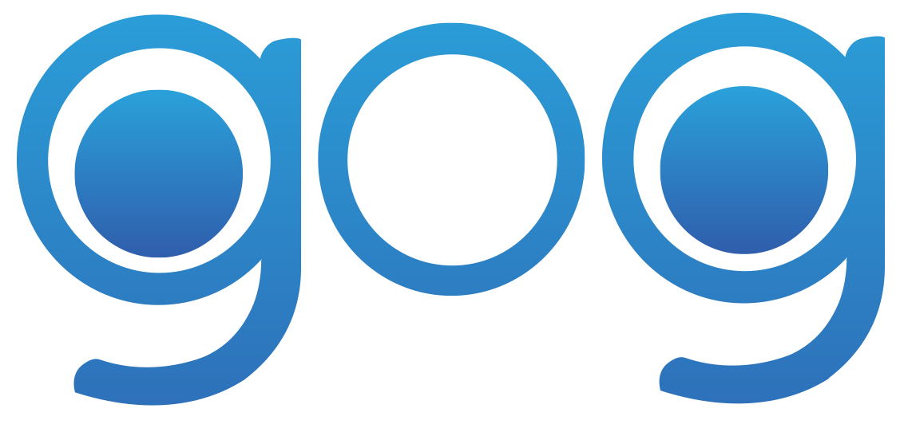
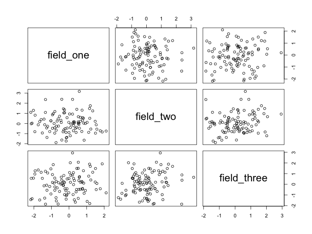
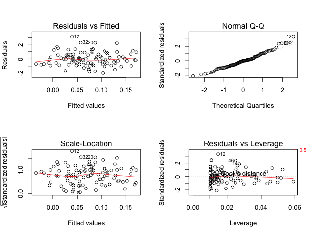
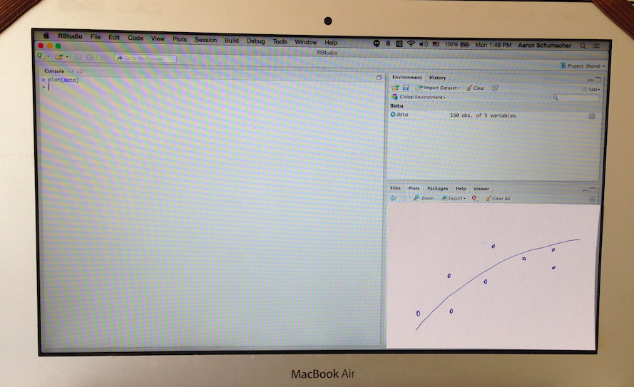
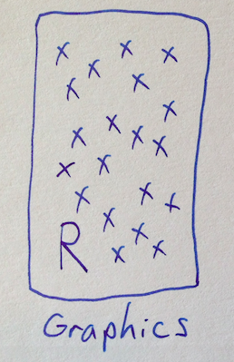
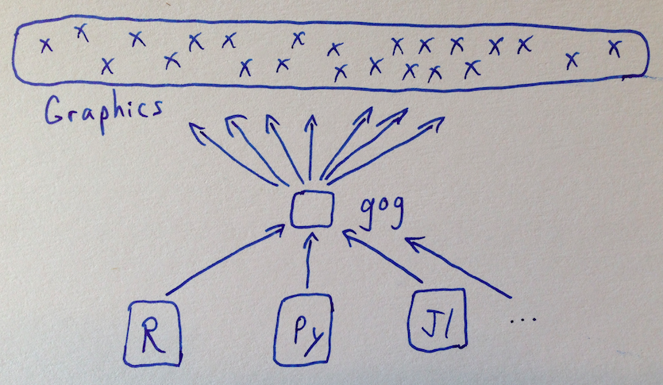
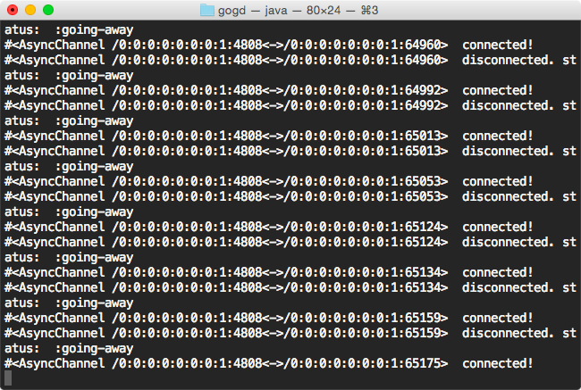
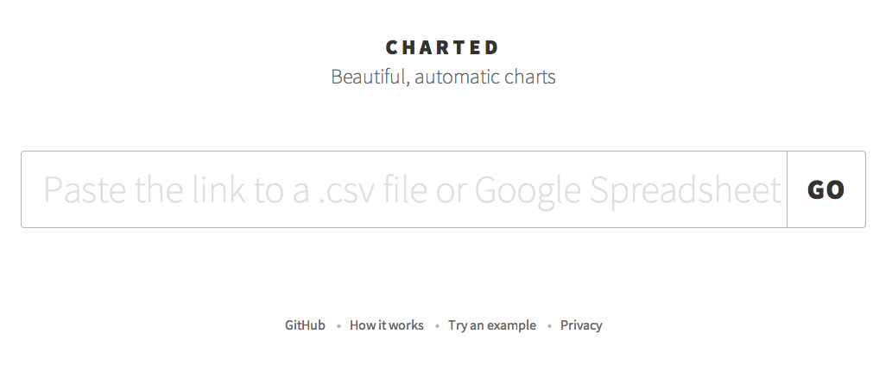
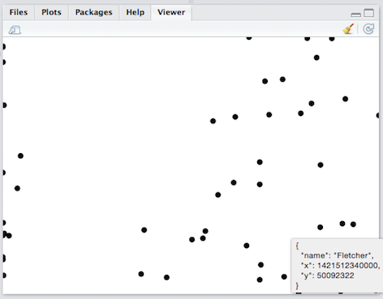

# gog: a separate layer for visualization

*A short presentation at the DC [Monthly Challenge](http://www.meetup.com/TrackMaven-Monthly-Challenge/) on [Monday January 19, 2015](http://www.meetup.com/TrackMaven-Monthly-Challenge/events/219314544/).*


-----



-----

`gog` is a name for a simple idea I've been exploring about making it easy to quickly see data from whatever computing environment you happen to be in.

First I'll talk about _quickly_, then I'll talk about _from whatever_, and then I'll show some `gog` prototype work.

There are two kinds of _quickly_ that I care about. One is getting images produced quickly, and another is working with or exploring them quickly.


-----

```r
plot(data)
```

-----

This is `R`. `R` can produce plots quickly. The `plot` function is generic and will dispatch to a method that knows how to plot whatever you're plotting. This is very nice for the user.


-----


-----

If you plot a single vector, you get an image like this with the index in the horizontal direction.


-----


-----

If you plot a data frame with two fields, you get a familiar scatterplot.


-----



-----

If you plot a data frame with more than two fields, you get a scatterplot matrix.


-----



-----

And if you plot a linear model object, you get four diagnostic plots.

All of these plots were created with `plot(data)`. There are a lot of defaults chosen in order to get something on the screen. You might also want to see another view, but the pure convenience of being able to `plot(data)` so easily is really wonderful.

The only way to reduce the friction of graphing even further would be to have plots automatically generated in the background based on whatever data you have on your system. I [think](https://twitter.com/planarrowspace/status/555893329460994048) that would be a fun project, in fact.

Once you have an image, you want to be able to work with it quickly and easily. This means interaction with the image itself, and this is a place that `R` is not particularly strong, at least with base graphics.


-----



-----

A lot of statistical graphics behave essentially like paper. I like paper a lot, but computers can do more. We should expect, at a minimum, to be able to point to a data element and find out more about it. There are tons of other direct manipulation ways to interact with graphics (like brushing) that we should be able to have easily at our disposal.

Most of the world agrees that the way to get interactivity is to use web frontend things, and I'm inclined to think so too. It does often seem that the time to produce a visualization has a dramatic inverse relationship with the amount of interactivity supported, however.

In summary:

 * Interactivity lets us quickly work with plots.
 * A simple user API lets us quickly make plots.

What about _from whatever_?


-----



-----

`R` can make a lot of different graphics. Parts of the ecosystem are organized in clever ways that make things convenient for `R` users, and there's just a ton available. It seems fine to make our graphics in `R`. But what about other languages?


-----


-----

The current status quo is mostly to not share graphics capabilities between languages. So if Python want to have `ggplot`, [somebody](https://yhathq.com/) has to [port](http://ggplot.yhathq.com/) it over, which takes a bunch of work. And newer languages can be at a disadvantage purely because they don't have as much tooling for visualization, despite other strengths.

What I'm suggesting is that we might be able to pull the graphics parts out of our data languages.


-----



-----

So this is the idea. You make the control surface inside various languages quite small and easy, so that everybody can connect into a sort of shared library of visualization pieces.


-----


-----

As an aside:

The grammar of graphics seems to be a good idea, and the [book](http://www.amazon.com/The-Grammar-Graphics-Statistics-Computing/dp/0387245448) is also quite good. A lot of what's good about Tableau is good because of the grammar of graphics.

However, the design that should be influenced by the grammar of graphics is not the part that `gog` is directly concerned with.


-----

```r
ggplot(data) +
  aes(x=thing) +
  geom_histogram() +
  # etc.
```
-----

To make a comparison to R's `ggplot2`, notice that you always start by passing data in. Then `ggplot2` let's you specify everything about your plot—and you _have_ to specify a good deal before you get any plot at all.


-----

```r
gog(data)
# etc. happens elsewhere
```
-----

What `gog` suggests is to standardize the data passing, but then the way that the plot gets made is none of `gog`'s business. It's probably a good idea to start with some default plot and then let users work with it further.

So what is all this nonsense, and how could it work?


-----



-----

The connecting component is a `gog` HTTP server which runs on port 4808 and just accepts POST requests at `/data` and rebroadcasts it to anything listening to a websocket also at `/data`. The assumption is that we're passing a JSON array of objects.

I have [a gog server](https://github.com/ajschumacher/gogd) written in Clojure, but a server can be implemented and hosted however you want, as long as everything connects.


-----



-----

People have already made some visualizations that are suitable for adapting to use with `gog`. As an example, I took the code from [charted.co](http://www.charted.co/), which was designed to load data from CSV files, and adapted it to also allow input from `gog`.


-----

```python
# pip install gogpy
from gogpy import gog
import numpy as np
import pandas as pd
gog(pd.DataFrame(np.random.sample(10)))
```
-----

The `gogpy` package is ridiculously small, but can still be `pip` installed from [PyPI](https://pypi.python.org/pypi) for your convenience. Currently the `gog` function will only take a `pandas` `DataFrame`.


-----


-----

Thanks to the work that went into making `charted.co`, we have a graph already.


-----

```python
import time
data = pd.DataFrame(np.random.sample(100))
for i in range(91):
    gog(data[i:i+10])
    time.sleep(2)
```
-----

Live updates are the only thing happening—it just depends on when you send the data.


-----

```r
# install_github("ajschumacher/gogr")
library("gogr")
data <- data.frame(0-runif(100))
for (i in 1:91) {
    gog(data[i:(i+9), ,drop=F])
    Sys.sleep(2)
}
```
-----

The `R` package [gogr](https://github.com/ajschumacher/gogr) isn't on [CRAN](http://cran.r-project.org/) but can be installed with [devtools](https://github.com/hadley/devtools). It's trivially easy to use any visualization that supports `gog` from any environment that supports `gog`.


-----

```r
rstudio::viewer("http://localhost:8000")
library("gogr")
data <- iris
names(data)[1:2] <- c("x", "y")
gog(data)
```
-----

It turns out that the [RStudio](http://www.rstudio.com/) viewer pane is really just [WebKit](https://www.webkit.org/) and it's easy to plug in `gog` visualizations.


-----


-----

I made this little visualization, a simple scatterplot with [D3](http://d3js.org/). It's very crude at the moment, but it's enough to show sepal length versus sepal width, and to show information about data points as we explore around. This could obviously be much improved with such luxuries as axes, and replace the renaming of columns to ’x’ and ’y’ with defaulting and interaction. And using “title” elements for tooltips has only the advantage of expediency.

But even in its current state this visualization allows for fun data manipulation experiments with animated updates which would be much more work to achieve with other techniques. (See [demo.R](demo.R) for the complete `R` demo source.)


-----

```python
# access meetup API and extract data, then:
data = pd.DataFrame({'x': rsvped, 'y': ids, 'name': names})
gog(data)
```
-----

Of course nobody cares about irises - let's pull some data about humans we know, using the Meetup API. (See [demo.py](demo.py) for complete Python demo source.)


-----



-----

Even though we collected data with Python, we can visualize it wherever we want, including back inside the RStudio interface.

I haven't tried it, but it strikes me that it would be pretty straightforward to cobble together an RStudio-style Python IDE, at least with a REPL and `gog` visualization container, using existing components.


-----

Thank you!

-----

This is all very preliminary and there are no doubt a lot of complications and other things to consider. The question of how to manage possibly many `gog` visualization frontends or have any sort of dispatch system is not at all addressed, for instance. And there are a number of more or less related projects, which I've started to collect at [ajschumacher/gog](https://github.com/ajschumacher/gog). Any and all feedback, suggestions, or anything else appreciated!
