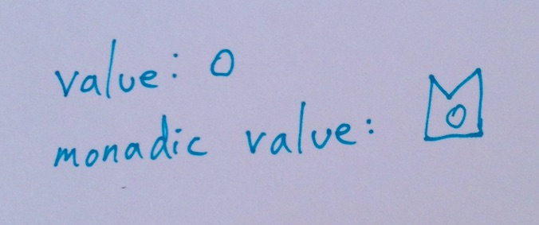
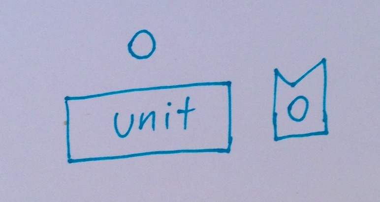
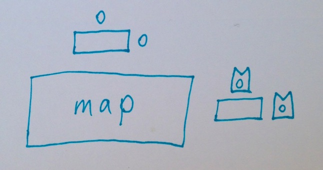
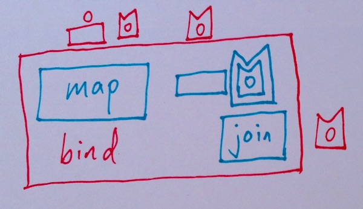

# Monads by Diagram

Let's get some notation out of the way:

A “function” is represented by a rectangle. Its arguments (“input”) appear above it, and its result (“output”) appears to its right.

We have some idea of “values” which can be worked with. We introduce the idea of a “monadic value” which can be thought of as “wrapping” our more familiar values.

There's a function called “unit” which takes a value and returns a monadic value. Now we can make monadic values from our usual values.

There's a function called “bind” which takes a function and a monadic value. The argument function takes a value and returns a monadic value. The argument monadic value gets unwrapped by “bind” and its value becomes the argument to the passed function. Now we can do things to our monadic values.

That's it. Monads are defined. They should obey some reasonable rules, but that’s it.

_And yet you want more?_

Nobody wants to write functions that take a normal value and return a monadic value. The “map” function takes a normal function that knows nothing about monads and returns a function that takes and returns monadic values. Just use the resulting function on your monadic values! So convenient!

The “join” function unwraps a doubly-monadic value. You want this.

We can combine the “map” and “join” functions to get the “bind” function. Pretty neat!

_And yet you want a real explanation?_

For a lucid formal exposition, read [Monads for Functional Programming](http://homepages.inf.ed.ac.uk/wadler/papers/marktoberdorf/baastad.pdf). The above is my attempt to express the key definitions there, without the mathematical Haskell notation.

For a plain-talking explanation with practical examples in friendly Ruby, [read](http://codon.com/refactoring-ruby-with-monads) or (preferably) [watch](https://www.youtube.com/watch?v=uTR__8RvgvM) Refactoring Ruby with Monads. [Tom Stuart](https://twitter.com/tomstuart) uses `from_value` for “unit”, `and_then` for “bind”, and `within` for calling “map” and applying the result.

For a great overview of even more kinds of things and much better illustration than I can manage, read [Functors, Applicatives, And Monads In Pictures](http://adit.io/posts/2013-04-17-functors,_applicatives,_and_monads_in_pictures.html). This follows the Haskell in using `fmap` for “map”.

And [don't forget](http://james-iry.blogspot.com/2009/05/brief-incomplete-and-mostly-wrong.html):

> “a monad is a monoid in the category of endofunctors, what's the problem?”
