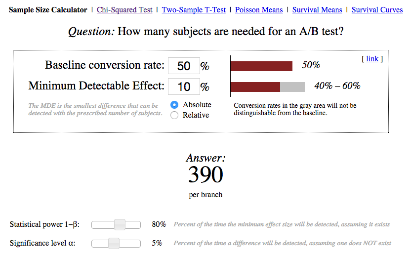
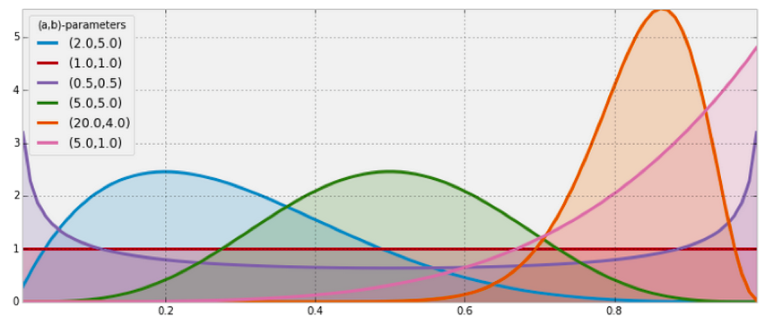

# These 17 Amazing Split Test Facts Will Shock You!


-----

 * split tests?
 * traditional design
 * dynamic methods

-----

Here's the plan.

* What are split tests?
* Designing traditional split test experiments.
* More interesting and dynamic Bayesian methods.


-----


-----

This split test was [featured](https://whichtestwon.com/test/if-the-shoe-fits/) on [Which Test Won](https://whichtestwon.com/). The main element in the design at left was a dynamic carousel of images. The main image at right was static.

Which version performed better in terms of onward clicks from the page?

Which Test Won reports that this test ran on the German Clarks site for seven weeks, and conversions were 17.5% higher for the static version at right.

Note that it isn't just visuals that can be split-tested. It can be the only (or at least best) way to get good feedback on algorithm performance in the wild, for recommenders and the like.

Let's do our own split test:


-----

Aaron Schumacher

@planarrowspace

-----


-----

Aaron Schumacher!

@planarrowspace

-----

Problems with this split test?

 * not a real "split"
 * small sample size
 * very small conversion rate
 * no real measurement

There are implementation challenges, and frameworks/services that attempt to solve them, for split tests.

Fun paper on practical issues: [Trustworthy online controlled experiments: Five puzzling outcomes explained (2012)](http://citeseerx.ist.psu.edu/viewdoc/summary?doi=10.1.1.294.8275).

There's also experimental design!


-----

RCT

-----

Oh the joy of Randomized Controlled Trials!


-----

 * significance α
 * power 1-β
 * effect size
 * sample size

-----

These four quantities are related and we need to understand each. (Type one error, type two error, etc.)

For effect size: often difference of means over standard deviation.

How are these quantities related to one another?

Note that *Statistical power analysis for the behavioral sciences* by Jacob Cohen is the standard for power calculations, with over 71k citations according to Google.


-----

 * A/B testing
 * split testing
 * multivariate testing

-----

Power techniques are going to vary based on the kind of experiment. Most of the time it's proportions that we're interested in, so we'll assume a normal two-proportion test.

Some situations will call for different techniques.


-----

```python
from statsmodels.stats.proportion import proportion_effectsize
proportion_effectsize(0.6, 0.5)
```
-----

Getting an effect size that will work in our z-test framework...


-----

```python
from statsmodels.stats.power import zt_ind_solve_power
zt_ind_solve_power(effect_size=0.2, alpha=0.05, power=0.8)
```
-----

Calculate away!


-----



-----

You can also find pre-built sample size calculators such as the [one](http://www.evanmiller.org/ab-testing/sample-size.html) from [Evan Miller](http://www.evanmiller.org/).


-----

drawbacks

-----

 * plan sample size etc. up front
 * wait until it's completely done before making a decision


-----

exploration / exploitation

-----

This is what we want to do!

How do we make good choices?

One very good way: Thompson sampling.


-----

What's the deal with Naive Bayes?

-----

(An aside to get grounding in what we've seen before.)

What's naive about it?

How Bayesian is it?

What we really want are probability *distributions* to represent our knowledge.


-----

the joy of `Beta(α, β)`

-----

Note: totally different α and β than before!


-----



-----

Defined on zero-one.

Interpret α as successes, β as failures (neglecting -1 adjustment).

Expected value is what you'd think, etc.


-----

update by addition

-----

Bayesian joy! Self-conjugate!

Example: solve the problem of reasonable [sorts by ratings](http://www.evanmiller.org/how-not-to-sort-by-average-rating.html)

Example: sample from betas to decide what to show, update betas on every action (Thompson sampling)


-----


-----

This (and the last graphic) are from a [presentation](http://chrishalpert.com/NYDW%20Bandit%20Presentation.ppsx) by [Meetup](http://www.meetup.com/)'s Chris Halpert. They've run multi-armed bandits with (at least) as many as 398 variants.


-----

Thank you!

-----
