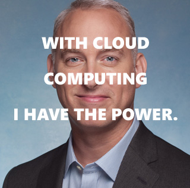

# 80% Definitions

The [Pareto Principle](http://en.wikipedia.org/wiki/Pareto_principle) describes 80% of effects coming from 20% of causes. If you're lucky, you might get 80% effectiveness for 20% effort.

Of course, 80% of Pareto examples are made up.

I think we're mostly through the hype cycle for these, at least in some circles, but these phrases are still sometimes poorly understood.

I'm going to give “80% definitions” for these terms. They are deliberately reductive, but they give a very high ratio of useful content to marketing spin.

-----

-----

I'll leave “Integrated Business Planning” alone—what is big data?

-----

-----

If you have big data, you know about it, because you can't fit it on one hard drive. That's it.

You might have unstructured data, which is hard to work with. You might have data on different computers because many people have small data sets, which is hard to work with. You might have an unfamiliar data source, which is hard to work with.

But if you can fit your data on one hard drive, it isn't big. Bigness is about size.

In this case, I think it's much clearer the kind of problem this company is solving. Somebody was trying to do integrated business planning but they couldn't because they could only handle one hard drive of data at a time. It's hard to work with more data than that.

But if that isn't your problem, don't waste your time.

-----

-----

What is this “cloud computing”?

-----

-----

“The cloud” is computers you can't see. Like the internet? Yes. Exactly like the internet.

It's nice to be able to use computers you can't see and have them do clever things, but fundamentally it's just computers.

Here the substitution is really helpful in having intelligent thoughts about this claim. What power do you have, mystery man? It could be the power to easily use more computers whenever he wants to. But also, often somebody owns the cloud computers and somebody else uses them; which side are you on, mystery man? Do you have power because you're selling cloud computing, or using it?

-----

data science

-----

Finally: data science.

-----

-----

If you look carefully, you'll notice that this unicorn is *also* a Venn diagram.

But wait! Data science *isn't* magic! (In fact, originally I was going to substitute in “counting”, which is pretty accurate more often than you'd think.) Let’s go through a process that describes what a data scientist often does.
