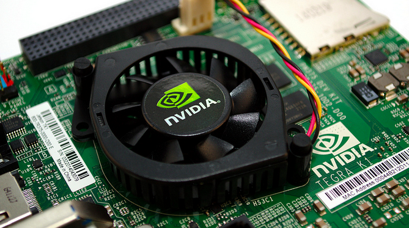

# Setting up the NVIDIA Jetson TK1

Let's do [deep learning](https://en.wikipedia.org/wiki/Deep_learning) on a [GPU](https://en.wikipedia.org/wiki/Graphics_processing_unit)!

Go!




*[Image from Gareth Halfacree](https://www.flickr.com/photos/120586634@N05/14488628209/in/album-72157645736592714/).*


There's a little work involved in setting up the Jetson; I'm mostly following advice from an NVIDIA Developer Zone [post](https://devtalk.nvidia.com/default/topic/718220/tegra-tools/jetson-tegra-k1-development-kit/) on flashing a Jetson from a Mac, and Pete Warden's [post](http://petewarden.com/2014/10/25/how-to-run-the-caffe-deep-learning-vision-library-on-nvidias-jetson-mobile-gpu-board/) on setting up deep learning with [Caffe](http://caffe.berkeleyvision.org/) on the Jetson.

In outline:

 1. Flash the Jetson to most recent OS.
 2. Install some neural net framework.
 3. Train a deep net on some image data.

Without extra hardware, the easiest way to start working with the Jetson is to plug it in directly to your router with an ethernet cable. If you log in to your router and see what's connected to it you should see `tegra-ubuntu` there, with a corresponding IP address. For me, it was at 192.168.1.5. You can log in from any other computer on your network, using the default username and password (both `ubuntu`).

```bash
ssh ubuntu@192.168.1.5
```

The GPU on the Jetson is a Tegra. The Jetson I received came with the [original version](https://developer.nvidia.com/linux-tegra-rel-19) of the "[Linux for Tegra](https://developer.nvidia.com/linux-tegra)" Ubuntu-based operating system. I'm not sure how much difference it makes, but I thought I'd better update to the most recent version (currently [21.3](https://developer.nvidia.com/linux-tegra-r213)).

I flashed with the [Jetson TK1 Development Pack](https://developer.nvidia.com/jetson-tk1-development-pack). Two things about the Development Pack:

 * You can only run the Development Pack on 64-bit Ubuntu 12.04 and 14.04. I used 14.04.
 * The Development Pack is about 12 gigabytes in size, so make sure you have enough space on your machine or any virtual machine you plan to use.

I'm running a Mac over here, so I used [VirtualBox](https://www.virtualbox.org/) (4.3.28, plus the extension pack). I installed [Ubuntu Desktop](http://www.ubuntu.com/download/desktop) 14.04.2 LTS from ISO. I hadn't created a VirtualBox image this way before; it's pretty cool! You can tell VirtualBox that the ISO is in a virtual DVD drive, and boot from it. Takes me back to the days when you had to actually burn an ISO to a physical CD...

It took me a couple tries to get everything right; to get it all done in one pass you would want to connect the Jetson via USB and start it in recovery mode now, then adjust the VirtualBox settings so that there's a "USB Device Filter" for the "NVIDIA Corp. APX [0101]" device accessible, before even installing the VM.

There was one headache in getting the Ubuntu desktop to display at reasonable resolutions. The display resolution started at 640 by 480, with no apparent way to change it. Thanks to [Jonathan Davis](http://askubuntu.com/users/394518/johnathan-davis) for [suggesting](http://askubuntu.com/questions/588943/experiencing-small-resolution-issue-in-ubuntu-14-04-2-with-virtualbox-getting-s) a solution that worked for me:

```bash
sudo apt-get remove libcheese-gtk23
sudo apt-get install xserver-xorg-core
sudo apt-get install -f virtualbox-guest-x11
```

Reboot and get full-screen majesty!

In Ubuntu then I installed the [Jetson TK1 Development Pack](https://developer.nvidia.com/jetson-tk1-development-pack). This whole process takes at least enough time to eat some Thai food.

After cleaning out the old record from `~/.ssh/known_hosts`, I was able to log in to a shiny new up-to-date Linux for Tegra install!
