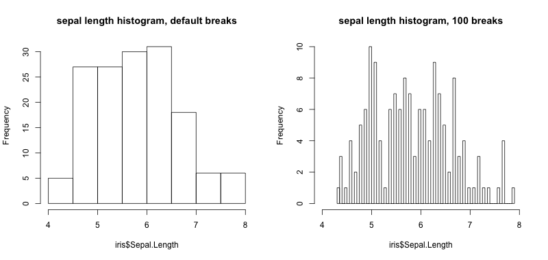
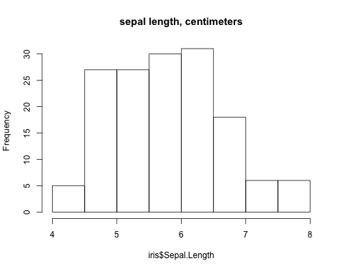
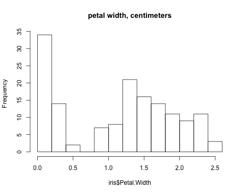
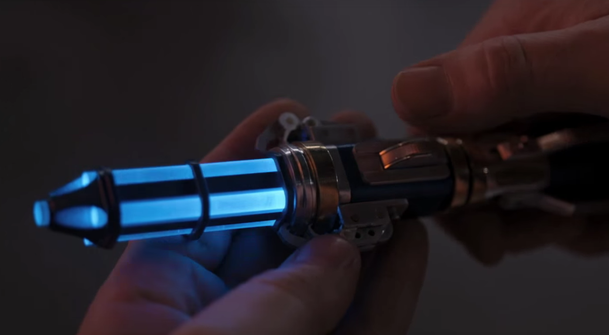

# Hearing Data with Sonic Histograms

You can see an iris, and you can smell an iris, and you can measure the [length and width of 150 iris sepals and petals](https://en.wikipedia.org/wiki/Iris_flower_data_set)... but can you _hear_ the iris data?

<audio controls preload="auto" autobuffer>
    <source src="yes.mp3" type="audio/mpeg" />
    <source src="yes.ogg" type="audio/ogg" />
</audio>

[](https://en.wikipedia.org/wiki/Iris_flower_data_set)

[Histograms](https://en.wikipedia.org/wiki/Histogram) are a great way to get a sense for the distribution of a set of values. The view you get depends on how wide your bars are.



Both those histograms look pretty good, but audio isn't so boxy. A cousin of the histogram, [kernel density estimation](https://en.wikipedia.org/wiki/Kernel_density_estimation) (KDE) seems more like audio. Like a histogram, it can be more or less "smooth".


Stealing the idea of KDE, we can adapt it for audio. We'll just add up audio pulses that are positioned in time to represent values.

We can use "wide" audio points <audio controls preload="auto" autobuffer><source src="sonic_point_wide.mp3" type="audio/mpeg" /><source src="sonic_point_wide.ogg" type="audio/ogg" /></audio> or "narrow" audio points <audio controls preload="auto" autobuffer><source src="sonic_point_narrow.mp3" type="audio/mpeg" /><source src="sonic_point_narrow.ogg" type="audio/ogg" /></audio>.

Combining a bunch of wide audio points, we get a "smoother" audio histogram. <audio controls preload="auto" autobuffer><source src="sonic_sepal_length_wide.mp3" type="audio/mpeg" /><source src="sonic_sepal_length_wide.ogg" type="audio/ogg" /></audio> And if we combine narrow audio points, we get a more "discrete" sounding histogram. <audio controls preload="auto" autobuffer><source src="sonic_sepal_length_narrow.mp3" type="audio/mpeg" /><source src="sonic_sepal_length_narrow.ogg" type="audio/ogg" /></audio>

Adding an audio axis label and some sonic tick marks, we get serviceable audio histograms that you can compare to their visible counterparts.

<audio controls preload="auto" autobuffer><source src="sonic_sepal_length.mp3" type="audio/mpeg" /><source src="sonic_sepal_length.ogg" type="audio/ogg" /></audio> 

<audio controls preload="auto" autobuffer><source src="sonic_sepal_width.mp3" type="audio/mpeg" /><source src="sonic_sepal_width.ogg" type="audio/ogg" /></audio> 

<audio controls preload="auto" autobuffer><source src="sonic_petal_length.mp3" type="audio/mpeg" /><source src="sonic_petal_length.ogg" type="audio/ogg" /></audio> 

<audio controls preload="auto" autobuffer><source src="sonic_petal_width.mp3" type="audio/mpeg" /><source src="sonic_petal_width.ogg" type="audio/ogg" /></audio> 

So yes, it kind of works! You can certainly hear bimodality, and even differentiate between the first two distributions if you listen carefully. I probably won't switch from visualizations to sonifications, but it's a fun things to explore!

---

Thanks to [Spotify](https://www.spotify.com/)'s [Monthly Music Hackathon NYC](http://monthlymusichackathon.org/) ([@musichackathon](https://twitter.com/musichackathon)) [Sound Visualization & Data Sonification Hackathon](http://monthlymusichackathon.org/post/133438271112/viz-son) for providing the push to do this. There's [video on Livestream](http://livestream.com/accounts/5176069/events/4582831) (I'm on from about 5:30 to 10:30) but ironically the audio doesn't seem to be working. Thanks also to [Thomas Levine](https://thomaslevine.com/) for showing me the [tuneR](https://cran.r-project.org/web/packages/tuneR/index.html) library for [R](https://www.r-project.org/) which let me jump in and start making sounds really quickly.

---

This code was hacked together quickly and is not what you'd call "production grade". It uses the Mac `say` and also `ffmpeg` via `system`, but it's otherwise [R that might work for you](play.R) if you want to try it.

```r
# install.packages("tuneR")  # install if not installed
library("tuneR")
setWavPlayer('/usr/bin/afplay')  # on Mac


point_at <- function(value,  # data value
                     lowest,  # data range min
                     highest,  # data range max
                     duration,  # seconds
                     point_width,  # seconds for +/- 3 SD (points are normal)
                     point_freq=440, sample_rate=44100) {
  point_width_samples <- point_width * sample_rate
  point <- sine(point_freq, point_width_samples, stereo=TRUE)
  filter <- dnorm(seq_along(point), mean = length(point)/2, sd = length(point)/6)
  filter <- filter / max(filter)
  point <- point * filter
  duration <- duration * sample_rate
  data_range <- highest - lowest
  left_offset <- value - lowest
  peak_position <- (left_offset / data_range) * duration
  left_padding_duration <- peak_position - length(point)/2
  if (left_padding_duration > 0) {
    result <- bind(silence(left_padding_duration, stereo=TRUE), point)
  } else {
    result <- point[abs(left_padding_duration):length(point)]
  }
  if (length(result) < duration) {
    result <- bind(result, silence(duration - length(result), stereo=TRUE))
  } else {
    result <- result[1:duration]
  }
  result
}

points_at <- function(values,  # data values
                      lowest,  # data range min
                      highest,  # data range max
                      duration,  # seconds
                      point_width,  # seconds for +/- 3 SD (points are normal)
                      point_freq=440, sample_rate=44100) {
  result <- silence(duration * sample_rate, stereo = TRUE)
  for (value in values) {
    result <- result + point_at(value, lowest, highest, duration, point_width,
                                point_freq, sample_rate)
  }
  result
}

low_high <- function(values) {
  breakpoints <- pretty(values)
  lowest <- breakpoints[1]
  highest <- breakpoints[length(breakpoints)]
  c(lowest, highest)
}

normalized_sonic_hist_content <- function(values,  # data values
                                          duration=4,  # seconds
                                          point_width=0.2,  # seconds for +/1 3 SD (points are normal)
                                          point_freq=440, sample_rate=44100) {
  breakpoints <- low_high(values)
  lowest <- breakpoints[1]
  highest <- breakpoints[2]
  content <- points_at(values, lowest, highest, duration, point_width,
                       point_freq, sample_rate)
  normalize(content)
}

sonic_hist <- function(values,  # data values
                       main,  # "title" of variable
                       duration=4,  # seconds
                       point_width=0.2,  # seconds for +/1 3 SD (points are normal)
                       point_freq=440,
                       legend=TRUE,
                       units="",
                       edge=TRUE, edge_freq=880, edge_duration=1000,
                       sample_rate=44100) {
  if (missing(main)) {
    main <- deparse(substitute(values))
  }
  breakpoints <- low_high(values)
  lowest <- breakpoints[1]
  highest <- breakpoints[2]
  content <- normalized_sonic_hist_content(values, duration, point_width, point_freq, sample_rate)
  edge_sound <- sine(edge_freq, duration=edge_duration, stereo=TRUE)
  if (edge) {
    content <- bind(edge_sound, content, edge_sound)
  }
  if (legend) {
    system(paste("say", main, "in", duration, "seconds from", lowest, "to", highest, units, "-o t"))
    system("ffmpeg -i t.aiff -ar 44100 t.wav")
    legend_mono <- normalize(readWave("t.wav"), pcm=FALSE)
    legend_stereo <- stereo(legend_mono, legend_mono)
    system("rm t.aiff t.wav")
    content <- bind(legend_stereo, content)
  }
  content
}

triple_save <- function(some_wav) {
  name_prefix <- deparse(substitute(some_wav))
  wav_name <- paste(name_prefix, ".wav", sep='')
  mp3_name <- paste(name_prefix, ".mp3", sep='')
  ogg_name <- paste(name_prefix, ".ogg", sep='')
  writeWave(some_wav, wav_name)
  system(paste("ffmpeg -i", wav_name, mp3_name))
  system(paste("ffmpeg -i", wav_name, ogg_name))
  system(paste("rm", wav_name))
}

data("iris")

iris$Sepal.Length


png('two_histograms.png', width=800, height=380)
par(mfrow=c(1, 2))
hist(iris$Sepal.Length, main="sepal length histogram, default breaks")
hist(iris$Sepal.Length, breaks=100, xlim=c(4, 8), main="sepal length histogram, 100 breaks")
dev.off()

png('two_kdes.png', width=800, height=380)
par(mfrow=c(1, 2))
plot(density(iris$Sepal.Length), main="sepal length kernel density, default binwidth")
plot(density(iris$Sepal.Length, bw=0.01), main="sepal length kernel density, 0.01 binwidth")
dev.off()

sonic_point_wide <- point_at(value=4, lowest=0, highest=8, duration=2, point_width=0.5)
triple_save(sonic_point_wide)
sonic_point_narrow <- point_at(value=4, lowest=0, highest=8, duration=2, point_width=0.05)
triple_save(sonic_point_narrow)

sonic_sepal_length_wide <- sonic_hist(iris$Sepal.Width, legend=F, edge=F, point_width=0.4)
triple_save(sonic_sepal_length_wide)
sonic_sepal_length_narrow <- sonic_hist(iris$Sepal.Width, point_width=0.05, legend=F, edge=F)
triple_save(sonic_sepal_length_narrow)

sonic_tick_mark <- sine(880, duration=1000, stereo=TRUE)
triple_save(sonic_tick_mark)

png("sepal_length.png", height=380, width=480)
hist(iris$Sepal.Length, main="sepal length, centimeters")
dev.off()
sonic_sepal_length <- sonic_hist(iris$Sepal.Length, main="sepal length", units="centimeters")
triple_save(sonic_sepal_length)

png("sepal_width.png", height=380, width=480)
hist(iris$Sepal.Width, main="sepal width, centimeters")
dev.off()
sonic_sepal_width <- sonic_hist(iris$Sepal.Width, main="sepal width", units="centimeters")
triple_save(sonic_sepal_width)

png("petal_length.png", height=380, width=480)
hist(iris$Petal.Length, main="petal length, centimeters")
dev.off()
sonic_petal_length <- sonic_hist(iris$Petal.Length, main="petal length", units="centimeters")
triple_save(sonic_petal_length)

png("petal_width.png", height=380, width=480)
hist(iris$Petal.Width, main="petal width, centimeters")
dev.off()
sonic_petal_width <- sonic_hist(iris$Petal.Width, main="petal width", units="centimeters")
triple_save(sonic_petal_width)
```

---

If you're having any problems with your sonic histograms, you can adjust them with a [sonic screwdriver](https://en.wikipedia.org/wiki/Sonic_screwdriver).


