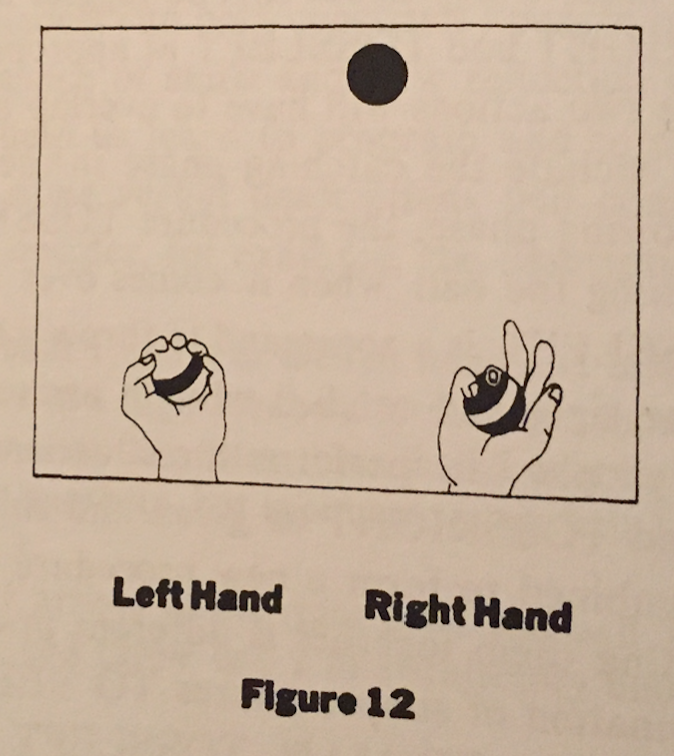
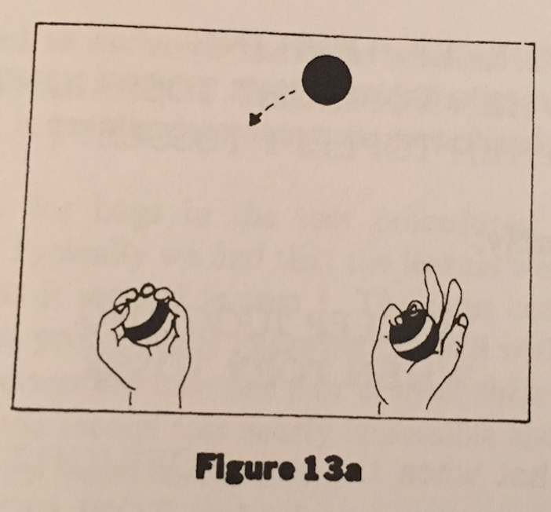
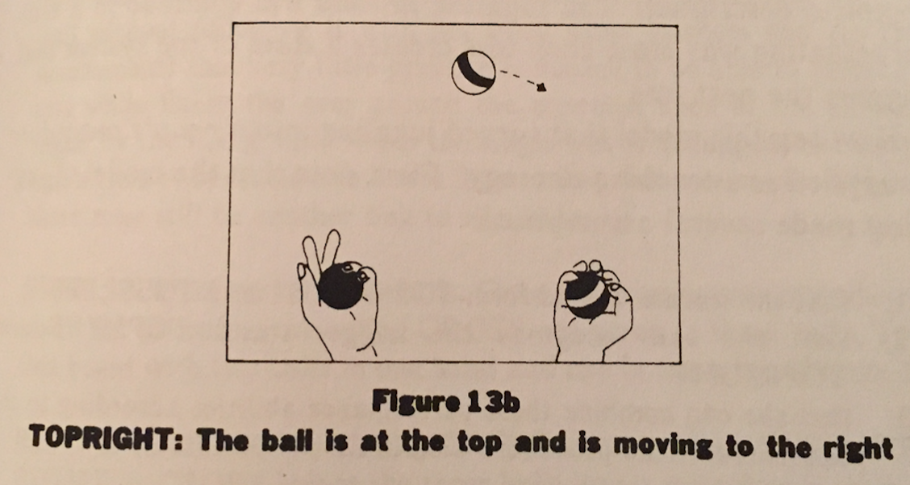

# Juggling for Programmers

[Seymour Papert](https://en.wikipedia.org/wiki/Seymour_Papert) wrote a book called [Mindstorms: Children, Computers, And Powerful Ideas](http://www.amazon.com/Mindstorms-Children-Computers-Powerful-Ideas/dp/0465046746). [Bret Victor](http://worrydream.com/) says in [Learnable Programming](http://worrydream.com/LearnableProgramming/) that Mindstorms is “perhaps the greatest book ever written on learning in general”.

Nestled in Mindstorms is juggling lesson which, it is claimed, reduces the time required to learn to juggle three balls continuously “often to as little as twenty or thirty minutes.” It took me about 40 minutes, but I was using ping pong balls, which are too light, small, and bouncy to be ideal. I have no other excuses.

The next section is how to juggle, from [Mindstorms](http://www.amazon.com/Mindstorms-Children-Computers-Powerful-Ideas/dp/0465046746).

---

There are many different kinds of juggling. When most people think of juggling, they are thinking about a procedure that is called “showers juggling.” In showers juggling balls move one behind the other in a “circle” passing from left to right at the top and from right to left at the bottom (or vice versa). This takes two kinds of throws: a short, low throw to get the balls from hand to the other at the bottom of the “circle” (near the hands) and a long, high throw to get the balls to go around the top of the circle. (See Figure 11.)


Cascade juggling has a simpler structure. There is no bottom of the circle; balls travel in both directions over the upper arc. There is only one kind of toss: a long and high one. (See Figure 11.) Its simplicity makes it a better route into juggling as well as a better example for our argument. Our guiding question is this: Will someone who wishes to learn cascade juggling be helped or hindered by a verbal, analytic description of how to do it? The answer is: It all depends. It depends on what materials the learner has for making analytic descriptions. We use cascade juggling to show how good computational models can help construct “people procedures” that improve performance of skills and how reflection on those people procedures can help us learn to program and to do mathematics. But, of course, _some_ verbal descriptions will confuse more than they will help. Consider, for example, the description:

 1. Start with balls 1 and 2 in the left hand and ball 3 in the right.
 2. Throw ball 1 in a high parabola to the right hand.
 3. When ball 1 is at the vertex throw ball 3 over to the left hand in a similar high parabola, but take care to toss ball 3 under the trajectory of ball 1.
 4. When ball 1 arrives at the right hand and ball 3 is at the vertex, catch ball 1 and throw ball 2 in a trajectory under that of ball 3, and so on.

This description is basically a brute-force straight-line program. It is not a useful description for the purpose of learning. People outside the computer culture might say it is too much like a computer program, “just one instruction after another.” It is like certain programs, for example Keith's first `MAN` program. But we have seen that stringing instructions together without good internal structure is not a good model for computer programming either, and we shall see that the techniques of structured programming that _are_ good for writing programs are also good as mathetic descriptions of juggling.

Our goal is to create a people procedure: `TO JUGGLE`. As a first step toward defining this procedure we identify and name subprocedures analogous to their role to the subprocedures Keith used in drawing his stick figure (`TO VEE`, `TO HEAD`, `TO LINE`). In the case of juggling, a natural pair of subprocedures is what we call `TOSSRIGHT` and `TOSSLEFT`. Just as the command `VEE` was defined functionally by the fact that it causes the computer to place a certain V-shaped figure on the screen, the command `TOSSLEFT` given to our apprentice juggler should “cause” him to throw a ball, which we assume he is holding in his left hand, over to the right hand.

But there is an important difference between programming `TO MAN` and programming `TO JUGGLE`. The programmer of `TO MAN` need not worry about timing, but in setting up the procedure for juggling we _must_ worry about it. The juggler must perform the actions `TOSSRIGHT` and `TOSSLEFT` at appropriate moments in a cycle, and the two actions will have to overlap in time. Since we have chosen to include the catching phase in the same subprocedure as the throwing phase, the procedure `TOSSRIGHT` is meant to include catching the ball when it comes over to the left hand. Similarly, `TOSSLEFT` is a command to throw a ball from the left hand over to the right and catch it when it arrives.

Since most people can perform these actions, we shall take `TOSSLEFT` and `TOSSRIGHT` as given and concentrate on how they can be combined to form a new procedure we shall call `TO JUGGLE`. Putting them together is different in one essential way from the combination of subprocedures `TO VEE` and `TO HEAD` to make the procedure `TO MAN`. `TOSSLEFT` might have to be initiated before the action initiated by the previous `TOSSRIGHT` is completed. In the language of computer science, this is expressed by saying that we are dealing with _parallel_ processes as opposed to the strictly _serial_ processes used in drawing the stick figure.

To describe the combination of the subprocedures we introduce a new element of programming: The concept of a “`WHEN DEMON`.” This is illustrated by the instruction: `WHEN HUNGRY EAT`. In one version of LOGO this would mean: Whenever the condition called `HUNGRY` happens, carry out the action called `EAT`. The metaphor of a “demon” expresses the idea that the command creates an autonomous entity within the computer system, one that remains dormant until a certain kind of event happens, and then, like a demon, it pounces out to perform its action. The juggling act will use two such `WHEN DEMONS`.

Their definitions will be something like:

```
WHEN something TOSSLEFT
WHEN something TOSSRIGHT
```

To fill the blanks, the “somethings,” we describe two conditions, or recognizable states of the system, that will trigger the tossing action.

At a key moment in the cycle the balls are disposed about like this (Figure 12):



But this diagram of the state of the system is incomplete since it fails to show in which direction the top ball is flying. To complete it we add arrows to indicate a direction (Figure 13a) and obtain two state descriptions (Figures 13b and 13c).






If we assume, reasonably, that the juggler can recognize these two situations, the following formalism should be self-explanatory:

```
TO KEEP JUGGLING
WHEN TOPRIGHT TOSSRIGHT
WHEN TOPLEFT TOSSLEFT
```

or even more simply:

```
TO KEEP JUGGLING
WHEN TOPX TOSSX
```

which declares that when the state `TOPRIGHT` occurs, the right hand should initiate a toss and when `TOPLEFT` occurs, the left hand should initiate a toss. A little thought will show that this is a complete description: The juggling process will continue in a self-perpetuating way since each toss creates a state of the system that triggers the next toss.

How can this model that turned juggling into a _people procedure_ be applied as a teaching strategy? First, note that the model of juggling made several assumptions:

 1. that the learner can perform `TOSSRIGHT` and `TOSSLEFT`
 2. that she can recognize the trigger states `TOPLEFT` and `TOPRIGHT`
 3. that she can combine these performance abilities according to the definitions of the procedure `TO KEEP JUGGLING`

Now, we translate our assumptions and our people procedures into a teaching strategy.

STEP 1: Verify that the learner _can_ toss. Give her one ball, ask her to toss it over into the other hand. This usually happens smoothly, but we will see later that a minor refinement is often needed. The spontaneous procedure has a bug.

STEP 2: Verify that the learner can combine tosses. Try with two balls with instructions:

```
TO CROSS
TOSSLEFT
WHEN TOPRIGHT TOSSRIGHT
END
```

This is intended to exchange the balls between left and right hands. Although it appears to be a simple combination of `TOSSLEFT` and `TOSSRIGHT`, it usually does not work immediately.

STEP 3: Look for bugs in the toss procedures. Why doesn't `TO CROSS` work? Typically we find that the learner's ability to toss is not really as good as it seemed in step 1. The most common deviation or “bug” in the toss procedure is following the ball with the eyes in doing a toss. Since a person has only one pair of eyes, their engagement in the first toss makes the second toss nearly impossible and thus usually ends in disaster with the balls on the floor.

STEP 4: Debugging. Assuming that the bug was following the first ball with the eyes, we debug by returning our learner to tossing with one ball without following it with her eyes. Most learners find (to their amazement) that very little practice is needed to be able to perform a toss while fixing the eyes around the expected apex of the parabola made by the flying ball. When the single toss is debugged, the learner again tries to combine two tosses. Most often this now works, although there may still be another bug to eliminate.

STEP 5: Extension to three balls. Once the learner can smoothly execute the procedure we called `CROSS`, we go on to three balls. To do this beings with two balls in one hand and one in the other (Figure 14).

Ball 2 is tossed as if executing `CROSS`, ignoring ball 1. The `TOSSRIGHT` in `CROSS` brings the three balls into a state that is ready for `KEEP JUGGLING`. The transition from `CROSS` to `KEEP JUGGLING` presents a little difficulty for some learners, but this is easily overcome. Most people can learn to juggle in less than half an hour by using this strategy.


Variants of this teaching strategy have been used by many LOGO teachers and studied in detail by one of them, Howard Austin, who took the analysis of juggling as the topic of his Ph.D. thesis. There is no doubt that the strategy is very effective and little doubt as to the cause: The use of programming concepts as a descriptive language facilitates debugging.

---

I think this, and all of [Mindstorms](http://www.amazon.com/Mindstorms-Children-Computers-Powerful-Ideas/dp/0465046746), is pretty cool. If nothing else, there is no longer any reason for anyone not to learn to juggle!
