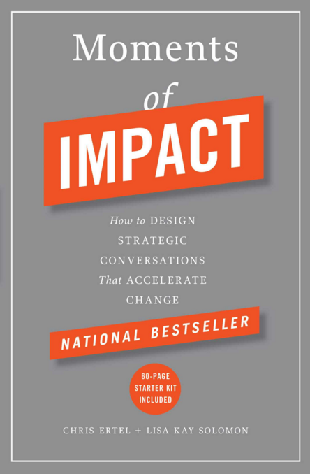

# Moments of Impact

This is a well-wrought business book about how to lead workshops.

When I got it, I thought this book was about negotiation: how to have
conversations that advance your aims. Really by "strategic
conversations" the authors mean "conversations about strategy" and
care mostly about getting business executives to work together.

In addition to open-ended "let's find a new direction" meetings, the
authors spend a lot of time on what are really questions of education.
Their guidance is similar to that for running an effective class
discussion, setting up small group work, or orchestrating experiential
learning.

It would be interesting to know what the effect would be of devoting
similar resources toward educating children as toward educating
executives.

The subtitle, "How to design strategic conversations that accelerate
change", includes the main term the authors are trying to advance:
"strategic conversations". I think that in a field with little in the
way of new ideas, authors of business books thrive to the extent that
they get their phrases to stick. The authors even focus on this kind
of phrase-finding in the contents of the book, and I think there's
something to it.

The book follows its outline very tightly, and its core outline is this:

> **Core principles and key practices**
>
> 1. Define your purpose
>     * Seize your moment
>     * Pick one purpose
>     * Go slow to go fast
> 2. Engage multiple perspectives
>     * Assemble a dream team
>     * Create a common platform
>     * Ignite a controlled burn
> 3. Frame the issues
>     * Stretch (don't break) mind-sets
>     * Think inside _different_ boxes
>     * Choose a few key frames
> 4. Set the scene
>     * Make your space
>     * Get visual
>     * _Do_ sweat the small stuff
> 5. Make it an experience
>     * Discover, don't tell
>     * Engage the whole person
>     * Create a narrative arc

They go through that outline in book form in the first 170 pages, and
then again in a "starter kit" (think "CliffsNotes") in the next 60
pages. Together, these parts make for a very pleasantly-dimensioned
book.

The book is really quite nicely designed by
[Mine](http://minesf.com/). Mine has a
[bboy demo reel](https://www.youtube.com/embed/vdGuEwZb378).
