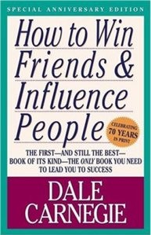
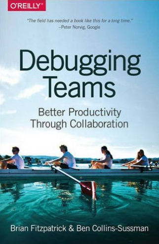

# Books for Professionals

My sister started her first post-graduate job last year. She asked me to recommend books on how to be a professional.

In my opinion, "being a professional" has at least two meanings:

1. In general, (a) **working effectively** (b) **_with people_**.
2. In particular, being an expert in your specific field.

Here are four picks regarding general professionalism.

---

### (a) **working effectively**

I recommend [How to Live on 24 Hours a Day](https://en.wikipedia.org/wiki/How_to_Live_on_24_Hours_a_Day) by Arnold Bennett. You can read it for free [online via Project Gutenberg](http://www.gutenberg.org/ebooks/2274).

I also highly recommend [Bit Literacy](http://bitliteracy.com/), which is a little old now but still relevant especially regarding how to handle email. You can read it for free [in the iBookstore](http://itunes.apple.com/us/book/isbn9780979368103).

---

### (b) _with people_

If you've never read [How to Win Friends and Influence People](https://en.wikipedia.org/wiki/How_to_Win_Friends_and_Influence_People), you should. I don't think it would be very surprising to you, since you're already so well-friended and influential, but it is a sort of classic and worth checking out. Looks like they're still trying to [sell it](http://www.amazon.com/How-Win-Friends-Influence-People/dp/0671027034).

I also recently (well, last November) read [Debugging Teams](http://shop.oreilly.com/product/0636920042372.do) and thought it was pretty good. I wrote [some stuff](http://planspace.org/20151118-debugging_teams/) about it and pulled out quotes. The book is [for sale](http://www.amazon.com/Debugging-Teams-Productivity-through-Collaboration/dp/1491932058).

---

Where is the line between competency that should be expected of everyone and area of specialist knowledge? This may be particularly confused by so-called "business books", some of which are about being effective in any role, some of which are specifically about "management", and all of which want to sell as many copies as possible at the airport. I suspect that most are weakly rehashing some of the above titles.

---

See also [Books for Programmers](/20160322-books_for_programmers/).
