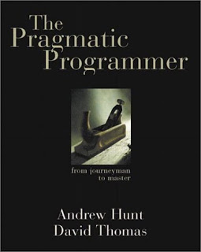
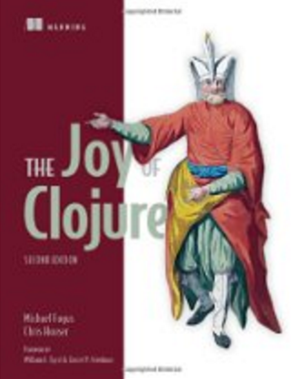
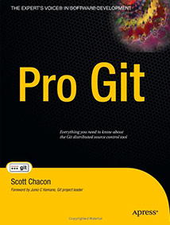

# Books for Programmers

Someone found my email address on [github](https://github.com/) and wrote asking me to recommend books about software development. Well, here is one book on software development in general, and roughly one book each in connection with Python, JavaScript, Clojure, R, and git.

---

### Software development in general

Some years ago a mentor lent me a copy of [The Pragmatic Programmer](https://pragprog.com/book/tpp/the-pragmatic-programmer). It is a very useful collection of The Right Way to do things. It's a set of ground rules for doing good work that can make you and the people you work with more effective.

For more books on software development "in general", it looks like [Atwood's list](http://blog.codinghorror.com/recommended-reading-for-developers/) is quite good. I should read some of those. He even lists Tufte!

---

### Python

I encountered [Think Python](http://greenteapress.com/wp/think-python-2e/) and the rest of Downey's books while teaching some data science courses. It's a nice intro to computer science, programming, and Python, and it's available for free online.

---

### JavaScript

If you want an intro to programming and JavaScript, I think everyone agrees that [Eloquent JavaScript](http://eloquentjavascript.net/) is the right book. If you know how to program and want the dense low-down on JavaScript, the classic is [JavaScript: The Good Parts](http://www.amazon.com/JavaScript-Good-Parts-Douglas-Crockford/dp/0596517742). There's probably more modern stuff because now you can start a whole company and even convince people to fund you, all with JavaScript. But here's a book I actually read:

[Functional JavaScript](http://shop.oreilly.com/product/0636920028857.do) covers interesting functional programming techniques with JavaScript and the [underscore](http://underscorejs.org/) library. I liked the content, but I also liked the writing so much that I looked for more by the author, which is what led me to the Clojure book below.

---

### Clojure

[Clojure](https://clojure.org/) is a neat language, and [The Joy of Clojure](http://www.joyofclojure.com/) is a neat book. There is a ton to learn. It's "a Clojure book", but as the subtitle, "Thinking the Clojure Way", indicates, the language and the book are not bashful about philosophy, and it's a different philosophy from a lot of other languages and ways of thinking. Use and appreciate functional programming with immutable data structures.

---

### R

Years back I loved [The Art of R Programming](https://www.nostarch.com/artofr.htm) for acknowledging that you need to program in R. Some books treat R like it's a statistics GUI that, for reasons unknown, you happen to have to type to use.

Nowadays I think Hadley's freely available [Advanced R](http://adv-r.had.co.nz/) is by far the best R book. Despite the title, it does also cover introductory material, but the pace is quicker and the depth is greater than The Art of R Programming.

---

### git

[git](https://git-scm.com/) is not a language, it's a version control tool, but I'm including it here because there's an obvious book for it which is free online. It's called [Pro Git](https://git-scm.com/book/en/v2). Newcomers to git sometimes find git confusing, and there's a simple solution: read the book. Read the whole book. Just read it.

---

See also [Books for Professionals](/20160320-books_for_professionals/).
