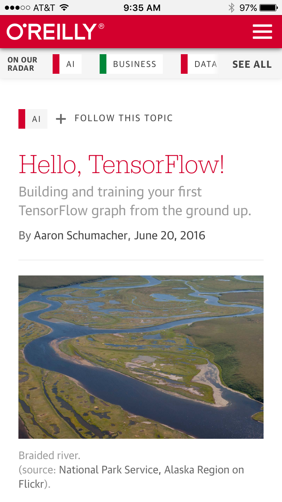
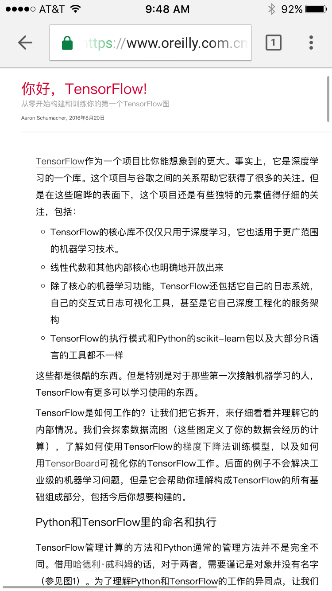
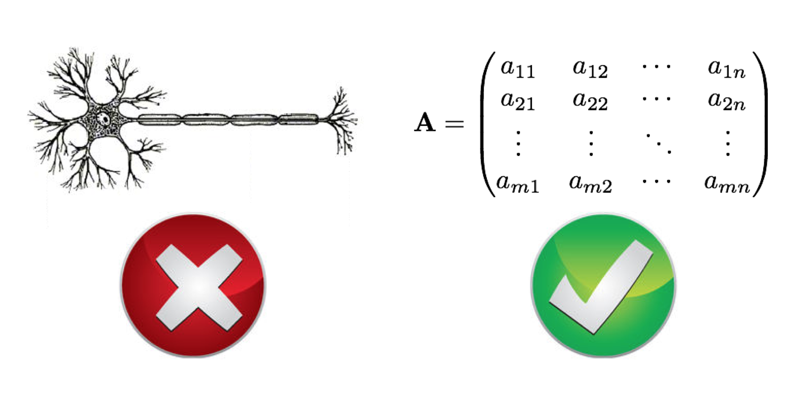

# Presenting “Hello, TensorFlow!” Again

*This is an updated presentation version of my “Hello, TensorFlow!” [O'Reilly post](https://www.oreilly.com/learning/hello-tensorflow). The [original](/20160629-presenting_hello_tensorflow/) was given at the [TensorFlow Washington DC](http://www.meetup.com/TensorFlow-Washington-DC/) meetup on Wednesday June 29, 2016, “[Deep Dive into TensorFlow](http://www.meetup.com/TensorFlow-Washington-DC/events/231860618/).” This version was created for a Wednesday October 5 2016 guest presentation at the DC [General Assembly Data Science Immersive](https://generalassemb.ly/education/data-science-immersive) and for a Wednesday October 26 2016 presentation at the [NVIDIA GPU Technology Conference (GTC) in DC](http://dc.gputechconf.com/). ([slides](big.html))*

I've given this talk a couple times, which means this is the improved version.

-----

planspace.org

@planarrowspace

-----

Hi! I'm Aaron. This is my blog and [my twitter handle](https://twitter.com/planarrowspace). You can get from one to the other. [This presentation](big.html) and a corresponding write-up (you're reading it) are on my blog (which you're on).

-----

-----

This presentation started as a blog post I [wrote](/20160619-writing_with_oreilly/) which was [published](https://www.oreilly.com/learning/hello-tensorflow) on O'Reilly.

If you want you can follow along [there](https://www.oreilly.com/learning/hello-tensorflow) and we'll stay pretty close to [that content](https://www.oreilly.com/learning/hello-tensorflow).

I also recorded an O'Reilly [Oriole](http://www.oreilly.com/oriole/) video and interactive version which should come out some time soon on O'Reilly's [Safari](http://safari.oreilly.com) service.

-----

-----

O'Reilly also translated and published a [Chinese version](https://www.oreilly.com.cn/ideas/?p=533), so if you prefer to read Chinese you can do that too.

-----

UNCLASSIFIED

-----

That reminds me, the classification level for this talk is UNCLASSIFIED.

_This is a little joke for the government-heavy [GTC DC](http://dc.gputechconf.com/) audience, which I hope nobody has reason to take offense at._

-----

-----

A lot of people have already contributed to this material. I work at [Deep Learning Analytics](http://www.deeplearninganalytics.com/) (DLA) and have to especially thank John for his support, and all my colleagues there for their feedback. I'm also particularly indebted to the [DC Machine Learning Journal Club](http://www.meetup.com/DC-Machine-Learning-Journal-Club/), and of course the folks at O'Reilly.

-----

-----

A brief note on popularity as measured by development activity on [GitHub](https://github.com/). [Caffe](http://caffe.berkeleyvision.org/) is another framework you might consider for deep learning. This is one way to compare [Caffe](https://github.com/BVLC/caffe/graphs/contributors) and [TensorFlow](https://github.com/tensorflow/tensorflow/graphs/contributors). TensorFlow is pretty active.

_Data and details for producing this graph are in [contrib_plot.ipynb](contrib_plot.ipynb)._

-----

-----

I'm going to try to show in a very hands-on way some of the details of how TensorFlow works. The idea is not to exercise all the features of TensorFlow but to really understand some of the important underlying concepts.

*Image from [National Park Service, Alaska Region on Flickr](https://www.flickr.com/photos/alaskanps/8029733984).*

-----

 * tensors
 * flows
 * pictures
 * servers

-----

There are a couple interesting things about TensorFlow.

I'm really only going to demonstrate the middle two, but let's mention them all.

-----

-----

First thing about TensorFlow: tensors.

TensorFlow hates neurons and it loves linear algebra.

When you design software you make choices that affect what you can do and how you can do it.

For neural nets, there has in the past been a fixation on the biological metaphor and the "neurons" in particular. If you've used software like R's [neuralnet](https://cran.r-project.org/web/packages/neuralnet/) package or Python's [PyBrain](http://pybrain.org/), you've seen interfaces where you typically define the number of neurons or "hidden units" that you want in each layer, and the connections between them (and perhaps some other components) are set up automatically one way or another.

TensorFlow does also provide a higher-level interface in [tf.contrib.learn](https://www.tensorflow.org/versions/master/tutorials/tflearn/index.html) that talks about hidden units and so on. But if you're looking at the math you have to evaluate inside these neural net models, the "neurons" hardly exist at all. The weights on the connections certainly exist, and there are operations that connect values as they flow through the network, but in the end you don't really need "neurons" to be a dominant abstraction in the system.

If you go this route, everything is just matrix math - or, for arbitrary dimensions, tensor math. This is the choice TensorFlow makes. It makes TensorFlow really flexible and lets it achieve efficient computation that would be more difficult otherwise.

So TensorFlow can do more than "just" neural nets. As demonstrated in the [Google/Udacity Deep Learning MOOC](https://www.udacity.com/course/deep-learning--ud730), you can implement logistic regression easily with TensorFlow, for example. There's even now a section of non-machine-learning applications in the [official tutorials](https://www.tensorflow.org/versions/r0.11/tutorials/index.html).

Focusing on (typically fixed-dimension) tensors does arguably make it more awkward to attempt esoteric techniques like dynamically changing the architecture of your neural net by adding neurons, for example. (This comment was inspired by [Let your Networks Grow](https://drive.google.com/file/d/0Bxf-khCt_eknWEF6aFJ1ZU4yQ00/view), [Neural Nets Back to the Future](https://sites.google.com/site/nnb2tf/) at [ICML 2016](http://icml.cc/2016/).)

The linear algebra you actually have to think about is not too tricky, but for our purposes I'm not going to use anything more than individual numbers, so there's no chance of being distracted by linear algebra.

The relevant point is that while some other software focuses on neurons and mostly ignores weights, in the case of TensorFlow we focus on weights and mostly ignore neurons as a top-level abstraction. In any event, it's all just numbers.

-----

-----

Second thing about TensorFlow: flows.

TensorFlow loves graphs.

It's important to distinguish between graphs and pictures. Here we mean [graphs](https://en.wikipedia.org/wiki/Graph_(abstract_data_type)) as in the abstract data type. Data flow graphs.

This is a picture of a data flow graph. You might prefer to think of it as \\(y=mx+b\\). This is what TensorFlow's graphs are like.

The advantage of graphs is that the software can manipulate them and "reason about" how to answer questions you're asking before it commits to particular execution paths.

Lots of software is moving toward working via graphs in this way. Often they're [directed acyclic graphs](https://en.wikipedia.org/wiki/Directed_acyclic_graph) but I don't care too much about whether that's always strictly the case. [🥚](https://twitter.com/planarrowspace/status/569963882900561921)

For example, [Theano](http://deeplearning.net/software/theano/) works similarly enough to TensorFlow that [Keras](http://keras.io/) can use either as its backend. [Torch](http://torch.ch/) is also similar.

Outside of software mostly for deep learning, [Spark](http://spark.apache.org/) works with a kind of computation graph to manage distributed processing. Tools like [Luigi](https://github.com/spotify/luigi) and [Drake](https://github.com/Factual/drake) manage graph pipelines of data. And many [recommend](http://drivendata.github.io/cookiecutter-data-science/) that all data work be thought of as graph-like pipelines.

The graph concept is interesting and worth exploring in order to understand TensorFlow, so I'll spend some time with it today.

*Image made with [draw.io](https://draw.io/).*

-----

-----

Third thing about TensorFlow: pictures.

If you use Python's [scikit-learn](http://scikit-learn.org/), you likely also use a separate visualization tool, likely including [matplotlib](http://matplotlib.org/). If you've tried to [visualize decision tree rules](/20151129-see_sklearn_trees_with_d3/), you may have had a frustrating time. You may or may not use any explicit logging system at all.

The [TensorBoard](https://github.com/tensorflow/tensorflow/blob/master/tensorflow/tensorboard/README.md) tooling that comes with TensorFlow is a great logging and visualizing system that gives you access to a lot of internals that could otherwise be a lot of work to expose.

I think TensorBoard _by itself_ is a compelling reason to use TensorFlow over other similar software.

TensorBoard is super great and I will be showing several sides of it today.

*Image from [TensorBoard: Graph Visualization](https://www.tensorflow.org/versions/r0.8/how_tos/graph_viz/index.html).*

-----

-----

Fourth thing about TensorFlow: servers.

TensorFlow loves moving directly into production.

In addition to everything else, TensorFlow has a highly-engineered serving architecture. So if you develop a TensorFlow model on your laptop, you can (relatively) easily build a deployment system to serve that model in a serious way. It seems pretty neat, but I haven't used it and I'm not going to talk more about it.

*Image from the [TensorFlow Serving Architecture Overview](https://tensorflow.github.io/serving/architecture_overview).*

-----

demo

-----

From here to the end is just demo! The starting point is [demo_start.ipynb](https://github.com/ajschumacher/ajschumacher.github.io/blob/master/20160629-presenting_hello_tensorflow/demo_begin.ipynb) and the ending point (with output) is [demo_end.ipynb](https://github.com/ajschumacher/ajschumacher.github.io/blob/master/20160629-presenting_hello_tensorflow/demo_end.ipynb).

-----

Thanks!

-----

Thank you!

-----

planspace.org

@planarrowspace

-----

This is just me again.
