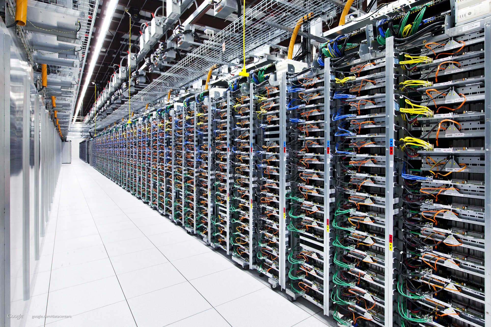

# Use only what you need from TensorFlow

There isn't just one decision to use [TensorFlow](https://www.tensorflow.org/) or not use TensorFlow; you have to make decisions about which pieces of TensorFlow you're going to use.

I've thought about [whether Tensorflow suffers from the second-system effect](/20170311-does_tensorflow_suffer_from_the_second_system_effect/), and my conclusion is that while TensorFlow has a huge abundance of features, it can't really be said to "suffer" from this. The engineering is solid and it supports very interesting applications.

For the individual user of TensorFlow, however, [over-engineering](https://en.wikipedia.org/wiki/Overengineering) is a relative term, and it's relative to the problem at hand.

One relevant dimension to consider is where you'll be running your code, which is related to the size of your data.

If your data fits in memory and you're running on one local machine, a lot of simple approaches will work for you.

If you're using massive quantities of data on multitudes of machines in a data center, you have a lot of concerns that you wouldn't have on one machine.

TensorFlow can run well in large distributed settings. But if you're not going to run that way, you may not need to use all that functionality.

For example, the bulk of the TensorFlow [documentation on reading data](https://www.tensorflow.org/programmers_guide/reading_data) focuses on a data pipeline that involves multiple processes and multiple coordinating queues. For reading large datasets from network storage (in [HDFS](https://wiki.apache.org/hadoop/HDFS), say) this might make a lot of sense.

On the other hand, you may be trying out the [Titanic machine learning challenge](https://www.kaggle.com/c/titanic) on [Kaggle](https://www.kaggle.com/), where the entire training set is a single CSV file with 892 lines.

If you decide you need to use the full TensorFlow data pipeline instead of something like [pandas.read_csv](http://pandas.pydata.org/pandas-docs/stable/generated/pandas.read_csv.html), you're doing a lot of unnecessary work, before you've even started working on the substance of your problem.

There's something to be said for trying out functionality you don't really need, just for the sake of learning it for possible future application. And if you're working on a toy problem like [Titanic](https://www.kaggle.com/c/titanic), maybe that is exactly what you want to do.

But for most work, if [you aren't gonna need it](https://en.wikipedia.org/wiki/You_aren't_gonna_need_it), don't use it—even if it's available in TensorFlow.
