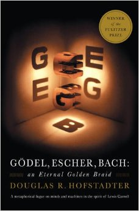
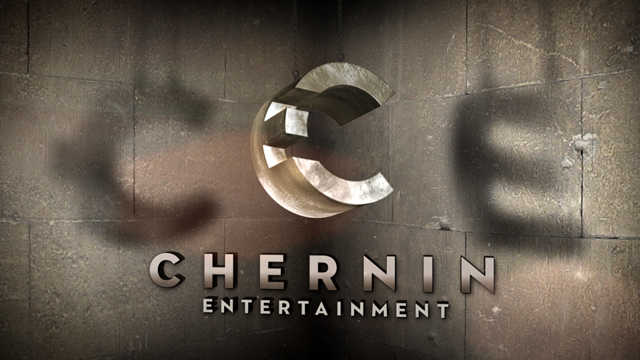
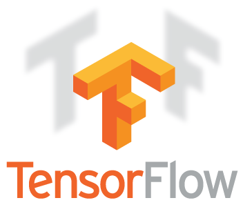
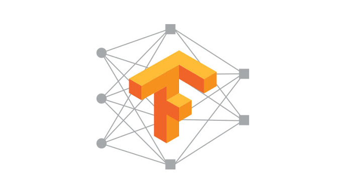

# Much Ado about the TensorFlow Logo

In the beginning, there was [Gödel, Escher, Bach: An Eternal Golden Braid](https://en.wikipedia.org/wiki/G%C3%B6del,_Escher,_Bach) by Douglas Hofstadter.

This "metaphorical fugue on minds and machines in the spirit of Lewis Carroll" includes the [strange loop](https://en.wikipedia.org/wiki/Strange_loop) idea and related discussion of consciousness and formal systems. Hofstadter's influence can be seen, for example, [in the name](https://cs.illinois.edu/news/strange-loop-conference) of the [Strange Loop](http://www.thestrangeloop.com/) tech conference.

It seems likely that many people working in artificial intelligence and machine learning have encountered Gödel, Escher, Bach.

Of course, there's also [Chernin Entertainment](https://en.wikipedia.org/wiki/Chernin_Entertainment), the production company.

So we shouldn't rule out the possibility that Google engineers are fans of [Chernin's work](http://www.imdb.com/company/co0286257/). I hear [Hidden Figures](https://en.wikipedia.org/wiki/Hidden_Figures) is quite good. And I guess a lot of people like [New Girl](https://en.wikipedia.org/wiki/New_Girl)?

In any event, somehow we get to this TensorFlow logo:

If you look carefully, does it seem like the right side of the "T" view is too short?

This very serious concern appears as [issue #1922](https://github.com/tensorflow/tensorflow/issues/1922) on the TensorFlow github, and [on the TensorFlow mailing list](https://groups.google.com/a/tensorflow.org/forum/#!topic/discuss/XhO1sqp4l4g) complete with ASCII art illustration.

The consensus response seemed to be some variant of "won't fix" (it wouldn't look as cool, anyway) until...

As of around the 1.0 release of TensorFlow, which was around the first [TensorFlow Dev Summit](https://events.withgoogle.com/tensorflow-dev-summit/), this logo variant seems to be in vogue. It removes the (possibly contentious) shadows, and adds a picture of a computation graph, in case you were about to forget that TensorFlow is about computation graphs. (If you want to think of it as a neural network, you're free to do so.)

Logos are fun!

---

Thanks to [David Cook](https://twitter.com/divergentdave) and [Philip Ashlock](https://twitter.com/philipashlock) for helping me find Chernin again based on a very murky memory.

I'm working on [Building TensorFlow systems from components](http://conferences.oreilly.com/oscon/oscon-tx/public/schedule/detail/57823), a workshop at [OSCON 2017](https://conferences.oreilly.com/oscon/oscon-tx).
