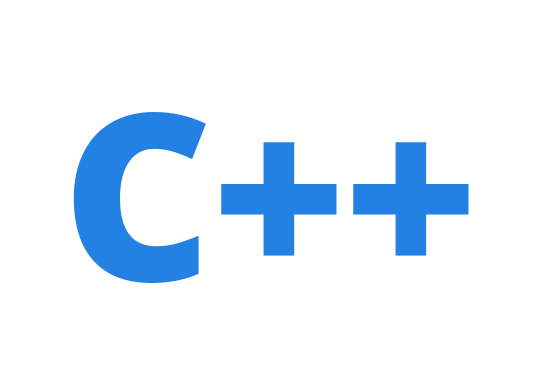

# TensorFlow APIs for Various Languages

You couldn't be blamed for thinking that [TensorFlow](https://www.tensorflow.org/) is a Python package. And a lot of TensorFlow functionality is unique to Python. But the core of TensorFlow—the part of TensorFlow that most truly _is_ TensorFlow—is the distributed runtime ("TensorFlow Distributed Execution Engine") and Python is just one way to talk to it.

(Image from the TensorFlow Dev Summit 2017 [keynote](https://www.youtube.com/watch?v=4n1AHvDvVvw).)

The runtime itself is written in C++, but it has APIs ("frontends") in many languages.

---

### C

The only TensorFlow APIs with any [official stability](https://www.tensorflow.org/programmers_guide/version_semantics) are the [C API](https://github.com/tensorflow/tensorflow/blob/master/tensorflow/c/c_api.h) and (parts of) the Python API.

TensorFlow [suggests](https://www.tensorflow.org/extend/language_bindings) that you use the C API if you are making a TensorFlow API for some other language. Lots of programming languages have mechanisms for connecting with [C](https://en.wikipedia.org/wiki/C_(programming_language)). In a very real sense the TensorFlow C API exists _so that_ other APIs can be built.

There are a number of non-Python [languages with TensorFlow APIs](https://www.tensorflow.org/api_docs/) but for the most part I will consider them "deploy only" ("inference only") and largely ignore them.

---

### C++

The [C++ API](https://www.tensorflow.org/api_docs/cc/) is "exposed through header files in [tensorflow/cc](https://github.com/tensorflow/tensorflow/tree/master/tensorflow/cc)" and [C++](https://en.wikipedia.org/wiki/C%2B%2B) is the language that the TensorFlow runtime is written in, but the C++ API is still marked as experimental and has fewer features than are accessible via the Python API. It may be where you want to be for some deploy scenarios.

As a possibly interesting historical note, [the MapReduce paper](https://research.google.com/archive/mapreduce.html) was another place where the world saw Google (and Jeff Dean) making something cool with C++. Yahoo! (and others) eventually implemented those concepts in Java, as [Hadoop](http://hadoop.apache.org/). Google seems to continue to do a lot of work in C++.

---

### Java

Possibly recognizing [Java's](https://en.wikipedia.org/wiki/Java_(programming_language)) presence in industry, TensorFlow now has a [Java API](https://www.tensorflow.org/api_docs/java/reference/org/tensorflow/package-summary).

---

### Go

[Go](https://en.wikipedia.org/wiki/Go_(programming_language)) is a Google programming language, and so it seems appropriate that there is a [Go API](https://godoc.org/github.com/tensorflow/tensorflow/tensorflow/go) for TensorFlow.

---

### Rust

[Rust](https://en.wikipedia.org/wiki/Rust_(programming_language)) is a neat language, and it has a TensorFlow [api](https://github.com/tensorflow/rust) too ([docs](https://tensorflow.github.io/rust/tensorflow/)).

---

### Haskell

[Haskell](https://en.wikipedia.org/wiki/Haskell_(programming_language)) is not a language I would have guessed would have a TensorFlow API, but [it does](https://github.com/tensorflow/haskell) ([docs](https://tensorflow.github.io/haskell/haddock/)).

---

### Python

[Python](https://en.wikipedia.org/wiki/Python_(programming_language)) is where the action is. TensorFlow's [Python API documentation](https://www.tensorflow.org/api_docs/python/) is headed simply "All symbols in TensorFlow" and it really does [seem to be](https://www.tensorflow.org/extend/language_bindings) that TensorFlow functionality is prototyped in Python and then moved into the C++ core:

> Python was the first client language supported by TensorFlow and currently supports the most features. More and more of that functionality is being moved into the core of TensorFlow (implemented in C++) and exposed via a C API.

The Python API is so rich, you'll have to choose which levels of Python API you'll want to use.

---

### R

The [R](https://en.wikipedia.org/wiki/R_(programming_language)) TensorFlow API made by [RStudio](https://www.rstudio.com/) takes a different approach than the APIs that use TensorFlow's C API to connect with TensorFlow. [The R API](https://rstudio.github.io/tensorflow/) ([on github](https://github.com/rstudio/tensorflow)) wraps the entire Python API. This is not exactly what the TensorFlow project recommends, but it gives R users access to all the features in the Python API, which would be quite a lot of work to replicate using only the C API.

---

Thanks to [Kevin Ushey](https://blog.rstudio.org/author/kevinusheyrstudio/) for [directing](https://support.rstudio.com/hc/en-us/community/posts/115005611307) me to the right venue, and to [@jjallaire](https://github.com/jjallaire) and [@pourzanj](https://github.com/pourzanj) for an illuminating [discussion](https://github.com/rstudio/tensorflow/issues/105) around the R TensorFlow API.

I'm working on [Building TensorFlow systems from components](http://conferences.oreilly.com/oscon/oscon-tx/public/schedule/detail/57823), a workshop at [OSCON 2017](https://conferences.oreilly.com/oscon/oscon-tx).
