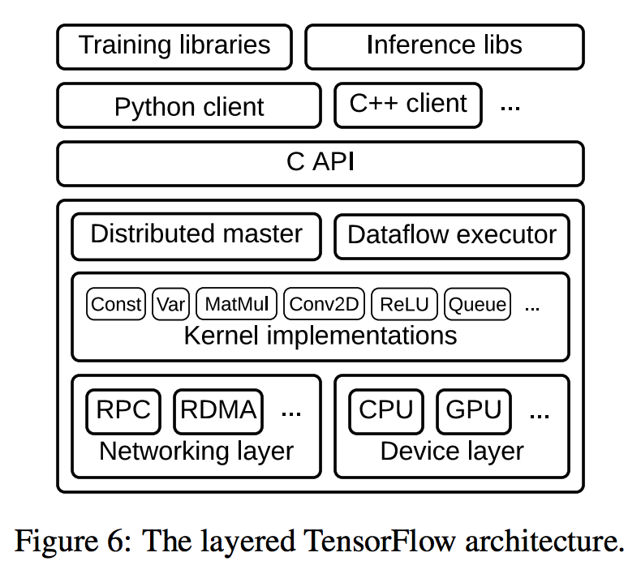

# TensorFlow as a Distributed Virtual Machine

TensorFlow has a flexible API, and it has automatic differentiation, and it can run on GPUs. But the thing that's really neat about TensorFlow is that it gives you a fairly general way to easily program across multiple computers.

TensorFlow's distributed runtime, the big bottom box in this figure from the [2016 paper](https://research.google.com/pubs/pub45381.html) "TensorFlow: A system for large-scale machine learning", is the part of TensorFlow that runs the computation graph.

The computation graph, specified with [protocol buffers](https://en.wikipedia.org/wiki/Protocol_Buffers), is much higher level than [Java virtual machine](https://en.wikipedia.org/wiki/Java_virtual_machine) (JVM) bytecode. But I think it's interesting to think of the TensorFlow distributed runtime as a sort of [virtual machine](https://en.wikipedia.org/wiki/Virtual_machine). This is not a whole system virtual machine, but a process virtual machine, like the JVM, to "execute computer programs in a platform-independent environment." The Python API can be like a [domain-specific language](https://en.wikipedia.org/wiki/Domain-specific_language) for programming the TensorFlow graph.

Unlike the JVM, and unlike any other system I know, TensorFlow lets you directly put computation on multiple machines, pretty much however you want, and then it quietly handles all the details for you. Wherever it needs to, TensorFlow adds send and receive nodes to allow the graph to be executed as specified. This is shown in this figure from the [2015 paper](https://research.google.com/pubs/pub45166.html) "TensorFlow: Large-Scale Machine Learning on Heterogeneous Distributed Systems" (also [available on arXiv](https://arxiv.org/abs/1603.04467) and commonly linked as the [PDF on tensorflow.org](http://download.tensorflow.org/paper/whitepaper2015.pdf)).

The box labels in the figure are for devices, but with TensorFlow they could be on the same machine or on different machines, and it hardly matters.

The flexibility and ease that result are incredible. It isn't terribly hard to think of implementing your own map-reduce system using TensorFlow. It might even be reasonably performant, if you have a distributed file system! The common TensorFlow distributed model training techniques are a kind of map-reduce, after all. But you could do pretty near anything! This is pretty cool.

---

I'm working on [Building TensorFlow systems from components](http://conferences.oreilly.com/oscon/oscon-tx/public/schedule/detail/57823), a workshop at [OSCON 2017](https://conferences.oreilly.com/oscon/oscon-tx).
