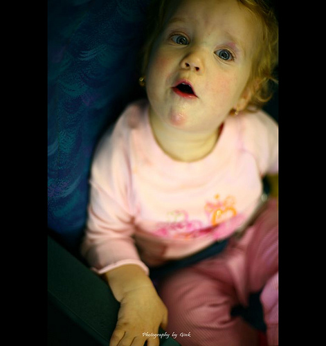
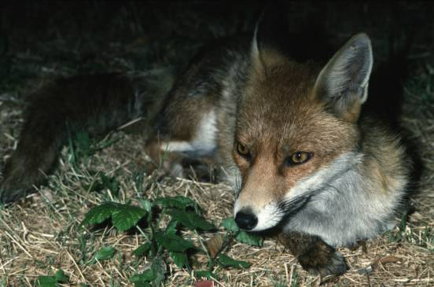

# Sampling ImageNet

[ImageNet](http://image-net.org/) is a standard image dataset. It's pretty big; just the IDs and URLs of the images take over a gigabyte of text. I collected a fun [sampling](https://github.com/ajschumacher/imagen) for small-scale purposes.

---

ImageNet is distributed primarily as a text file of [image URLs](http://image-net.org/download-imageurls). The compressed file is 334 megabytes. The unpacked file is 1.1 gigabytes.

```bash
$ wget http://image-net.org/imagenet_data/urls/imagenet_fall11_urls.tgz
$ tar zxvf imagenet_fall11_urls.tgz
$ wc fall11_urls.txt
##  14197122 28414665 1134662781 fall11_urls.txt
$ head -3 fall11_urls.txt
## n00004475_6590   http://farm4.static.flickr.com/3175/2737866473_7958dc8760.jpg
## n00004475_15899  http://farm4.static.flickr.com/3276/2875184020_9944005d0d.jpg
## n00004475_32312  http://farm3.static.flickr.com/2531/4094333885_e8462a8338.jpg
```

The first field is an image ID. The part before the underscore is a WordNet ID, so the first image is of `n00004475`. What's that?

The mapping from WordNet ID to a brief text label can be downloaded from a link on the ImageNet [API page](http://image-net.org/download-API).

```bash
$ wget http://image-net.org/archive/words.txt
$ wc words.txt
##   82114  302059 2655750 words.txt
$ head -3 words.txt
## n00001740   entity
## n00001930   physical entity
## n00002137   abstraction, abstract entity
```

There are 82,114 WordNet IDs. Now we can decode the one we're interested in.

```bash
$ grep n00004475 words.txt
## n00004475    organism, being
```

So the first picture in ImageNet is of an "organism, being". What does such a thing look like?



There are eight examples of "organism, being" and two of the others are cats.

I think 82,114 categories is too many to try to sample randomly from, for my purposes. I'll use the [200 categories](http://image-net.org/challenges/LSVRC/2017/browse-det-synsets) specified for the [ILSVRC2017](http://image-net.org/challenges/LSVRC/2017/) object detection [challenge](http://image-net.org/challenges/LSVRC/2017/#det).

```bash
wget -O 200words.html http://image-net.org/challenges/LSVRC/2017/browse-det-synsets
```

I used Emacs to pull out the 200 WordNet IDs and convenient extra-short descriptions, saved in [200words.csv](200words.csv). The script [make_urls_subset.py](make_urls_subset.py) produces [200words100urls.csv](200words100urls.csv) with 100 random URLs for each of the categories. Finally, [get_fives.py](get_fives.py) downloads five working JPGs for each category. A couple came back with "missing" images, so I manually replaced those with others from the list.

The results are packaged up on [GitHub](https://github.com/) at [ajschumacher/imagen](https://github.com/ajschumacher/imagen) and feature such beauties as [n02118333_27_fox.jpg](img/n02118333_27_fox.jpg).


