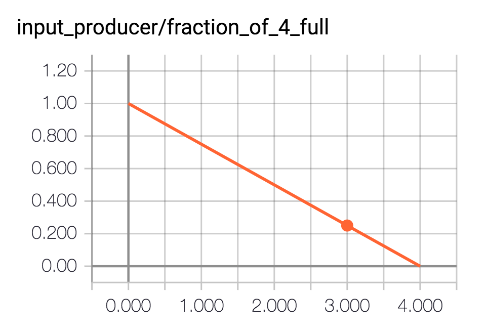

# TensorFlow's QueueRunner

A TensorFlow [QueueRunner](https://www.tensorflow.org/programmers_guide/threading_and_queues#queuerunner) helps to feed a TensorFlow [queue](http://planspace.org/20170327-tensorflow_and_queues/) using threads which are optionally managed with a TensorFlow [Coordinator](http://planspace.org/20170324-the_tensorflow_coordinator_for_python_threading/). QueueRunner objects can be used directly, or via higher-level APIs, which also offer automatic TensorBoard summaries.

```python
import tensorflow as tf
session = tf.Session()
```

---

## QueueRunner Directly

To use a QueueRunner you need a TensorFlow queue and an op that puts a new thing in the queue every time that op is evaluated. Typically, such an op will itself involve a queue, which is a bit of a tease. To avoid that circularity, this example will use random numbers.

```python
queue = tf.FIFOQueue(capacity=10, dtypes=[tf.float32])
random_value_to_enqueue = tf.random_normal([])  # shape=[] means a single value
enqueue_op = queue.enqueue(random_value_to_enqueue)
random_value_from_queue = queue.dequeue()
```

At this point if you evaluate `random_value_from_queue` in the session it will block, because nothing has been put in the queue yet.

```python
queue_runner = tf.train.QueueRunner(queue, [enqueue_op])
```

Still nothing has been enqueued, but `queue_runner` stands ready to make threads that will do the enqueuing.

If you put more enqueue ops in the list, or the same one multiple times, more threads will be started when things get going.

```python
coordinator = tf.train.Coordinator()
threads = queue_runner.create_threads(session, coord=coordinator, start=True)
```

Using `start=True` means we won't have to call `.start()` for each thread ourselves.

```python
>>> len(threads)
## 2
```

There are two threads running: one for handling coordinated shutdown, and one for the enqueue op.

Now at last we can get at random values from the queue!

```python
>>> session.run(random_value_from_queue)
## 0.69283932
>>> session.run(random_value_from_queue)
## -0.53802371
```

The feeding thread will try to keep the queue at capacity, which was set to 10, so there should always be more items available to dequeue.

Since we used a coordinator, we can shut the threads down nicely.

```python
coordinator.request_stop()
coordinator.join(threads)
```

---

## QueueRunner with Higher-Level APIs

It's possible to work with QueueRunner directly, as shown above, but it's easier to use higher-level TensorFlow APIs that themselves use QueueRunner.

It's common for TensorFlow queue-chains to start with a list of filenames (sometimes a list of just one filename) to read data from. The `string_input_producer` function makes a queue using provided strings.

```python
queue = tf.train.string_input_producer(['a', 'b', 'c', 'd'])
letter_from_queue = queue.dequeue()
```

This is a `FIFOQueue`, just as before, but notice we don't have an enqueue op for it. Like many things in `tf.train`, here TensorFlow has already done some work for us. A QueueRunner has already been made, and it was added to the `queue_runners` collection.

```python
>>> tf.get_collection('queue_runners')
## [<tensorflow.python.training.queue_runner_impl.QueueRunner object at 0x121ee2c10>]
```

You could access and run that QueueRunner directly, but `tf.train` makes things easier.

<!--

Finally, here's a place where it would be useful to be
doing a session context manager!

-->

```python
coordinator.clear_stop()
threads = tf.train.start_queue_runners(sess=session, coord=coordinator)
```

`tf.train.start_queue_runners` automatically starts the threads.

```python
>>> session.run(letter_from_queue)
session.run(letter_from_queue)
## 'a'
>>> session.run(letter_from_queue)
## 'c'
>>> session.run(letter_from_queue)
## 'd'
>>> session.run(letter_from_queue)
## 'b'
>>> session.run(letter_from_queue)
## 'd'
```

By default, the queue will go through the original items multiple times, or multiple epochs, and shuffle the order of strings within an epoch.

Limiting the number of epochs uses a local variable, which must be initialized.

```python
queue = tf.train.string_input_producer(['a', 'b', 'c', 'd'],
                                       shuffle=False, num_epochs=1)
letter_from_queue = queue.dequeue()
initializer = tf.local_variables_initializer()
session.run(initializer)
threads = tf.train.start_queue_runners(sess=session, coord=coordinator)
```

Now the QueueRunner will close the queue when there isn't anything more to put in it, so the dequeue op will eventually give an `OutOfRangeError`.

```python
>>> session.run(letter_from_queue)
## 'a'
>>> session.run(letter_from_queue)
## 'b'
>>> session.run(letter_from_queue)
## 'c'
>>> session.run(letter_from_queue)
## 'd'
>>> session.run(letter_from_queue)
## OutOfRangeError
```

---

## Automatic TensorBoard Summaries

A single-epoch queue will be helpful for illustrating an interesting thing about `tf.train.string_input_producer`: it automatically adds a TensorBoard summary to the graph.


It's nice to have direct control over every detail of your program, but the conveniences of higher-level APIs are also pretty nice. The summary that gets added is a scalar summary representing the percent full that the queue is.


```python
tf.reset_default_graph()  # Starting queue runners will fail if a queue is
session = tf.Session()    # closed, so we need to clear things out.
queue = tf.train.string_input_producer(['a', 'b', 'c', 'd'],
                                       shuffle=False, capacity=4, num_epochs=1)
letter_from_queue = queue.dequeue()
summaries = tf.summary.merge_all()
summary_writer = tf.summary.FileWriter('logs')
initializer = tf.local_variables_initializer()
session.run(initializer)
coordinator = tf.train.Coordinator()
threads = tf.train.start_queue_runners(sess=session, coord=coordinator)
for i in range(4):
    summary_writer.add_summary(session.run(summaries), i)
    session.run(letter_from_queue)
summary_writer.add_summary(session.run(summaries), 4)
summary_writer.flush()  # Ensure everything is written out.
```

After opening up TensorBoard with `tensorboard --logdir=logs` and going to `http://localhost:6006/` and and turning off plot smoothing, you'll see this:



This shows that the queue, with capacity four, started 100% full and then every time something was dequeued from it it became 25 percentage points less full until it was empty.

For this example, the queue wasn't being refilled, so we knew it would become less and less full. But if you're reading data into an input queue that you expect to keep full, it's a great diagnostic to be able to check how full it actually is while things are running, to find find out if loading data is a bottleneck.

The automatic TensorBoard logging here is also a nice first taste of all the things that happen with even higher-level TensorFlow APIs.


---

I'm working on [Building TensorFlow systems from components](http://conferences.oreilly.com/oscon/oscon-tx/public/schedule/detail/57823), a workshop at [OSCON 2017](https://conferences.oreilly.com/oscon/oscon-tx).
