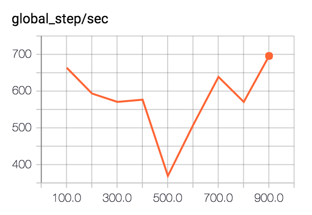
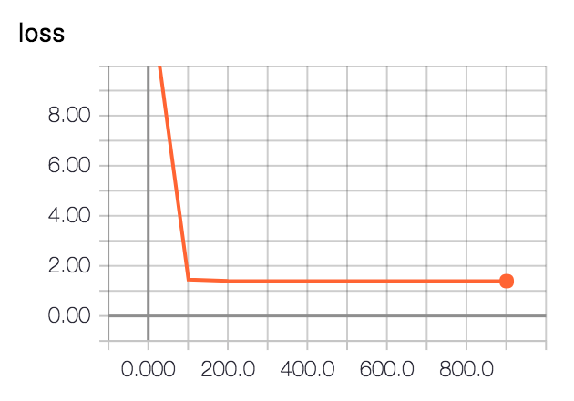

# Simple Regression with a TensorFlow Estimator

With TensorFlow 1.1, the [Estimator](https://www.tensorflow.org/api_guides/python/contrib.learn#estimators) API is now at `tf.estimator`. A number of "canned estimators" are [at](https://www.tensorflow.org/extend/estimators) `tf.contrib.learn`. This higher-level API bakes in some best practices and makes it much easier to do a lot quickly with TensorFlow, similar to using APIs available in other languages.

---

## Data

This example will use the very simple [US Presidential Party and GDP Growth dataset](/20170505-simple_dataset_us_presidential_party_and_gdp_growth/): [president_gdp.csv](/20170505-simple_dataset_us_presidential_party_and_gdp_growth/president_gdp.csv).

The regression problem will be to predict annualized percentage GDP growth from presidential party.

---

## R

[R](https://www.r-project.org/) is made for problems such as this, with an API that makes it quite easy:

```r
> data = read.csv('president_gdp.csv')
> model = lm(growth ~ party, data)
> predict(model, data.frame(party=c('R', 'D')))
##        1        2
## 2.544444 4.332857
```

The dataset is very small, and we won't introduce a train/test split. Linear regression is just a way of calculating means: we expect our model to predict the mean GDP growth conditional on party. Annual GDP growth during Republican presidents has been about 2.5%, and during Democratic presidents about 4.3%.

---

## sklearn

Moving into Python, let's first read in the data and get it ready, using [NumPy](http://www.numpy.org/) and [Pandas](http://pandas.pydata.org/).

```python
import numpy as np
import pandas as pd

data = pd.read_csv('president_gdp.csv')
party = data.party == 'D'
party = np.expand_dims(party, axis=1)
growth = data.growth
```

With R, we relied on automatic handling of categorical variables. Here we explicitly change the strings 'R' and 'D' to be usable in a model: Boolean values will become zeros and ones. We also adjust the `party` data shape to be one row per observation.

Tracking [TensorFlow Python APIs](/20170321-various_tensorflow_apis_for_python/), the Estimator API comes from TF Learn, which is inspired by [scikit-learn](http://scikit-learn.org/). Here's the regression with scikit:

```python
import sklearn.linear_model

model = sklearn.linear_model.LinearRegression()
model.fit(X=party, y=growth)
model.predict([[0], [1]])
## array([ 2.54444444,  4.33285714])
```

---

## TensorFlow

This will abuse the API a little to maximize comparability to the examples above; you'll see warnings when you run the code, which will be addressed in the next section.

```python
import tensorflow as tf

party_col = tf.contrib.layers.real_valued_column(column_name='')
model = tf.contrib.learn.LinearRegressor(feature_columns=[party_col])
```

Unlike with scikit, we need to specify the structure of our regressors when we instantiate the model object. This is done with FeatureColumns. There are several [options](https://www.tensorflow.org/tutorials/wide#selecting_and_engineering_features_for_the_model); `real_valued_column` is probably the simplest but others are useful for general categorical data, etc.

We're providing that data as a simple matrix, so it's important that we use the empty string `''` for `column_name`. If there is a substantial `column_name`, we'll have to provide data in dictionaries with column names as keys.

```python
model.fit(x=party, y=growth, steps=1000)
list(model.predict(np.array([[0], [1]])))
## [2.5422058, 4.3341689]
```

TensorFlow needs to be told how many steps of gradient descent to run, or it will keep going indefinitely, without additional configuration. A thousand iterations gets very close to the results achieved with R and with scikit.

There are a lot of things that `LinearRegressor` takes care of. In this code, we did not have to explicitly:

 * Create any TensorFlow variables.
 * Create any Tensorflow ops.
 * Choose an optimizer or learning rate.
 * Create a TensorFlow session.
 * Run ops in a session.

This API also does a lot more than the R or scikit examples above, and allows for even more extensions.

---

## TensorFlow Extensions

The Estimator API does a lot by default, and allows for a lot more optionally.

First, there is a `model_dir`. Above, TensorFlow automatically used a temporary directory. It's nicer to explicitly choose a `model_dir`.

```python
model = tf.contrib.learn.LinearRegressor(feature_columns=[party_col],
                                         model_dir='tflinreg')
```

The `model_dir` is used for two main purposes:

 * Saving TensorBoard summaries (log info)
 * Saving model checkpoints


### Automatic TensorBoard

[Like](/20170430-tensorflows_queuerunner/) an `input_producer`, an Estimator automatically writes information for TensorBoard. To check them out, point TensorBoard at the `model_dir` and browse to `localhost:6006`.

```bash
$ tensorboard --logdir tflinreg
```

For the example above, we get the model graph and two scalar summaries.

Here's what was was constructed in the TensorFlow graph for our `LinearRegressor`:


In the scalar summaries, we get a measure of how fast the training process was running, in global steps per second:



The variation in speed shown here is not particularly meaningful.

And we get the training loss:



We didn't really need to train for a full thousand steps.

By default, summaries are generated every 100 steps, but this can be set via `save_summary_steps` in a [`RunConfig`](https://www.tensorflow.org/api_docs/python/tf/estimator/RunConfig), along with several other settings.

Further customization, with support for additional metrics, validation on separate data, and even automatic early stopping, is available with [ValidationMonitor](https://www.tensorflow.org/get_started/monitors).


### Automatic Model Save/Restore

After training for 1,000 steps above, TensorFlow saved the model to the `model_dir`. If we point to the same `model_dir` again in a new Python session, the model will be automatically restored from that checkpoint.

```python
import numpy as np
import tensorflow as tf

party_col = tf.contrib.layers.real_valued_column(column_name='')
model = tf.contrib.learn.LinearRegressor(feature_columns=[party_col],
                                         model_dir='tflinreg')
list(model.predict(np.array([[0], [1]])))
## [2.5422058, 4.3341689]
```

For more control over how often and when checkpoints are saved, see [`RunConfig`](https://www.tensorflow.org/api_docs/python/tf/estimator/RunConfig).


### Using input functions

Above, training data was provided via `x` and `y` arguments, which is like how scikit works, but not really what TensorFlow Estimators should use.

The appropriate mechanism is to make an [input function](https://www.tensorflow.org/get_started/input_fn) that returns the equivalents to `x` and `y` when called. The function is passed as the `input_fn` argument to `model.fit()`, for example.

This approach is flexible and makes it easy to avoid, for example, keeping track of separate data structures for data and labels.


### Distributed Training

Among the `tf.contrib.learn` [goodies](https://www.tensorflow.org/api_guides/python/contrib.learn) is [`tf.contrib.learn.Experiment`](https://www.tensorflow.org/api_docs/python/tf/contrib/learn/Experiment), which works with an Estimator to help do distributed training. It looks like this one is still settling down, with a lot of deprecated bits at the moment. I'm interested to see more about this. For now, you could check out a Google Cloud ML [example](https://github.com/GoogleCloudPlatform/cloudml-samples/blob/master/iris/trainer/task.py) that works with `learn_runner`.


---

I'm working on [Building TensorFlow systems from components](http://conferences.oreilly.com/oscon/oscon-tx/public/schedule/detail/57823), a workshop at [OSCON 2017](https://conferences.oreilly.com/oscon/oscon-tx).
