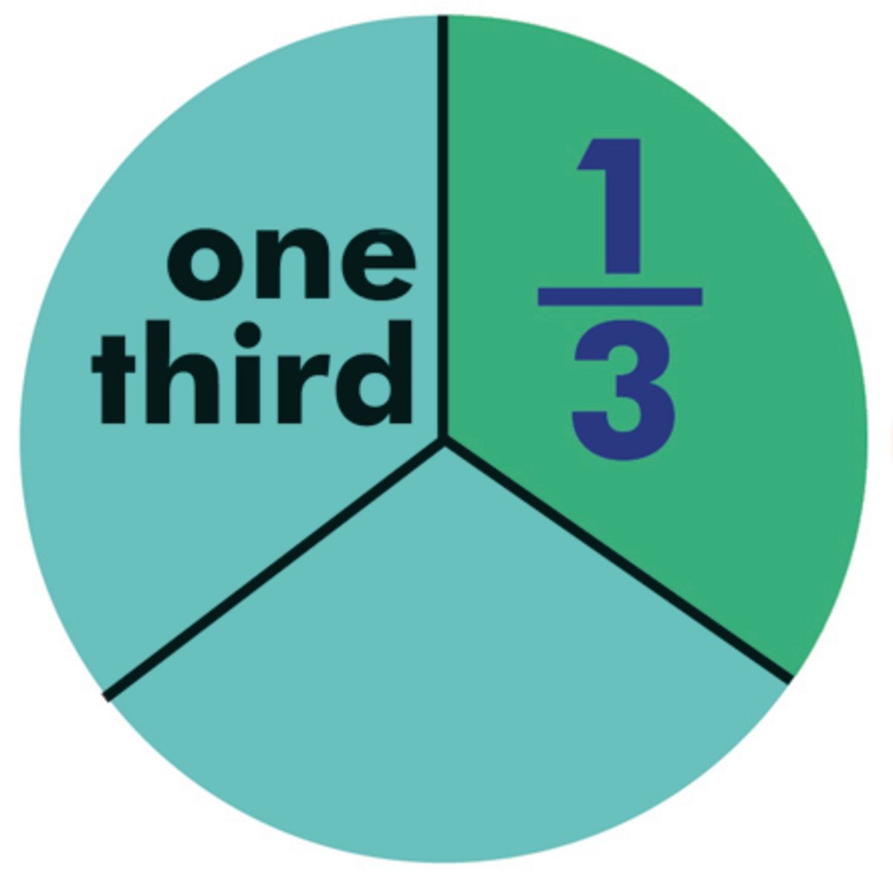
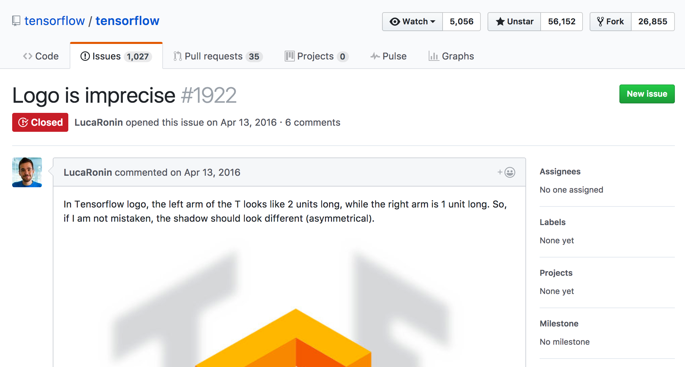
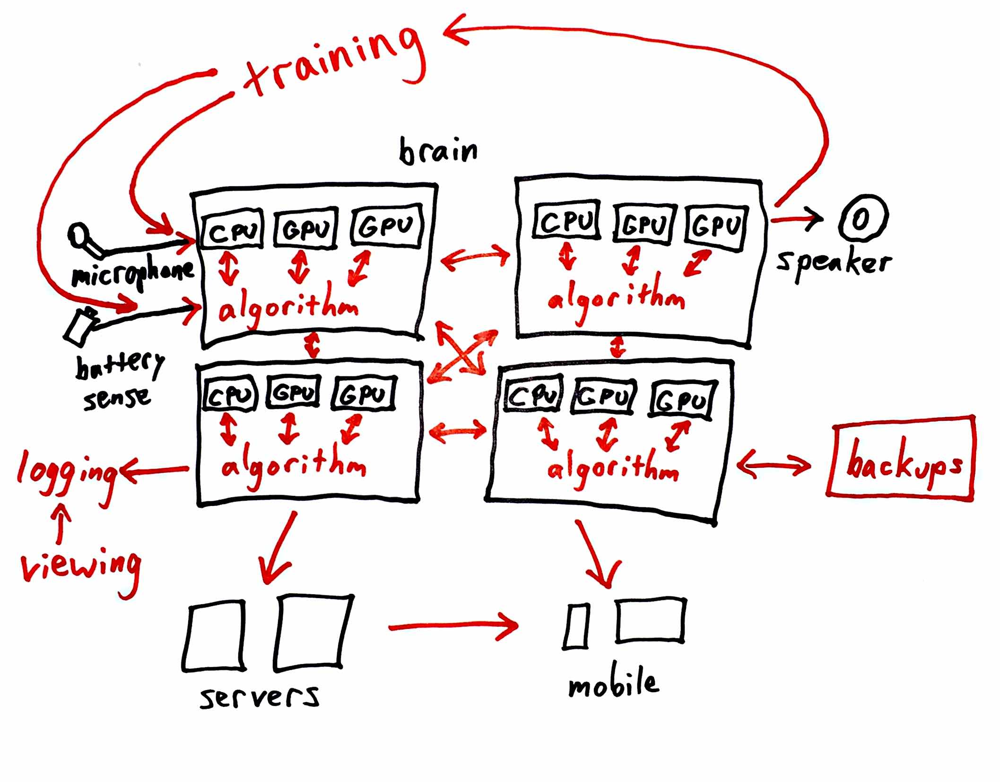
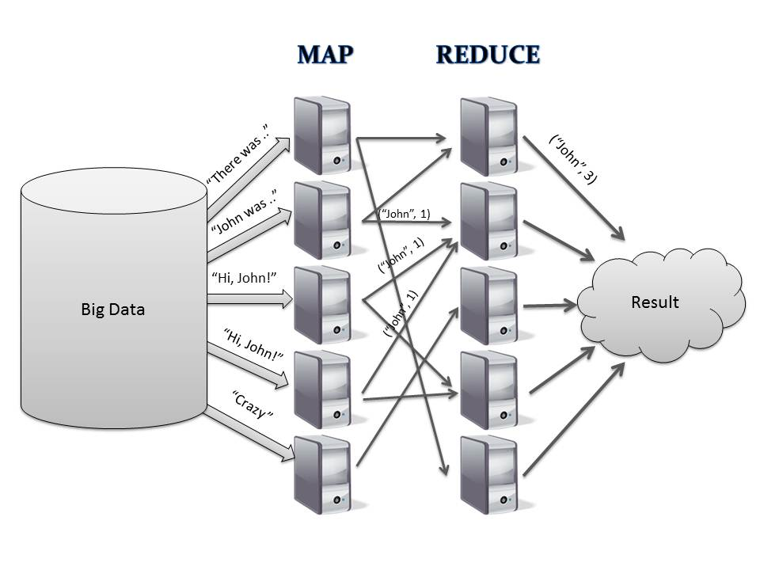
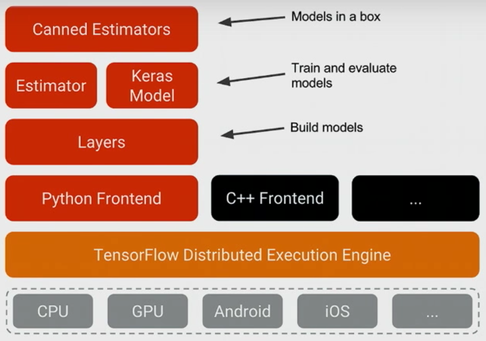
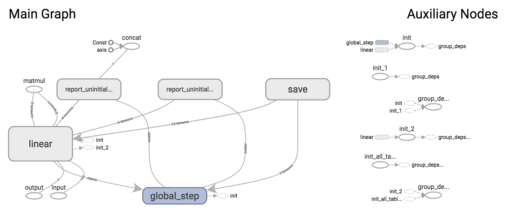

# Building TensorFlow Systems from Components

*These are materials for a [workshop](https://conferences.oreilly.com/oscon/oscon-tx/public/schedule/detail/57823) given Tuesday May 9, 2017 at [OSCON](https://conferences.oreilly.com/oscon/). ([slides](big.html))*

---

### Workshop participant materials

These are things you can use during the workshop. Use them when you need them.

 * Focus one: _getting data in_
     * Download notebook: [start state](data_start.ipynb) / [end state](data_end.ipynb)
     * View notebook on GitHub: [start state](https://github.com/ajschumacher/ajschumacher.github.io/blob/master/20170509-building_tensorflow_systems_from_components/data_start.ipynb) / [end state](https://github.com/ajschumacher/ajschumacher.github.io/blob/master/20170509-building_tensorflow_systems_from_components/data_end.ipynb)
     * [`mystery.tfrecords`](/20170425-mystery.tfrecords/)
 * Focus two: _distributed programs_
     * [`mapreduce_with_tensorflow` code and data](https://github.com/ajschumacher/mapreduce_with_tensorflow/)
     * [Command-Line Apps and TensorFlow](/20170314-command_line_apps_and_tensorflow/)
     * [TensorFlow Clusters: Questions and Code](/20170410-tensorflow_clusters_questions_and_code/)
     * [Distributed MapReduce with TensorFlow](/20170411-distributed_mapreduce_with_tensorflow/)
     * [TensorFlow as Automatic MPI](/20170423-tensorflow_as_automatic_mpi/)
 * Focus three: _high-level ML APIs_
     * Download notebook: [start state](high_ml_start.ipynb) / [end state](high_ml_end.ipynb)
     * View notebook on GitHub: [start state](https://github.com/ajschumacher/ajschumacher.github.io/blob/master/20170509-building_tensorflow_systems_from_components/high_ml_start.ipynb) / [end state](https://github.com/ajschumacher/ajschumacher.github.io/blob/master/20170509-building_tensorflow_systems_from_components/high_ml_end.ipynb)
     * [Simple Regression with a TensorFlow Estimator](/20170506-simple_regression_with_a_tensorflow_estimator/)
     * [Canned Models with Keras in TensorFlow](/20170502-canned_models_with_keras_in_tensorflow/)

The whole slide deck and everything follows, and it's long.


-----

Thank you!

-----

Before starting, I want to take a moment to notice how great it is to have a conference. Thank you for being here! We are all really lucky. If this isn't nice, I don't know what is.


-----

<center>
planspace.org

@planarrowspace
</center>

-----

Hi! I'm Aaron. This is my blog and [my twitter handle](https://twitter.com/planarrowspace). You can get from one to the other. [This presentation](big.html) and a corresponding write-up (you're reading it) are on my blog (which you're on).

If you want to participate in the workshop, _really go_ to `planspace.org` and pull up these materials!


-----

```bash
$ pip install --upgrade tensorflow
$ pip freeze | grep tensorflow
## tensorflow==1.1.0
```

-----

You'll want to have TensorFlow version 1.1 installed. TensorFlow 1.1 was only officially released on April 20, and the API really has changed.

The _core documented_ API, mostly the low-level API, is frozen as of TensorFlow 1.0, but a lot of higher-level stuff is still changing. TensorFlow 1.1 brings in some really neat stuff, like Keras, which we'll use later.


-----


-----

As an example: I wrote [Hello, TensorFlow!](https://www.oreilly.com/learning/hello-tensorflow) about a year ago. It used TensorFlow 0.8.

After TensorFlow 1.0 came out, I went and looked at the summary code block at the end of "[Hello, TensorFlow!](https://www.oreilly.com/learning/hello-tensorflow)". It had 15 lines of TensorFlow code. Of that, 5 lines no longer worked. I had to update 33% of the lines of my simple TensorFlow example code because of API changes.


-----



-----

I was surprised that it was one third.

I have an [updated code snippet](/20160620-hello_tensorflow_just_the_code/), but we're not doing "[Hello, TensorFlow!](https://www.oreilly.com/learning/hello-tensorflow)" today.


-----

```bash
$ pip install --upgrade tensorflow
$ pip freeze | grep tensorflow
## tensorflow==1.1.0
```

-----

So please have TensorFlow 1.1 installed, is the point of that whole story.

The stable bits of TensorFlow really are stable, but there's a lot of exciting new stuff, and I don't want you to miss out today!


-----

THE BIG IDEA

-----

Okay! What is this workshop about?


-----

use what you need

-----

TensorFlow works for you! Use it where it does things that help you.

TensorFlow is a tool. It's a very general tool, on the one hand. It's also a tool with lots of pieces. You can use [some](/20170312-use_only_what_you_need_from_tensorflow/) of the pieces. Or you can decide not to use TensorFlow altogether!

We'll look at several specific aspects of TensorFlow. Maybe you'll want to use them. Maybe you won't. The hope is that you'll be more comfortable with what's available and able to decide what to apply when.

If you like [Rich Hickey words](https://www.infoq.com/presentations/Simple-Made-Easy), maybe I'm trying to _decomplect_ the strands within TensorFlow so they can be understood individually.


-----

THE PLAN

-----

Here's the plan for this workshop.


-----

 * one short work
 * three longer works

-----

I'll talk about some things, but the hope of the workshop is that you do some good work.

I hope that you don't finish all the things you think of, but want to keep working after the workshop is over.

Also, there's a break from 10:30 to 11:00 on the official schedule, but I don't really like that. If we happen to be working during the break, fine. Feel free to take a break whenever you need a break.


-----

Do what you want!

-----

TensorFlow is really big, and not every part will be interesting or important to you.

I'll have very specific things for you to work on for each of the works, but if you think of something better to do, you better do it!


-----

Intro by Logo

-----

To get creative juices flowing a little, let's explore some logo history.


-----


-----

Not that sort of [Logo](https://en.wikipedia.org/wiki/Logo_(programming_language))!

Fine to think about, though.


-----


-----

In the beginning, there was [Gödel, Escher, Bach: An Eternal Golden Braid](https://en.wikipedia.org/wiki/G%C3%B6del,_Escher,_Bach) by Douglas Hofstadter.

This "metaphorical fugue on minds and machines in the spirit of Lewis Carroll" includes the [strange loop](https://en.wikipedia.org/wiki/Strange_loop) idea and related discussion of consciousness and formal systems. Hofstadter's influence can be seen, for example, [in the name](https://cs.illinois.edu/news/strange-loop-conference) of the [Strange Loop](http://www.thestrangeloop.com/) tech conference.

It seems likely that many people working in artificial intelligence and machine learning have encountered Gödel, Escher, Bach.


-----


-----

Of course, there's also [Chernin Entertainment](https://en.wikipedia.org/wiki/Chernin_Entertainment), the production company.

So we shouldn't rule out the possibility that Google engineers are fans of [Chernin's work](http://www.imdb.com/company/co0286257/). [Hidden Figures](https://en.wikipedia.org/wiki/Hidden_Figures) is quite good. And I guess a lot of people like [New Girl](https://en.wikipedia.org/wiki/New_Girl)?


-----


-----

In any event, somehow we get to this TensorFlow logo:

If you look carefully, does it seem like the right side of the "T" view is too short?


-----



-----

This very serious concern appears as [issue #1922](https://github.com/tensorflow/tensorflow/issues/1922) on the TensorFlow github, and [on the TensorFlow mailing list](https://groups.google.com/a/tensorflow.org/forum/#!topic/discuss/XhO1sqp4l4g) complete with ASCII art illustration.

The consensus response seemed to be some variant of "won't fix" (it wouldn't look as cool, anyway) until...


-----


-----

As of around the 1.0 release of TensorFlow, which was around the first [TensorFlow Dev Summit](https://events.withgoogle.com/tensorflow-dev-summit/), this logo variant seems to be in vogue. It removes the (possibly contentious) shadows, and adds additional imagery in the background.

I want to suggest that the image in the background can be a kind of Rorschach test for at least three ways you might be thinking about TensorFlow.

 * Is it a diagram of connected neurons? Maybe you're interested in TensorFlow because you want to make neural networks.
 * Is it a diagram of a computation graph? Maybe you're interested in TensorFlow for general calculation, possibly using GPUs.
 * Is it a diagram of multiple computers in a distributed system? Maybe you're interested in TensorFlow for its distributed capabilities.

There can be overlap among those interpretations as well, but I hope the point is not lost that TensorFlow can be different things to different people.


-----

short work

-----

I want to get you thinking about systems without further restriction. The idea is to imagine and start fleshing out a system that might involve TensorFlow.

Later on we'll follow the usual workshop pattern of showing you something you can do and having you do it. But it's much more realistic and interesting to start from something you want to do and then try to figure out how to do it. So let's start from the big picture.


-----

draw a system!

 * block diagram
 * add detail
 * pseudocode?

-----

You can draw a system you've already made, or something you're making, or something you'd like to make. It could be something you've heard about, or something totally unique.

You don't have to know how to build everything in the system. You don't need to know how TensorFlow fits in. Feel free to draw what you _wish_ TensorFlow might let you do.

Keep adding more detail. If you get everything laid out, start to think about what functions or objects you might need to have, and start putting pseudocode together.


-----

short work over

-----

Moving right along...


-----

Let's do hard AI!

-----

I'm going to walk through an example and talk about how TensorFlow can fit in.

Doing hard AI, or Artificial General Intelligence (AGI), is intended as a joke, but it's increasingly less so, with Google DeepMind and OpenAI both explicitly working on getting to AGI.


-----

(build)

-----

I've got 35 slides of sketches, so they're in [a separate PDF](build.pdf) to go through.


-----



-----

Here's the final system that we built to.

We're not going to do everything in there today.


-----

 * getting data in
 * distributed programs
 * high-level ML APIs

-----

These are the three focuses for today.

The [original description](https://conferences.oreilly.com/oscon/oscon-tx/public/schedule/detail/57823) for this workshop also mentioned serving, but I'm not covering it today. Sorry. Not enough time.


-----

What even is TensorFlow?

-----

Here's one way to think about TensorFlow.


-----


-----

The beating heart of TensorFlow is the Distributed Execution Engine, or runtime.

One way to think of it is as a [virtual machine](/20170328-tensorflow_as_a_distributed_virtual_machine/) whose language is the TensorFlow graph.

That core is written in C++, but lots of TensorFlow functionality lives in the frontends. In particular, there's a lot in the Python frontend.

(Image from the TensorFlow Dev Summit 2017 [keynote](https://www.youtube.com/watch?v=4n1AHvDvVvw).)


-----


-----

Python is the richest frontend for TensorFlow. It's what we'll use today.

You should remember that not everything in the Python TensorFlow API touches the graph. Some parts are just Python.


-----


-----

R has an unofficial [TensorFlow API](https://rstudio.github.io/tensorflow/) which is kind of interesting in that it just wraps the Python API. It's really more like an R API to the Python API to TensorFlow. So when you use it, you write R, but Python runs. This is not how TensorFlow encourages languages to implement TensorFlow APIs, but it's out there.


-----


-----

The way TensorFlow encourages API development is via TensorFlow's C bindings.


-----


-----

You could use C++, of course.


-----


-----

Also there's Java.


-----


-----

And there's Go.


-----


-----

And there's Rust.


-----


-----

And there's even Haskell!


-----


-----

Currently, languages other than Python have TensorFlow support that is very close to the runtime. Basically make your ops and run them.

This is likely to be enough support to deploy a TensorFlow system in whatever language you like, but if you're developing and training systems you probably still want to use Python.


-----

graph or not graph?

-----

So this is a distinction to think about: Am I using the TensorFlow graph, or not?


-----

 * getting data in

-----

So here we are at the first focus area.

We'll do two sub-parts.


-----

 * getting data in
     * to the graph
     * TFRecords

-----


First, a quick review of the the graph and putting data into it.

Second, a bit about TensorFlow's TFRecords format.


-----

(notebook)

-----

There's a Jupyter notebook to talk through at this point.

 * Download: [start state](data_start.ipynb) / [end state](data_end.ipynb)
 * View on GitHub: [start state](https://github.com/ajschumacher/ajschumacher.github.io/blob/master/20170509-building_tensorflow_systems_from_components/data_start.ipynb) / [end state](https://github.com/ajschumacher/ajschumacher.github.io/blob/master/20170509-building_tensorflow_systems_from_components/data_end.ipynb)


-----

long work

-----

It's time to do some work!


-----

work with data!

 * your own system?
 * planspace.org: `mystery.tfrecords`
 * move to graph

-----

Option one is always to work on your own system. Almost certainly there's some data input that needs to happen. How are you going to read that data, and possibly get it into TensorFlow?

If you want to stay really close to the TensorFlow stuff just demonstrated, here's a fun little puzzle for you: What's in [`mystery.tfrecords`](/20170425-mystery.tfrecords/)?

That could be hard, or it could be easy. If you want to extend it, migrate the reading and parsing of the TFRecords file into the TensorFlow graph. The demonstration in the notebook worked with TFRecords/Examples without using the TensorFlow graph. The links on the [`mystery.tfrecords`](/20170425-mystery.tfrecords/) page can help with this.


-----

long work over

-----

Moving right along...


-----


-----

As a wrap-up: Working directly with data, trying to get it into the right shape, cleaning it, etc., may not be the most fun, but it's got to be done. Here's a horrible pie chart [from some guy on Forbes](https://www.forbes.com/sites/gilpress/2016/03/23/data-preparation-most-time-consuming-least-enjoyable-data-science-task-survey-says/), the point of which is that people spend a good deal of time fighting with data.


-----

 * distributed programs

-----

We arrive at the second focus area. TensorFlow has some pretty wicked distributed computing capabilities.


-----

 * distributed programs
     * command-line arguments
     * MapReduce example

-----

I'm putting a bit about command-line arguments in here because I think it's interesting. It doesn't necessarily fit in with distributed computing, although you might well have a distributed program that takes command-line arguments. Google Cloud ML can use command-line arguments for hyperparameters, for example.

Then we'll get to a real distributed example, in which we implement a distributed MapReduce word count in 50 lines of Python TensorFlow code.


-----

command-line arguments

-----

So let's take a look at some ways to do command-line arguments.

This section comes from the post [Command-Line Apps and TensorFlow](/20170314-command_line_apps_and_tensorflow/).


-----

```bash
$ python script.py --color red
a red flower
```

-----

I'll show eight variants that all do the same thing. You provide a `--color` argument, and it outputs (in text) a flower of that color.


-----

```python
import sys

def main():
    assert sys.argv[1] == '--color'
    print('a {} flower'.format(sys.argv[2]))

if __name__ == '__main__':
    main()
```

-----

This is a bare-bones `sys.argv` method. Arguments become elements of the `sys.argv` list, and can be accessed as such. This has limitations when arguments get more complicated.


-----

```python
import sys
import tensorflow as tf

flags = tf.app.flags
flags.DEFINE_string(flag_name='color',
                    default_value='green',
                    docstring='the color to make a flower')

def main():
    flags.FLAGS._parse_flags(args=sys.argv[1:])
    print('a {} flower'.format(flags.FLAGS.color))

if __name__ == '__main__':
    main()
```

-----

This `FLAGS` API is [familiar to Googlers](/20170313-tensorflow_use_of_google_technologies/), I think. It's interesting to me where some Google-internal things peak out from the corners of TensorFlow.


-----

```python
import sys
import gflags

gflags.DEFINE_string(name='color',
                     default='green',
                     help='the color to make a flower')

def main():
    gflags.FLAGS(sys.argv)
    print('a {} flower'.format(gflags.FLAGS.color))

if __name__ == '__main__':
    main()
```

-----

You could also install the `gflags` module, which works much the same way.


-----

```python
import sys
import argparse

parser = argparse.ArgumentParser()
parser.add_argument('--color',
                    default='green',
                    help='the color to make a flower')

def main():
    args = parser.parse_args(sys.argv[1:])
    print('a {} flower'.format(args.color))

if __name__ == '__main__':
    main()
```

-----

Here's Python's own standard [`argparse`](https://docs.python.org/3/library/argparse.html), set up to mimic the `gflags` example, still using `sys.argv` explicitly.


-----

```python
import tensorflow as tf

def main(args):
    assert args[1] == '--color'
    print('a {} flower'.format(args[2]))

if __name__ == '__main__':
    tf.app.run()
```

-----

Using `tf.app.run()`, another Google-ism, frees us from accessing `sys.argv` directly.


-----

```python
import tensorflow as tf

flags = tf.app.flags
flags.DEFINE_string(flag_name='color',
                    default_value='green',
                    docstring='the color to make a flower')

def main(args):
    print('a {} flower'.format(flags.FLAGS.color))

if __name__ == '__main__':
    tf.app.run()
```

-----

We can combine `tf.app.run()` with `tf.app.flags`.


-----

```python
import google.apputils.app
import gflags

gflags.DEFINE_string(name='color',
                     default='green',
                     help='the color to make a flower')

def main(args):
    print('a {} flower'.format(gflags.FLAGS.color))

if __name__ == '__main__':
    google.apputils.app.run()
```

-----

To see the equivalent outside the TensorFlow package, we can combine `gflags` and `google.apputils.app`.


-----

```python
import argparse

parser = argparse.ArgumentParser()
parser.add_argument('--color',
                    default='green',
                    help='the color to make a flower')

def main():
    args = parser.parse_args()
    print('a {} flower'.format(args.color))

if __name__ == '__main__':
    main()
```

-----

This has all been fun, but here's what you should really do. Just use `argparse`.


-----

Whew!

-----

That was a lot of arguing.

It may be worth showing all these because you'll encounter various combinations as you read code out there in the world. More recent examples are tending to move to `argparse`, but there are some of the other variants out there as well.


-----

MapReduce example

-----

Now to the MapReduce example!


-----


-----

Recall that the core of TensorFlow is a _distributed_ runtime. What does that mean?


-----

`tf.device()`

-----

Behold, the power of `tf.device()`!


-----
```
with tf.device('/cpu:0'):
    # Do something.
```
-----

You can specify that work happen on a local CPU.


-----
```
with tf.device('/gpu:0'):
    # Do something.
```
-----

You can specify that work happen on a local GPU.


-----
```
with tf.device('/job:ps/task:0'):
    # Do something.
```
-----

In exactly the same way, you can specify that work happen on _a different computer_!

This is pretty amazing. I think of it as sort of [declarative MPI](/20170423-tensorflow_as_automatic_mpi/).


-----


-----

TensorFlow automatically figures out when it needs to send information between devices, whether they're on the same machine or on different machines. So cool!


-----



-----

MapReduce is often associated with Hadoop. It's just divide and conquer.

So let's do it with TensorFlow!


-----

(demo)

-----

It's time to see how this looks in practice! (Well, or at least to see how it looks in a cute little demo.)

The demo uses the contents of the [mapreduce_with_tensorflow](https://github.com/ajschumacher/mapreduce_with_tensorflow) repo on GitHub. For more explanation, see [TensorFlow Clusters: Questions and Code](/20170410-tensorflow_clusters_questions_and_code/) and [Distributed MapReduce with TensorFlow](/20170411-distributed_mapreduce_with_tensorflow/).


-----

(code)

-----

Walking through some details inside [`count.py`](https://github.com/ajschumacher/mapreduce_with_tensorflow/blob/master/count.py).


-----

long work

-----

It's time to do some work!


-----

make something happen!

 * your own system?
 * different distributed functionality?
 * add command-line?

-----

Option one is always to work on your own system. Maybe command-line args are relevant to you. Maybe running a system across multiple machines is relevant for you. Or maybe not.

If you want to exercise the things just demonstrated, you could add a command-line argument to the distributed word-count program. For example, you could make it count only a particular word, or optionally count characters, or something else. Or you could change the distributed functionality without any command-line fiddling. (You could make it a distributed neural net training program, for example.)

Here are some links that might be helpful:

 * [Command-Line Apps and TensorFlow](/20170314-command_line_apps_and_tensorflow/)
 * [TensorFlow Clusters: Questions and Code](/20170410-tensorflow_clusters_questions_and_code/)
 * [Distributed MapReduce with TensorFlow](/20170411-distributed_mapreduce_with_tensorflow/)
 * [TensorFlow as Automatic MPI](/20170423-tensorflow_as_automatic_mpi/)


-----

long work over

-----

Moving right along...


-----


-----

I should probably say that you don't really want to start all your distributed TensorFlow programs by hand. [Containers](https://www.docker.com/) and [Kubernetes](https://kubernetes.io/) and all that.


-----

 * high-level ML APIs

-----

Let's to some machine learning!


-----



-----

New and exciting things are being added in TensorFlow Python land, building up the ladder of abstraction.

This material comes from [Various TensorFlow APIs for Python](/20170321-various_tensorflow_apis_for_python/).

(Image from the TensorFlow Dev Summit 2017 [keynote](https://www.youtube.com/watch?v=4n1AHvDvVvw).)


-----


-----

The "layer" abstractions largely from TF-Slim are now appearing at `tf.layers`.


-----


-----

The Estimators API now at `tf.estimator` is drawn from `tf.contrib.learn` work, which is itself heavily inspired by scikit-learn.


-----


-----

And Keras is entering TensorFlow first as `tf.contrib.keras` and soon just `tf.keras` with version 1.2.


-----

 * high-level ML APIs
     * training an Estimator
     * pre-trained Keras

-----

So let's try this out!


-----

(notebook)

-----

There's a Jupyter notebook to talk through at this point.

 * Download: [start state](high_ml_start.ipynb) / [end state](high_ml_end.ipynb)
 * View on GitHub: [start state](https://github.com/ajschumacher/ajschumacher.github.io/blob/master/20170509-building_tensorflow_systems_from_components/high_ml_start.ipynb) / [end state](https://github.com/ajschumacher/ajschumacher.github.io/blob/master/20170509-building_tensorflow_systems_from_components/high_ml_end.ipynb)

There's also a TensorBoard demo baked in there. A couple backup slides follow.


-----



-----

This is what the graph should look like in TensorBoard.


-----


-----

Steps per second should look something like this.


-----


-----

Loss should look like this.


-----


-----

I just enjoy this image too much not to share it.


-----

long work

-----


It's time to do some work!


-----

make something happen!

 * your own system?
 * flip regression to classification?
 * classify some images?

-----

Option one is always to work on your own system. Do you need a model of some kind in your system? Maybe you can use TensorFlow's high-level machine learning APIs.

If you want to work with the stuff just shown some more, that's also totally cool! Instead of simple regression, maybe you want to flip the presidential GDP problem around to be logistic regression. TensorFlow has `tf.contrib.learn.LinearClassifier` for that. And many more variants!

Or maybe you want to classify your own images, or start to poke around the model some more. Also good! If you want more example images, there's [this set](https://github.com/ajschumacher/imagen).

Here are some links that could be helpful:

 * [Simple Regression with a TensorFlow Estimator](/20170506-simple_regression_with_a_tensorflow_estimator/)
 * [Canned Models with Keras in TensorFlow](/20170502-canned_models_with_keras_in_tensorflow/)


-----

long work over

-----

Moving right along...


-----


-----

Oh my! Are we out of time already?


-----

What else?

-----

There are a lot of things we haven't covered.


-----

debugging, optimizing (XLA, low-precision, etc.), serving, building custom network architectures, embeddings, recurrent, generative, bazel, protobuf, gRPC, queues, threading...

-----

Here's a list of the first things that came to mind.

I hope you continue to explore!


-----

Thanks!

-----

Thank you!


-----

<center>
planspace.org

@planarrowspace
</center>

-----

This is just me again.
