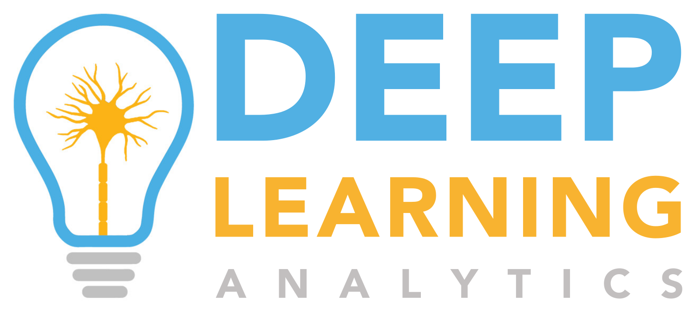
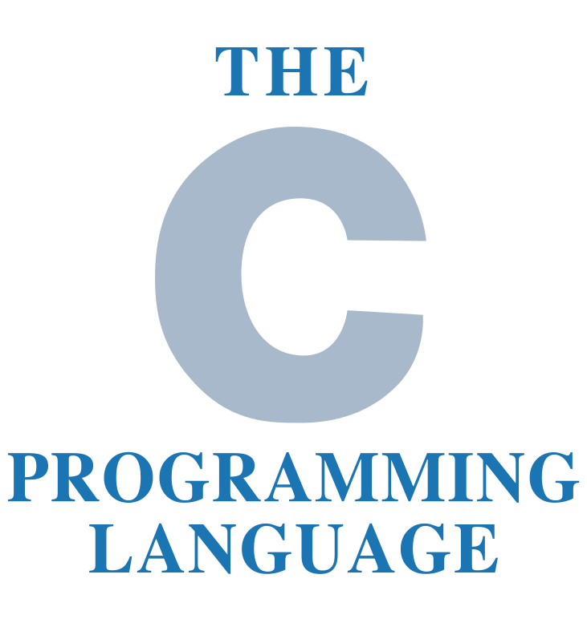
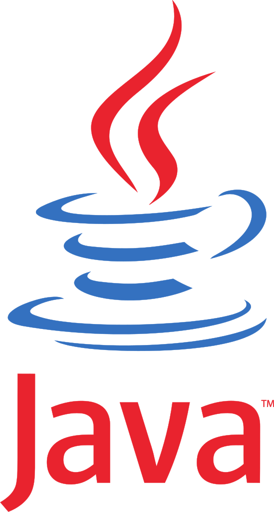
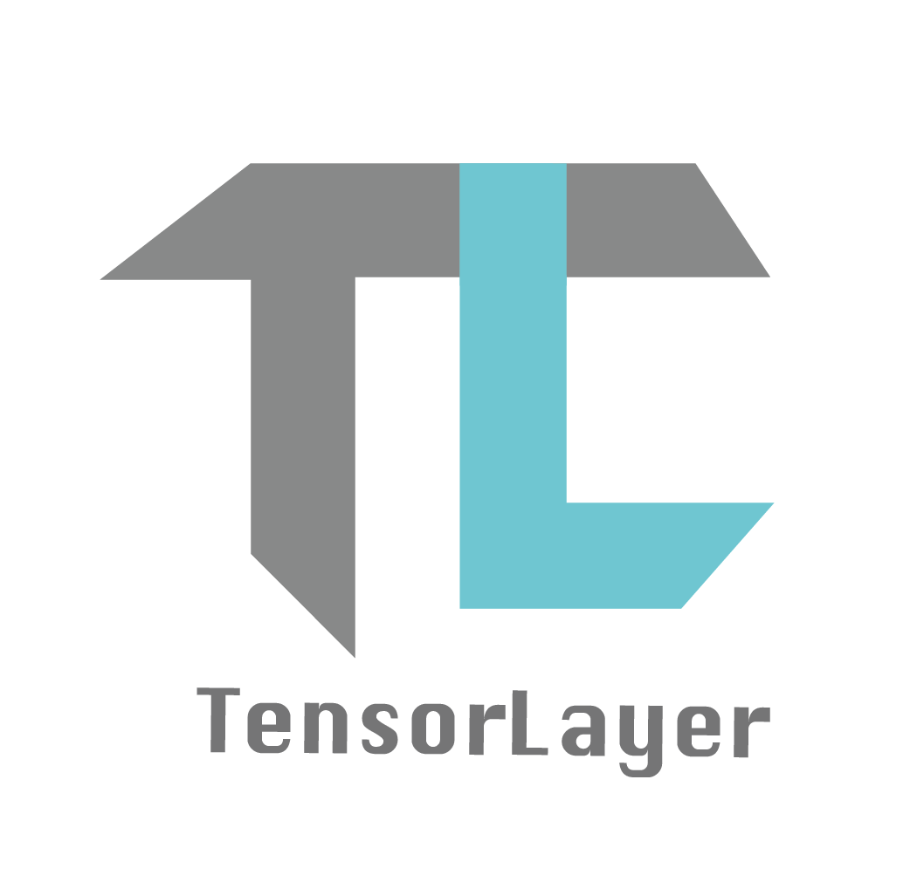
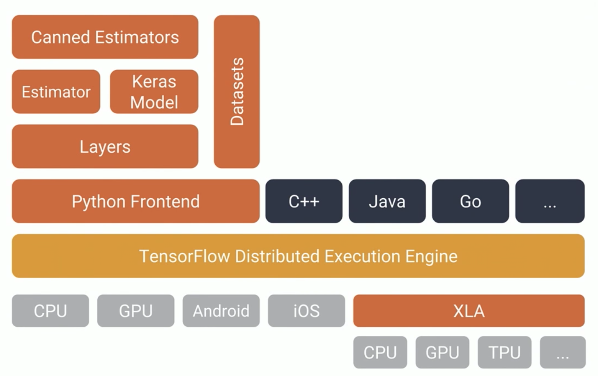
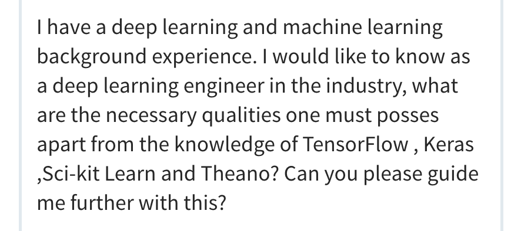

# More and Better: The New TensorFlow APIs

*These are materials for a [webinar](https://www.altoros.com/blog/event/more-and-better-the-new-tensorflow-apis/) given Wednesday May 24, 2017. ([slides](big.html)) ([video](https://altoros.wistia.com/medias/e5su4b1vtz)) The Jupyter notebook and supporting files for code demos are available in a [repository](https://github.com/ajschumacher/tf_api_20170524) on GitHub.*


-----

Thank you!

-----

Before starting, I want to take a moment to notice how great it is to have a webinar. Thank you for checking it out! We are all really lucky. If this isn't nice, I don't know what is.


-----

<center>
planspace.org

@planarrowspace
</center>

-----

Hi! I'm Aaron. This is my blog and [my twitter handle](https://twitter.com/planarrowspace). You can get from one to the other. [This presentation](big.html) and a corresponding write-up (you're reading it) are on my blog (which you're on).


-----



-----

I work for a company called Deep Learning Analytics. You can find out more about DLA at [deeplearninganalytics.com](https://www.deeplearninganalytics.com/). We work with a number of frameworks, and I've been keeping an eye on TensorFlow.

I do _not_ work for Google, and I'm not a core TensorFlow developer. I'm just talking about my view of things, which is not authoritative or official.


-----

motivation

-----

Why this talk? What is it about, and who should care?


-----

"a low-level library, meaning you’ll be multiplying matrices and vectors." (2015)

-----

This is a description of TensorFlow from an [article](http://fastml.com/what-you-wanted-to-know-about-tensorflow/) that came out the same month TensorFlow was released, in November of 2015. It was pretty true then.

Some people thought this was fine. It was like [Theano](http://deeplearning.net/software/theano/).

Some people thought it was not so fine, and so they may have decided TensorFlow was not for them.

But while Theano hasn't radically expanded its API to include tons of higher-level ways of using it, TensorFlow has. TensorFlow is no longer only a low-level library.


-----

```python
...TensorFlow 1.2.0rc0
```

-----

TensorFlow wasn't "finished" when it was released as open source. It only hit version 1.0 in February of this year. And that means the low-level API is largely stabilized. But high-level APIs are being added at a rapid pace.

I gave a [workshop](/20170509-building_tensorflow_systems_from_components/) on TensorFlow at [OSCON](https://conferences.oreilly.com/oscon/) two weeks ago, and one of the APIs I'll talk about today is new since then. I'll also mention things that aren't going to be in TensorFlow for at least a few weeks yet.

(I'm referring to the [`Dataset` API](https://github.com/tensorflow/tensorflow/tree/master/tensorflow/contrib/data), which entered `contrib` in 1.2, and the Keras model `get_estimator` method, respectively.)


-----

"I don't know which API to use." (2017)

-----

This is a sentiment I encountered in talking to people at the [DC Deep Learning Working Group](https://www.meetup.com/DC-Deep-Learning-Working-Group/).

There are now so many ways of using TensorFlow, it can be overwhelming, and you might not know where to start. If you do jump in, you might only see one part of the API and not know what else you're missing.


-----

a tour of TensorFlow APIs

-----

This talk is not for people who are expert TensorFlow developers or people who have been following TensorFlow development super closely.

This talk is for people who are new to TensorFlow, or people who may have tried TensorFlow in the past but haven't been following more recent developments.

The hope is that you'll understand better the options you have for using TensorFlow and be able to choose what to explore.


-----

 * language survey
 * Python survey
 * Python focus

-----

We'll start very broad and then narrow in on a few high-level APIs for TensorFlow.

First, considering the way TensorFlow works with multiple programming languages can illuminate the core of TensorFlow's low-level design. This introduces the low-level Python API, and the key distinction between implementations on and off the TensorFlow graph.

We're not going to cover them all equally, but we'll survey a lot of Python API options and how they relate.

Finally, we'll focus on aspects of the core TensorFlow Python APIs, especially Keras and the Estimator API, with a little bit more detail and code examples.

(The following section is based on [TensorFlow APIs for Various Languages](/20170320-tensorflow_apis_for_various_languages/).)

-----

What even is TensorFlow?

-----

Here's one way to think about TensorFlow.


-----


-----

The beating heart of TensorFlow is the Distributed Execution Engine, or runtime.

One way to think of it is as a [virtual machine](/20170328-tensorflow_as_a_distributed_virtual_machine/) whose language is the TensorFlow graph.

That core is written in C++, but lots of TensorFlow functionality lives in the frontends. In particular, there's a lot in the Python frontend.

(Image from the TensorFlow Dev Summit 2017 [keynote](https://www.youtube.com/watch?v=4n1AHvDvVvw).)


-----


-----

Python is the richest frontend for TensorFlow. It's what we'll use today.

You should remember that not everything in the Python TensorFlow API touches the graph. Some parts are just Python.


-----


-----

R has an unofficial [TensorFlow API](https://rstudio.github.io/tensorflow/) which is kind of interesting in that it just wraps the Python API. It's really more like an R API to the Python API to TensorFlow. So when you use it, you write R, but Python also runs. This is not how TensorFlow encourages languages to implement TensorFlow APIs, but it's out there.


-----



-----

The way TensorFlow encourages API development is via TensorFlow's C bindings.


-----


-----

You could use C++, of course.


-----



-----

Also there's Java.


-----


-----

And there's Go.

Python, C++, Java, and Go are the only languages with official Google-blessed TensorFlow APIs. But there are projects offering APIs that interface with TensorFlow via the C bindings.


-----


-----

There's Rust.


-----


-----

And there's C#.


-----


-----

And there's Julia.


-----


-----

And there's even Haskell!


-----


-----

Currently, a rough summary is that languages other than Python have TensorFlow support that is close to the runtime. Basically make your ops and run them.

This is likely to be enough support to deploy a TensorFlow system doing inference in whatever language you like, but if you're developing and training systems you probably still want to use Python.


-----

graph or not graph?

-----

So this is a distinction to think about: Am I using the TensorFlow graph, or not?

The distinction will be pretty clear when using the low-level API. It becomes less obvious when using higher-level APIs, but the situation there is that you can safely assume they're using the graph.


-----

Python APIs

-----

So, what's this about multiple Python APIs?

TensorFlow started with a low-level API, and it's always been possible and even a good idea to build higher-level APIs on top of it. Plenty of people have done so.

Let's start by checking out some APIs that are entirely outside of TensorFlow.

(The following section is based on [Various TensorFlow APIs for Python](/20170321-various_tensorflow_apis_for_python/).)


-----


-----

It seems like lots of projects got names involving one or the other of "tensor" or "flow". It doesn't mean they're part of TensorFlow, and it doesn't mean they're good.

Of course, maybe they are; some of these could be good for you, for all I know.


-----


-----

The confusingly named [TFLearn](https://github.com/tflearn/tflearn) (no space; perhaps more clearly identified as [TFLearn.org]((http://tflearn.org/))) is not at all the same thing as the TF Learn (with a space) that appears in TensorFlow at `tf.contrib.learn`. TFLearn is a [separate](http://stackoverflow.com/questions/38859354/what-is-the-difference-between-tf-learn-aka-scikit-flow-and-tflearn-aka-tflea) Python package that uses TensorFlow. It seems like it aspires to be like Keras. Even the TFLearn logo looks like a knock-off.


-----



-----

Another one with a confusing name is [TensorLayer](https://github.com/zsdonghao/tensorlayer/). This is a separate package from TensorFlow and it's different from TensorFlow's layers API.


-----

ImageFlow

-----

[ImageFlow](https://github.com/HamedMP/ImageFlow) was supposed to make it easier to do image work with TensorFlow. It looks like it's abandoned.


-----

Pretty Tensor

-----

[Pretty Tensor](https://github.com/google/prettytensor) is still a Google project, so it might be worth checking out if you really like [fluent interfaces](https://en.wikipedia.org/wiki/Fluent_interface) with lots of chaining, like [d3](https://d3js.org/).


-----


-----

Google's [DeepMind](https://deepmind.com/) group [released](https://deepmind.com/blog/open-sourcing-sonnet/) their [Sonnet](https://github.com/deepmind/sonnet) library, which is used in the code for their [learning to learn](https://github.com/deepmind/learning-to-learn) and [Differentiable Neural Computer](https://github.com/deepmind/dnc) projects. Sonnet isn't part of TensorFlow (it builds on top) but it is a Google project. Sonnet has a modular approach compared to that of [Torch/NN](https://github.com/torch/nn). Also they have a cool logo.


-----


-----

The previous APIs exist outside of TensorFlow. Let's now talk about APIs _inside_ TensorFlow.

We'll trace the development of the stack of available APIs before looking at some code examples.

(Image from the TensorFlow Dev Summit 2017 [keynote](https://www.youtube.com/watch?v=4n1AHvDvVvw).)


-----

Python Frontend (op level)

-----

You can continue to use TensorFlow's low-level APIs.

There are ops, like `tf.matmul` and `tf.nn.relu`, which you might use to build a neural network architecture in full detail. To do really novel things, you may want this level of control. But you may also prefer to work with larger building blocks. The other other APIs below will mostly specialize in this kind of application.

There are also ops like `tf.image.decode_jpeg` (and many others) which may be necessary but don't necessarily relate to what is usually considered the architecture of neural networks. Some higher-level APIs wrap some of this functionality, but they usually stay close to the building of network architectures and the training of such networks once defined.


-----

Layers

-----

The "layer" abstraction is a natural way to think about deep neural network design.

This `layers` API provides a first higher level of abstraction over writing things out by individual ops. For example, `tf.layers.conv2d` implements a convolution layer that involves multiple individual ops.


-----


-----

You may have heard of [TF-Slim](https://research.googleblog.com/2016/08/tf-slim-high-level-library-to-define.html). TF-Slim has a number of [components](https://github.com/tensorflow/tensorflow/tree/master/tensorflow/contrib/slim) but it looks like essentially we're seeing the following: `tf.contrib.slim.layers` became `tf.contrib.layers` becomes `tf.layers`.

Sergio Guadarrama, one of the TF-Slim authors, generously confirmed that TensorFlow is converging on a layers API and implementation along these lines, but warns that there can still be some differences. He points out that `tf.contrib.layers` have [`arg_scope`](https://www.tensorflow.org/versions/master/api_docs/python/tf/contrib/framework/arg_scope), while `tf.layers` don't.

Other parts of TF-Slim are likely also worth using, and there is a collection of [models that use TF-Slim](https://github.com/tensorflow/models/tree/master/slim) in the [TensorFlow models repository](https://github.com/tensorflow/models).

Historical note: It looks like before calling them layers, TF-Slim overloaded the word "op" for their layer concept (see [earlier documentation](https://github.com/tensorflow/models/tree/master/inception/inception/slim)).

TF-Slim is in the TensorFlow codebase as `tf.contrib.slim`.


-----


-----

[Keras](https://keras.io/) was around before TensorFlow. It was always a high-level API for neural nets, originally running with [Theano](http://www.deeplearning.net/software/theano/) as its backend.

After the release of TensorFlow, Keras moved to also work with TensorFlow as a backend. And now TensorFlow is absorbing at least some aspects of the Keras project into the TensorFlow codebase, though [François Chollet](https://twitter.com/fchollet) seems likely to continue championing Keras as a very fine project in its own right. (See also his response to a [Quora question](https://www.quora.com/What-will-Keras-do-with-TensorFlow-Slim) about any possible relationship between TF-Slim and Keras.)

Keras is appearing in the TensorFlow codebase as [tf.contrib.keras](https://github.com/tensorflow/tensorflow/tree/master/tensorflow/contrib/keras) and should move to `tf.keras` at TensorFlow 1.3, at which point it will also be possible to turn Keras models directly into Estimators, which we'll see next.


-----


-----

Distinct from TensorFlow, the [scikit-learn](http://scikit-learn.org/) project makes a lot of machine learning models conveniently available in Python.

A key design element of scikit is that many different models offer the same simple API: they are all implemented as _estimators_. So regardless of whether the model is linear regression or a GBM (Gradient Boosting Machine), you get the same simple interface.

The estimators API started as [skflow](https://github.com/tensorflow/skflow) ("scikit-flow") before moving into the TensorFlow codebase as [tf.contrib.learn](https://github.com/tensorflow/tensorflow/tree/master/tensorflow/contrib/learn/python/learn) ("TF Learn") and now the base estimator code is getting situated in [tf.estimator](https://github.com/tensorflow/tensorflow/tree/master/tensorflow/python/estimator) and [documentation](/20170521-navigating_tensorflow_estimator_documentation/) is accumulating.


-----

Estimators

-----

The Estimators API really just defines an interface. You can design models that fit into the Estimator system, or you can use Estimator-based models that are already "set up" to varying degrees.


-----

Canned Estimators

-----

Canned estimators are concrete pre-defined models that follow the estimator conventions. Currently there are a bunch right in `tf.contrib.learn`, such as `LinearRegressor` and `DNNClassifier`. There are some elsewhere. For example, [kmeans](https://github.com/tensorflow/tensorflow/blob/master/tensorflow/contrib/factorization/g3doc/kmeans.md) is in `tf.contrib.factorization`. It isn't clear to me exactly where all the canned estimators will eventually settle down in the API; some may eventually move out of `contrib`.

"Canned Estimators" are a lot like scikit-learn in the level at which they make functionality available to programmers.


-----

 * automatic checkpoints
 * automatic logging
 * separate train/eval/pred
 * easily train distributed

-----

What do you get with Estimators? A bunch of things!


-----


-----

One more thing: loading data. A lot of people have gotten hung up on the complicated multi-thread, multi-queue, queue-runner design that TensorFlow has espoused for loading data.


-----

Datasets

-----

TensorFlow developers [listened](https://github.com/tensorflow/tensorflow/issues/7951), and they came up with [Datasets](https://github.com/tensorflow/tensorflow/tree/master/tensorflow/contrib/data), which is a new API that wraps all the complexity in a pretty nice interface.

This is new as of about a week ago.


-----



-----

So this is the latest diagram from Google I/O. It adds XLA, which I won't talk about.

(Image from [TensorFlow Frontiers](https://www.youtube.com/watch?v=OzAdKMPgUt4) at Google I/O '17.)


-----

code!

-----

Let's look at some code, shall we?

Go to a notebook ([start](https://github.com/ajschumacher/tf_api_20170524/blob/master/APIs_start.ipynb)/[finish](https://github.com/ajschumacher/tf_api_20170524/blob/master/APIs_finish.ipynb)) in the [tf_api_20170524](https://github.com/ajschumacher/tf_api_20170524) repo.


-----

more

-----

For lots more, there are plenty of places you can go.

My [blog](/) is one place.

[TensorFlow](https://www.tensorflow.org/)'s documentation is another.

The latest [video](https://www.youtube.com/watch?v=OzAdKMPgUt4)s from Google is another. The I/O 2017 videos include a few TensorFlow ones, and there's also still the February TensorFlow DevFest video collection.


-----


-----

I want to also mention this book by the author of Keras: [Deep Learning with Python](https://www.manning.com/books/deep-learning-with-python). It's pretty good. If you're looking to understand deep learning, this is now the book I recommend. It's currently in pre-release, and the available chapters are pretty great already. It focuses on Keras rather than TensorFlow per se, but especially since Keras is now _in_ TensorFlow, any Keras thing is also a TensorFlow thing.

The first chapter is free.


-----



-----

I want to close with a thought that is not so much about programming. This is a question I got on LinkedIn, and it made me think.

It is eventually necessary to have some proficiency with particular tools, but the qualities I find most important are not really particular tool skills.

What problem do you need to solve? Can you identify it, articulate it, frame it in a way that makes it tractable? Can you work with what's available to come up with a solution?

I hope knowing more about TensorFlow is helpful to you as you go forward with your work, but I also think it's important to remember that TensorFlow is just a tool. Your success comes from what you do.


-----

Thanks!

-----

Thank you!


-----

<center>
planspace.org

@planarrowspace
</center>

-----

This is just me again.
