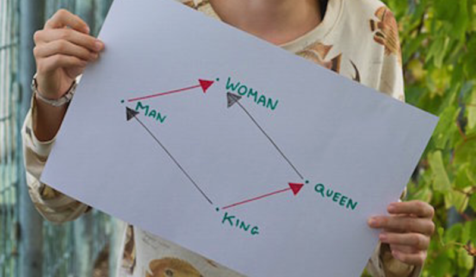

# Word Vectors and SAT Analogies

In 2013, [word2vec](https://code.google.com/archive/p/word2vec/) popularized [word vectors](http://colah.github.io/posts/2014-07-NLP-RNNs-Representations/) and _king - man + woman = queen_.

[](http://p.migdal.pl/2017/01/06/king-man-woman-queen-why.html)

This reminded me of [SAT](https://en.wikipedia.org/wiki/SAT) analogy questions, which [disappeared from the SAT in 2005](http://blog.prepscholar.com/sat-analogies-and-comparisons-why-removed-what-replaced-them), but looked like this:

```
PALTRY : SIGNIFICANCE ::

A. redundant : discussion
B. austere : landscape
C. opulent : wealth
D. oblique : familiarity
E. banal : originality
```

The king/queen example is not difficult, and I don't know whether it was tested or discovered. A better evaluation would use a set of challenging pre-determined questions.

There is a Google set of analogy questions, but all the relationships are grammatical, geographical, or by gender. Typical: "fast : fastest :: old : oldest." ([dataset](http://download.tensorflow.org/data/questions-words.txt), [paper](https://arxiv.org/abs/1301.3781), [context](https://www.aclweb.org/aclwiki/index.php?title=Google_analogy_test_set_(State_of_the_art)))

SAT questions are more interesting. Selecting from fixed answer choices provides a nice guessing baseline (1/5 is 20%) and using a human test means it's easier to get human performance levels (average US college applicant is 57%; human voting is 81.5%).

Michael Littman and Peter Turney have made available [a set of 374 SAT analogy questions](https://www.aclweb.org/aclwiki/index.php?title=SAT_Analogy_Questions_(State_of_the_art)) since 2003. You have to email Turney to get them, and I appreciate that he helped me out.

Littman and Turney [used](http://cogprints.org/4518/1/NRC-48273.pdf) a vector-based approach on their dataset back in 2005. They achieved 47% accuracy (state of the art at the time) which is a nice benchmark.

They made vectors for each word pair using web data. To get a value for "banal : originality" they would search [AltaVista](https://en.wikipedia.org/wiki/AltaVista) for "banal and not originality" and take the log of the number of hits. With a list of 64 connectives they made vectors with 128 components.

I'm using [GloVe](https://nlp.stanford.edu/projects/glove/) and word2vec word vectors that are per-word and based on various text corpora directly. Since the vectors are not specific to particular pairings, they may at a relative disadvantage for the SAT task. To get a vector for a word pair, I just subtract.

Stanford provides a variety of GloVe vectors pre-trained on three different corpora:

 * Twitter (`glove.twitter`)
    * 2B tweets, 27B tokens, 1.2M vocab, uncased
    * as each of 25d, 50d, 100d, & 200d vectors
 * Wikipedia 2014 + Gigaword 5 (`glove.6B`)
    * 6B tokens, 400K vocab, uncased
    * as each of 50d, 100d, 200d, & 300d vectors
 * Common Crawl
    * uncased (`glove.42B`) 42B tokens, 1.9M vocab, 300d vectors
    * cased (`glove.840B`) 840B tokens, 2.2M vocab, 300d vectors

I have one word2vec model: `GoogleNews-vectors` trained on a Google News dataset, providing 300d vectors.


 * The best word vectors for the SAT analogies task (`glove.840B`) achieve 49% accuracy. This outperforms the 2005 47% result, but is still within the confidence bounds of 42.2% to 52.5% that they report.
 * Holding the training set constant and varying the size of the vectors affects performance on the SAT analogies task: bigger vectors work better, though performance may be plateauing around 300d.
 * Twitter data does markedly worse on the SAT analogies task. This is consistent with Twitter's limitations and reputation for being less than erudite.

Trained word vectors provide a fixed vocabulary. When a word was missing, I used a vector of zeros. Most embeddings only missed one to eight words from the 374 questions, but `glove.twitter` missed 105. I also checked accuracies when excluding questions that had unsupported words for a set of embeddings, and the results were remarkably close, even with the Twitter embeddings. So the accuracies are due to the embeddings and not just gaps in the vocabularies.

It is pretty impressive that word vectors work as well as they do on this task, but nobody should consider word vectors a solution to natural language understanding. Problems with word vectors have been pointed out ([source](http://www.aclweb.org/anthology/N15-1098), [source](http://www.aclweb.org/anthology/C/C16/C16-1262.pdf), [source](http://anthology.aclweb.org/W16-2503), [source](https://arxiv.org/abs/1705.11168)).

Still, the idea of word vectors (translating sparse data to a learned dense representation) is super useful, and not just for words. See implementations [in Keras](https://keras.io/layers/embeddings/) and [in TensorFlow](https://www.tensorflow.org/api_docs/python/tf/contrib/layers/embedding_column).

These methods are not the best-performing non-human technique for these SAT analogy questions. Littman and Turney [report](https://www.aclweb.org/aclwiki/index.php?title=SAT_Analogy_Questions_(State_of_the_art)) several. Latent Relational Analysis comes in at 56% accuracy, against the average US college applicant at 57%.

This is a case in which "the average human" is not a good bar for measuring AI success. The average human has a remarkably small vocabulary relative to what a computer should easily handle, not to mention that the average human would not be admitted to most colleges you could name.

---

I'm grateful to the [DC Deep Learning Working Group](https://www.meetup.com/DC-Deep-Learning-Working-Group/) for helpful discussions, and particularly Shabnam Tafreshi and Dmitrijs Milajevs for sharing references at [the January 26, 2017 meeting](https://www.meetup.com/DC-Deep-Learning-Working-Group/events/237114317/). Thanks also to [Travis Hoppe](https://twitter.com/metasemantic) of [DC Hack and Tell](http://dc.hackandtell.org/) for always doing cool things with NLP.

Notes:

 * An [example](https://www.technologyreview.com/s/541356/king-man-woman-queen-the-marvelous-mathematics-of-computational-linguistics/) of word2vec popularization.
 * My code is available at [ajschumacher/sat_analogies](https://github.com/ajschumacher/sat_analogies).
 * All but 20 of the 374 questions have five designed answer choices; those 20 have four and "no : choice" as the last option. To maintain comparability I kept those questions in, though it means a human guessing baseline should be slightly over 20%.
 * For efficiency, I used GloVe values as 2-byte floats, which is lossy. I also tested with 4-byte floats, and the results varied by at most one question, while being much slower to generate.
 * If you don't normalize the relationship vectors to the unit ball, cosine distance appears much more effective than Euclidean distance for this task, and the advantage increases with dimensionality. The effect disappears and the two distances produce almost identical results when the vectors are normalized (varying by at most one question of 374).


