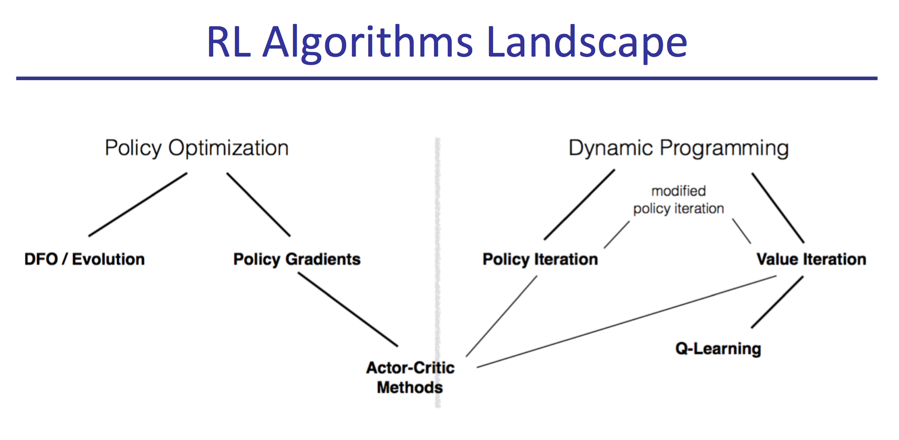
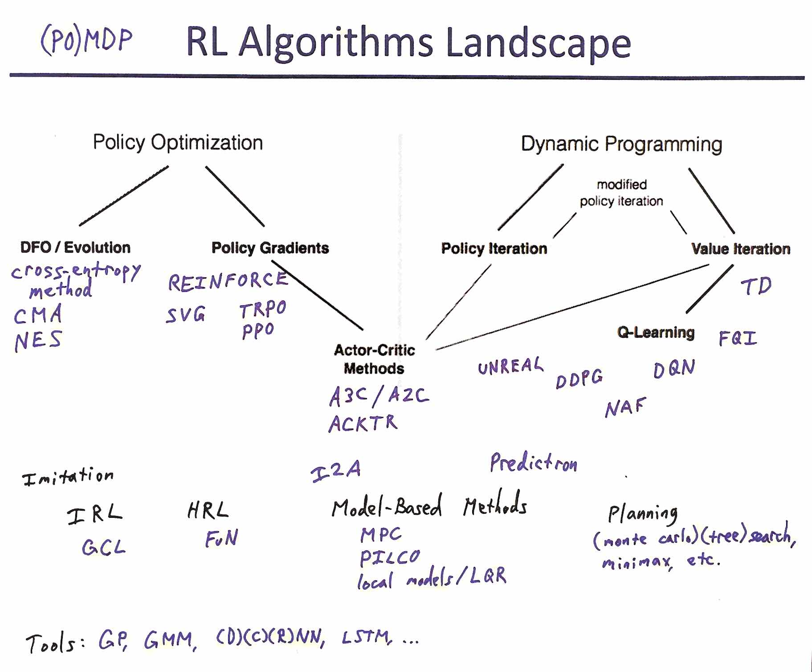

# Berkeley Deep RL Bootcamp

At its conclusion, [Pieter Abbeel](https://people.eecs.berkeley.edu/~pabbeel/) said a major goal of his 2017 [Deep Reinforcement Learning Bootcamp](https://www.deeprlbootcamp.berkeley.edu/) was to broaden the application of RL techniques. Around 250 representatives from research and industry had just emerged from 22 scheduled hours over a Saturday and Sunday in Berkeley. Abbeel asked the attendees to report back with tales of applying algorithms they may not have known existed previously.

Instruction came from leaders of modern reinforcement learning research, all delivering their expertise within a framework that highlighted the large-scale structure of the field. I found their organizing diagram to be particularly helpful.

The reinforcement learning problem statement is simple: at every time step, an agent gets some observation of state \\( s \\), some reward \\( r \\), and chooses an action \\( a \\). So an agent is \\( s,r \rightarrow a \\), and reinforcement learning is largely about rearranging these three letters.

For example, the Q function is \\( s,a \rightarrow \sum{r} \\). You [can](https://en.wikipedia.org/wiki/Bellman_equation) learn that function from experience, and it nicely induces a policy \\( s \rightarrow a \\). If you use a [ConvNet](https://en.wikipedia.org/wiki/Convolutional_neural_network) to learn the Q function, you can then [publish](https://deepmind.com/research/dqn/) in [Nature](https://www.nature.com/).

Of the many good things about the bootcamp, I most valued getting a better conceptual feel for RL. It was also great to hear from experts about practical details, intuitions, and future directions. For all of these I particularly appreciated [Vlad Mnih](https://www.cs.toronto.edu/~vmnih/)'s sessions.

The concerns of RL illuminate deep architectures from unique angles. The big networks that win classification challenges don't win in RL, for example, possibly getting at something about the nature of neural net training and generalization. Vlad described how fixing their target Q-network was more important with the smaller nets they used in development than on their final networks. Wins with [distributional RL](https://arxiv.org/abs/1707.06887) may connect to a fundamental affinity of neural nets for categorical problems over regression problems.

Approaches like [unsupervised auxiliary tasks](https://arxiv.org/abs/1611.05397) prompt comparisons with how the brain might work. But even cutting-edge techniques with models (\\( s,a \rightarrow s \\)) and planning, like [imagination-augmented agents](https://arxiv.org/abs/1707.06203) and the [predictron](https://arxiv.org/abs/1612.08810), do as much to highlight differences as similarities with how we think. RL is at least as close to [optimal control](https://en.wikipedia.org/wiki/Optimal_control) as it is to [AGI](https://en.wikipedia.org/wiki/Artificial_general_intelligence).

Reinforcement learning is home to a profusion of acronyms and initialisms that can be intimidating. As best I can, I've extended the Deep RL Bootcamp's diagram to include everything that was covered, together with a few terms common elsewhere and a set of expansions and links. For didactic resources, start from [Karpathy](https://twitter.com/karpathy)'s [Pong from Pixels](http://karpathy.github.io/2016/05/31/rl/).

 * ([PO](https://en.wikipedia.org/wiki/Partially_observable_Markov_decision_process))[MDP](https://en.wikipedia.org/wiki/Markov_decision_process): (Partially Observable) Markov Decision Process
 * [DFO](https://en.wikipedia.org/wiki/Derivative-free_optimization): Derivative-Free Optimization
 * [cross-entropy method](https://en.wikipedia.org/wiki/Cross-entropy_method)
     * [Learning Tetris using the noisy cross-entropy method](http://iew3.technion.ac.il/CE/files/papers/Learning%20Tetris%20Using%20the%20Noisy%20Cross-Entropy%20Method.pdf)
 * [CMA](https://en.wikipedia.org/wiki/CMA-ES): Covariance Matrix Adaptation
 * [NES](https://en.wikipedia.org/wiki/Natural_evolution_strategy): Natural Evolution Strategy
     * [Evolution strategies as a scalable alternative to reinforcement learning](https://blog.openai.com/evolution-strategies/)
 * [REINFORCE](http://citeseerx.ist.psu.edu/viewdoc/download?doi=10.1.1.31.2545&rep=rep1&type=pdf): REward Increment = Nonnegative Factor times Offset Reinforcement times Characteristic Eligibility
 * [TRPO](https://arxiv.org/abs/1502.05477): Trust Region Policy Optimization
 * [PPO](https://blog.openai.com/openai-baselines-ppo/): Proximal Policy Optimization
 * [SVG](https://arxiv.org/abs/1510.09142): Stochastic Value Gradients
 * [A3C](https://arxiv.org/abs/1602.01783): Asynchronous Advantage Actor Critic
 * [A2C](https://blog.openai.com/baselines-acktr-a2c/): (Synchronous) Advantage Actor Critic
 * [ACKTR](https://arxiv.org/abs/1708.05144): Actor Critic using Kronecker-Factored Trust Region
 * [UNREAL](https://arxiv.org/abs/1611.05397): UNsupervised REinforcement and Auxiliary Learning
 * [TD](https://en.wikipedia.org/wiki/Temporal_difference_learning): Temporal Difference (also \\( TD(\lambda) \\))
 * FQI: Fitted Q Iteration
 * [DQN](https://deepmind.com/research/dqn/): Deep Q-Network
 * [DDPG](https://arxiv.org/abs/1509.02971): Deep Deterministic Policy Gradient
 * [NAF](https://arxiv.org/abs/1603.00748): Normalized Advantage Functions
 * [Imitation](http://realai.org/imitation-learning/) Learning
 * [IRL](https://people.eecs.berkeley.edu/~pabbeel/cs287-fa12/slides/inverseRL.pdf): Inverse Reinforcement Learning
 * [GCL](https://arxiv.org/abs/1603.00448): Guided Cost Learning
 * [HRL](https://link.springer.com/referenceworkentry/10.1007%2F978-0-387-30164-8_363): Hierarchical Reinforcement Learning
 * FuN: FeUdal Networks
     * [Feudal reinforcement learning](http://www.cs.toronto.edu/~fritz/absps/dh93.pdf)
     * [FeUdal Networks for hierarchical reinforcement learning](https://arxiv.org/abs/1703.01161)
 * [MPC](https://en.wikipedia.org/wiki/Model_predictive_control): Model Predictive Control
 * [PILCO](http://mlg.eng.cam.ac.uk/pub/pdf/DeiRas11.pdf): Probabilistic Inference
for Learning COntrol
 * local models specifically as in [Learning contact-rich manipulation skills with guided policy search](https://arxiv.org/abs/1501.05611)
 * [LQR](https://en.wikipedia.org/wiki/Linear%E2%80%93quadratic_regulator): Linear-Quadratic Regulator
 * [The Predictron: End-to-end learning and planning](https://arxiv.org/abs/1612.08810)
 * [I2A](https://arxiv.org/abs/1707.06203): Imagination-Augmented Agent
 * ([Monte Carlo](https://en.wikipedia.org/wiki/Monte_Carlo_tree_search)) ([tree](https://en.wikipedia.org/wiki/Tree_traversal)) [search](https://en.wikipedia.org/wiki/Artificial_intelligence#Search_and_optimization), [minimax](https://en.wikipedia.org/wiki/Minimax), etc.
 * [GP](https://en.wikipedia.org/wiki/Gaussian_process): Gaussian Process
 * [GMM](https://en.wikipedia.org/wiki/Mixture_model#Gaussian_mixture_model): Gaussian Mixture Model
 * ([D](https://en.wikipedia.org/wiki/Deep_learning)/[C](https://en.wikipedia.org/wiki/Convolutional_neural_network)/[R](https://en.wikipedia.org/wiki/Recurrent_neural_network))[NN](https://en.wikipedia.org/wiki/Artificial_neural_network): (Deep/Convolutional/Recurrent) Neural Network
 * [LSTM](https://en.wikipedia.org/wiki/Long_short-term_memory): Long Short-Term Memory
