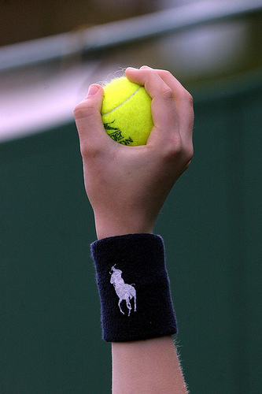
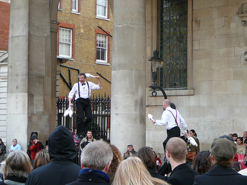
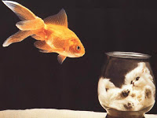
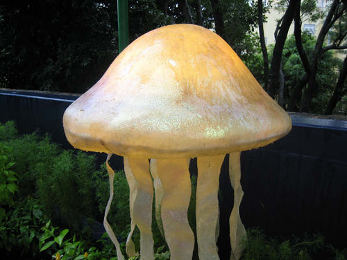
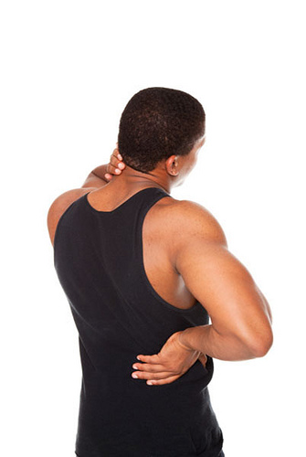
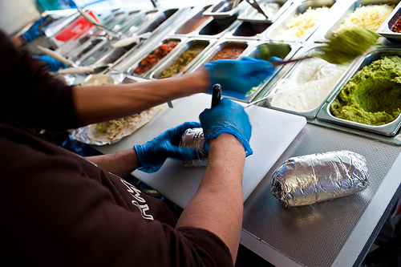

# Problems with ImageNet and its Solutions

The [ImageNet](http://www.image-net.org/) challenges play an important role in the development of computer vision. The great [success](https://papers.nips.cc/paper/4824-imagenet-classification-with-deep-convolutional-neural-networks) of neural nets on ImageNet has contributed to general fervor around artificial intelligence. While the applied breakthroughs are real, issues with ImageNet and modern networks indicate gaps between current practice and intelligent perception.

For this investigation I used a [subset](/20170430-sampling_imagenet/) of ImageNet consisting of 5 images from each of 200 classes and a [ResNet](https://arxiv.org/abs/1512.03385)50 network pre-trained on the 1,000-class ImageNet recognition task, as included with [Keras](https://keras.io/). The overlap is 150 classes, and on those the network has 92.3% top-5 accuracy, while it can't ever be correct for the other 50 subset classes. I also averaged the last layer's activations for each set of five examples to make class centroids, inducing a nearest-neighbor model.

The least important problem with ImageNet is that sometimes the ground truth labels are bad. My favorite example is an image labeled "[croquet](https://en.wikipedia.org/wiki/Croquet) ball," which the centroid model more correctly labels "tennis ball." Perhaps the original labeler saw what looks like a [Polo](https://en.wikipedia.org/wiki/Polo) [brand](https://en.wikipedia.org/wiki/Ralph_Lauren_Corporation) wristband and thought it was close enough to call croquet.

Neural nets are pretty robust to dirty training labels, so this is not the end of the world for model performance, but the occasional obviously incorrect label does highlight that "ground truth" is not absolute.

Apart from correctness, using a single label for an object is also a choice of representation that may not be optimal. ImageNet is labeled with [WordNet](https://wordnet.princeton.edu/), which is hierarchical. It might be beneficial for a system to know that croquet balls and tennis balls are both balls, for example, but this kind of information is not usually used.

Another interesting example is an image which the centroid model labels "person" but which is supposed to be "unicycle." The unicycles aren't clearly visible in the image, so the only way to get "unicycle" is by context.

Images frequently include multiple distinct entities, as in an image that is labeled "goldfish" but which also includes a cat in a glass bowl. The ResNet model's best guess is "goblet," which is not entirely baseless. Should "cat" be incorrect?

The problem of multiple subjects can be addressed by labeling bounding boxes within images, or even labeling every pixel. Recent ImageNet challenges seem to be focusing more on this kind of object detection. But even when there's clearly one main object in view, there are problems not well addressed by ImageNet models.

A garden statue of a jellyfish is labeled "jellyfish" by ImageNet. The centroid model guesses it's "mushroom." This is likely due at least in part to context clues. It's also indicative of the ResNet model's broader failure to have a flexible conception of jellyfish.

Overreliance on context is a known problem with image classifiers. For example, Google has [shown](https://research.googleblog.com/2015/06/inceptionism-going-deeper-into-neural.html) that some of its high-performing recognizers didn't distinguish dumbbells from the arms that held them. I saw something like this when the ResNet's top three guesses for a picture of a man were "dumbbell," "water bottle," and "hammer."

Focusing on the parts of images that contain only a specific object can treat symptoms like the dumbbell/arm problem, but they don't address the deeper issue that current neural nets don't really have a mechanism for understanding objects in visual scenes abstractly. Caption-generators have similar failure modes. I only know of [one explicit approach](https://arxiv.org/abs/1609.05518) to the problem, and it's not particularly elegant.

Neural net research seems to mostly hope that systems will learn an appropriate internal representation for a given task. For image classification, the representation is effective, but it seems different from human perception. If we knew better how thoughts are represented in the brain, we could emulate those representations directly. For the moment, we can only evaluate artificial representations indirectly.

I started this investigation hoping to find visual analogies with neural net activations, similar to [word analogies](/20170705-word_vectors_and_sat_analogies/) with word vectors. I didn't expect it to work great, but I was disappointed by just how poorly it worked.

Word vectors are trained based on how words appear in text. One common method puts words near each other in space if they could be substituted in a sentence. Syntax and semantics dictate word placement, so word vectors pick up these characteristics. For example, phrases like "She pet the ___" will tend to put "cat" and "dog" close in word vector representation. Image activations in a neural net are based on how things look, so it's less clear how much "meaning" they should pick up.

I was also using a very small collection of just 200 classes, so the space is super sparse. But I still have both "bicycle" and "motorcycle" (among others) so I was hoping to find some interesting analogies.

Unfortunately, for my 200 categories, there are no analogies by closest item with four distinct items. That is, when you find the closest thing to x + y - z, it's always one of x, y, or z. This is [a known problem](http://anthology.aclweb.org/W16-2503) with word vector analogies as well. The standard cheat is to just find the nearest new thing, which tends to mean you're just finding nearby items.

Even cheating to get uniqueness, the analogies I can come up with are not super compelling. Here are the best ones I found:

 * sheep : camel :: seal : hippopotamus
 * flute : oboe :: domestic cat : lion
 * brassiere : maillot :: guacamole : burrito

You could try to convince yourself that there's some meaning there, but it's really just that some things are close to each other in space; the relations are not super meaningful. Here are some examples with similar goodness in terms of distance:

 * flute : oboe :: snake : centipede
 * lemon : orange :: lizard : frog
 * lemon : orange :: pitcher : bowl

What about the bicycle and motorcycle?

 * bicycle : motorcycle :: flute : oboe
 * bicycle : motorcycle :: guacamole : burrito

What we see is that some things are close together; bicycle is close to motorcycle and flute is close to oboe. So when we ask for something close to bicycle + flute - oboe, for example, flute - oboe is basically zero and we find the closest thing to bicycle. The representations are successfully putting things that look similar close together.

In the case of "guacamole" and "burrito" images can frequently be used for either class. At best, the representation learns about co-occurrence. So the best case is the dumbbell/arm problem again.

It isn't really fair to ask activations trained for visual classification to also learn interesting semantics and give fun analogies, just as it isn't reasonable to anthropomorphize neural nets and imagine that they're close to emulating human perception or approaching general artificial intelligence.

One direction that aims to address the limitations of simple classification tasks, for example, is sometimes described as grounded perception or embodied cognition. The idea is that an agent needs to interact in an environment to learn things like "this is used for that" and so on. This might be part of an advance.

In my estimation, however, the core problem of neural-symbolic integration seems unlikely to be solved by some kind of accidental emergent property. We struggle to represent input to an intelligent system, and we have very little idea how to represent the internals. Perhaps further inspiration will come from neuroscience.

---

I presented a version of this material at the [2017-09-14 Hack and Tell](https://www.meetup.com/DC-Hack-and-Tell/events/241002526/) using some slides ([PPTX](hack_and_tell.pptx), [PDF](hack_and_tell.pdf)).
