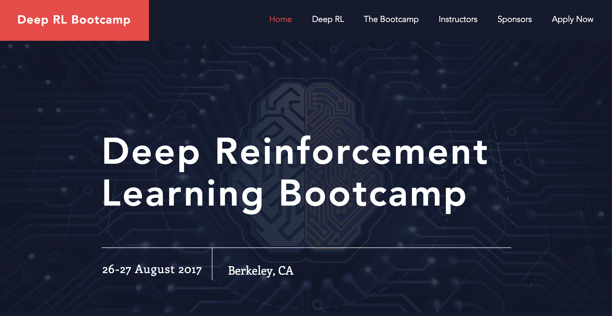
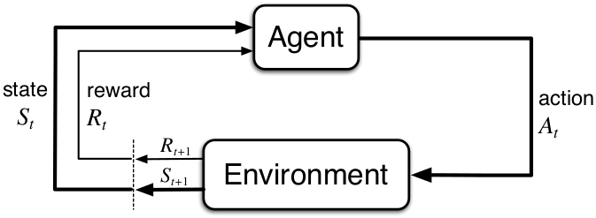
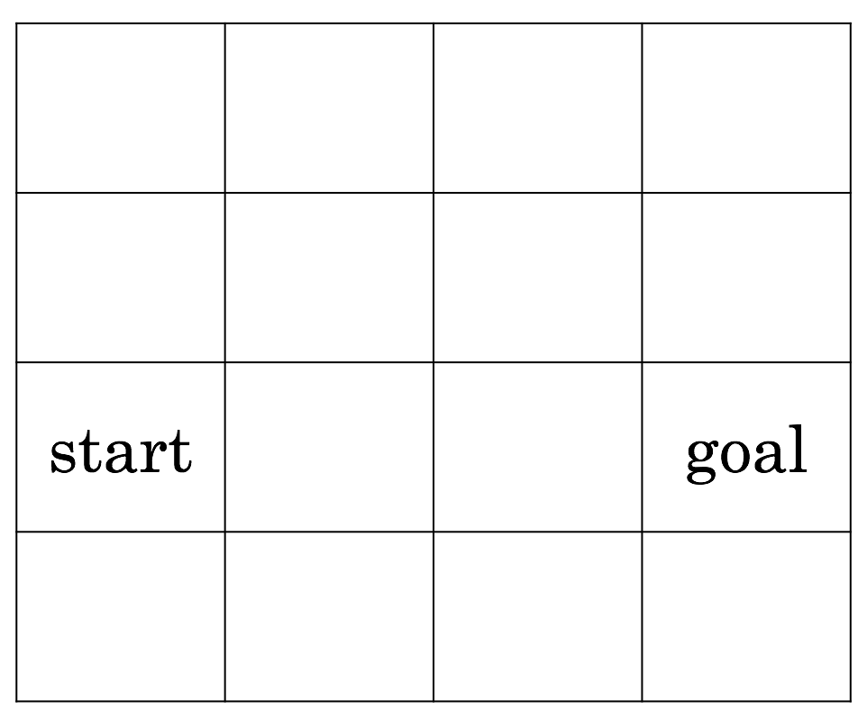

# Deep Reinforcement Learning

*This is a presentation given for [Data Science DC](https://www.meetup.com/Data-Science-DC/) on [Tuesday November 14, 2017](https://www.meetup.com/Data-Science-DC/events/244145151). ([PDF slides](deep_rl.pdf), [PPTX slides](deep_rl.pptx), [HTML slides](big.html))*

Further resources up front:

 * [A Brief Survey of Deep Reinforcement Learning](https://arxiv.org/abs/1708.05866) (paper)
 * Karpathy's [Pong from Pixels](http://karpathy.github.io/2016/05/31/rl/) (blog post)
 * [Reinforcement Learning: An Introduction](http://incompleteideas.net/sutton/book/the-book-2nd.html) (textbook)
 * David Silver's [course](http://www0.cs.ucl.ac.uk/staff/d.silver/web/Teaching.html) (videos and slides)
 * [Deep Reinforcement Learning Bootcamp](https://sites.google.com/view/deep-rl-bootcamp/lectures) (videos, slides, and labs)
 * OpenAI [gym](https://github.com/openai/gym) / [baselines](https://github.com/openai/baselines) (software)
 * [National Go Center](http://nationalgocenter.org/) (physical place)
 * [Hack and Tell](http://dc.hackandtell.org/) (fun meetup)

The following goes through all the content of the talk:


-----

Aaron Schumacher

 * planspace.org has these slides

-----

Hi! I'm Aaron. All these slides, and a corresponding write-up (you're reading it) are on my blog (which you're on).


-----


-----

I work at [Deep Learning Analytics](http://www.deeplearninganalytics.com/) (DLA). We do deep learning work for government and commercial customers. DLA is a great place to work, and one of the ways it's great is that it sends us to conferences and such things.


------



------

DLA sent me to the first UC Berkeley [Deep RL Bootcamp](https://www.deepbootcamp.io/) organized by Abbeel, Duan, Chen, and Karpathy. It was a great experience and it largely inspired this talk.

I have a separate [summary write-up](/20170830-berkeley_deep_rl_bootcamp/) about my experience at the bootcamp, and they've since put up all the [videos, slides, and labs](https://sites.google.com/view/deep-rl-bootcamp/lectures), so you can see everything that was covered there.


-----


-----

The other major source for this talk is Sutton and Barto's textbook, which I like a lot.

The picture shows [the first edition](https://mitpress.mit.edu/books/reinforcement-learning), which is not what you want. The second edition is [available free online](http://incompleteideas.net/sutton/book/the-book-2nd.html), and was last updated about a week ago (November 5, 2017).

Sutton and Barto are major figures in reinforcement learning, and they do not follow any [no original research rules](https://en.wikipedia.org/wiki/Wikipedia:No_original_research), making their book really fairly exciting, if you're not put off by the length (over 400 pages).

(The diagrams on the cover are not neural nets, but backup diagrams.)


-----

Plan

 * applications: what
     * theory
 * applications: how
 * onward

-----

text


-----

applications: what

-----

text


-----


-----

Backgammon


-----


-----

Atari games

best three (better than human): Video Pinball, Boxing, Breakout


-----


-----

Tetris


-----


-----

Go


-----

theory

-----

text


-----


-----

Yann LeCun's cake

 * cake: unsupervised learning
 * icing: supervised learning
 * cherry: reinforcement learning


-----

unsupervised learning

s

-----

text

"We are missing the principles for unsupervised learning." - Yann LeCun
https://www.youtube.com/watch?v=vdWPQ6iAkT4


-----

state s

 * numbers
 * text to numbers
 * image to numbers
 * sound to numbers

-----

note no distinction between state and observation

also often "x"

also observations or examples

covariates, explanatory variables, independent variables, predictors
https://en.wikipedia.org/wiki/Covariate


-----

unsupervised (?) learning

given s

learn s \rightarrow cluster_id

learn s \rightarrow s

-----

text

Unsupervised learning is the [dark matter](https://en.wikipedia.org/wiki/Dark_matter) of machine learning.


-----

deep unsupervised learning

s

with deep neural nets

-----

text


-----

supervised learning

s \rightarrow a

-----

also X, y


-----

action a

 * cat/dog
 * left/right
 * $price number(s)
 * voltage


-----

aka answer

also called labels

really could be anything s can be

ref NVIDIA car

imitation learning from Sergey Levine
https://www.youtube.com/watch?v=Pw1mvoOD-3A&list=PLkFD6_40KJIxopmdJF_CLNqG3QuDFHQUm&index=13


-----

supervised learning

given s, a

learn s \rightarrow a

-----

text


-----

deep supervised learning

s \rightarrow a

with deep neural nets

-----

text

also semi-supervised

some s, a

some s

mention active learning


-----

reinforcement learning

r, s \rightarrow a

-----

note optimal control connection


-----

reward r

 * -3
 * 0
 * 7
 * 5

-----

text


-----

r, s \rightarrow a

-----

agent makes choice


-----

clock

-----

text


-----

r', s' \rightarrow a'

-----

agent makes choice


-----

clock

-----

text


-----



-----

standard agent/env diagram


-----

optimal control / reinforcement learning

-----

different notation, cost minimization vs. reward maximization

[Lev Pontryagin](https://en.wikipedia.org/wiki/Lev_Pontryagin) vs. [Richard Bellman](https://en.wikipedia.org/wiki/Richard_E._Bellman)


-----

reinforcement learning

given r, s, a, r', s', a', ...

learn s \rightarrow a

-----

text


-----

Question:

Can you formulate supervised learning as reinforcement learning?

-----

text


-----

Question:

Why is the Sarsa algorithm called Sarsa?

-----

Sutton 1996

on-policy TD control


-----

reinforcement learning

r, s \rightarrow a

-----

text


-----

deep reinforcement learning

r, s \rightarrow a

with deep neural nets

-----

note: may not be in the obvious place


-----

Markov

s is enough

-----

state it


-----

```
                   Make choices?
                   no                        yes
Completely    no   Markov chain              MDP: Markov Decision Process
observable?   yes  HMM: Hidden Markov Model  POMDP: Partially Observable MDP
```

-----

talk about MDPs, note we ignore partial observability

blackjack example

compare Minecraft?

note usually finite

based on http://www.pomdp.org/faq.html

-----

policy \pi

\pi: s \rightarrow a

-----

it's a walker!

how do we know the policy is good?


-----

return

\sum r

-----

aka G


-----



-----

simple gridworld 4x4 start/end in corners

states, actions

episodic vs. continuing w/re-starts (consider both)

note infinite reward problem


-----

Question:

How do we keep our agent from dawdling?

-----

(or infinite reward?)


-----

negative reward at each time step

-----

-1, -1, -1, -1, ...

for episodic

Meeseeks reference


-----

discounted rewards

\sum \gamma^tr

-----

discount factor


-----

average rate of reward

\frac{\sum r}{t}

-----

text


-----

value functions

v: s \rightarrow \sum r

q: s, a \rightarrow \sum r

-----

text


-----

Question:

Does a value function specify a policy?

-----

text


-----

trick question?

v_\pi

q_\pi

-----

depends what you do


-----

value functions

v: s \rightarrow \sum r

q: s, a \rightarrow \sum r

-----

q gives policy; not sure for v


-----

environment dynamics

s, a \rightarrow r', s'

-----

text


-----

gridworld again

-----

don't know where you'll end up!


-----

model

s, a \rightarrow r', s'

-----

often just s'

model-based vs. model-free

games vs. learning a model

in adaptive control "system identification" is our "model learning"


-----

planning

-----

relate to value functions

note not too different from planning in the past

background vs. decision-time planning


-----

 * Dijkstra's algorithm
 * A*
 * minimax search
 * Monte Carlo tree search

-----

minimax search with alpha-beta pruning


-----


-----

roll-outs

backgammon dice picture


-----

everything is stochastic

-----

not just from dice


-----

Question:

How does randomness affect \pi, v, and q?

-----

text


-----

\pi: s \rightarrow a

v: s \rightarrow \sum r

q: s, a \rightarrow \sum r

-----

text


-----

\pi: P(a|s)

v: s \rightarrow \expected \sum r

q: s, a \rightarrow \expected \sum r

-----

text


-----


-----

icy pond: 20% chance you move 90º from where you intend

cliff

also in dynamics

icy pond gridworld

different optimal behavior depending on dynamics


-----


-----

multi-armed bandit

one state, one set of actions, stochastic reward

which ad to show, etc.

(also phrase as supervised learning?)


-----

exploration vs. exploitation

\epsilon-greedy policy

-----

usually do what looks best

\epsilon of the time, choose random action

bandit is one-state; even more need to explore in bigger MDPs

connect to active learning

two reasons for \epsilon-greedy:

 * explore all (find optimal)
 * for off-policy (what did I mean, here?)


-----

Monte Carlo returns

-----

v(s) = ?

keep track and average


run to end

many times

average

sample it! (rollouts again; note doing with model vs. with experience)


-----

non-stationarity

-----

v(s) changes over time


-----

stochastic gradient... moving average

-----

new mean = old mean + \alpha(new sample - old mean)

exponential mean

relate to SGD

\alpha, \beta vs. \eta


-----


-----

Example:

s_1 to s_2 deterministically

Question: How is v(s) related to v(s')?

note another popular way to represent MDPs


-----

Bellman equation

v(s) = r' + v(s')

-----

text


Bellman mix

"something not even a Congressman could object to"

http://arcanesentiment.blogspot.com/2010/04/why-dynamic-programming.html

img/bellman.jpg

DP!
value iteration!
policy iteration!
Generalized Policy Iteration!
CoD!


-----

temporal difference

-----

Sutton 1988

"bootstrap"


-----

Q-learning

Q(S, A) = Q(S, A) + \alpha (R + \gamma max_a Q(S', a) - Q(S, A))

-----

text


-----

on-policy / off-policy

-----

importance sampling


-----

estimate v, q

-----

something about getting deep w/v,q

note deadly triad? function approximation, bootstrapping, off-policy training


-----

policy gradient

-----

semi-gradient when bootstrapping


-----

REINFORCE

-----

text

http://blog.shakirm.com/2015/11/machine-learning-trick-of-the-day-5-log-derivative-trick/


-----

actor-critic

-----

text


-----

relate softmax and \epsilon-greedy

-----

text


-----

RNN/LSTM help w/POMDP?

-----

text


-----

applications: how

-----

text


-----


-----

Backgammon

TD-Gammon

s with custom features

v with shallow neural net

TD(\lambda)

self-play

shallow forward search


-----

dqn

-----

Playing Atari with Deep Reinforcement Learning
https://arxiv.org/abs/1312.5602
2013

Human-level control through Deep Reinforcement Learning
https://deepmind.com/research/dqn/
2015


-----


-----

Tetris

Learning Tetris Using the Noisy Cross-Entropy Method
http://citeseerx.ist.psu.edu/viewdoc/download?doi=10.1.1.81.6579&rep=rep1&type=pdf


-----

go

-----

Mastering the game of Go with deep neural networks and tree search
https://storage.googleapis.com/deepmind-media/alphago/AlphaGoNaturePaper.pdf

AlphaGo Zero
Mastering the game of Go without human knowledge
https://www.nature.com/articles/nature24270.epdf?author_access_token=VJXbVjaSHxFoctQQ4p2k4tRgN0jAjWel9jnR3ZoTv0PVW4gB86EEpGqTRDtpIz-2rmo8-KG06gqVobU5NSCFeHILHcVFUeMsbvwS-lxjqQGg98faovwjxeTUgZAUMnRQ
"Our approach is most directly applicable to Zero-sum games of perfect information."

alphago zero can only play legal moves, but stupid moves aren't
forbidden, so it is less constrained than alphago original~


-----


-----

conv agent

https://arxiv.org/abs/1709.02349


-----

language stuff

-----

A Deep Reinforcement Learning Chatbot
https://arxiv.org/abs/1709.02349
...Bengio

Amazon Alexa Prize
https://developer.amazon.com/alexaprize

Emergence of Grounded Compositional Language in Multi-Agent Populations
https://arxiv.org/abs/1703.04908
Igor Mordatch, Pieter Abbeel

Evolutionary game theory
https://en.wikipedia.org/wiki/Evolutionary_game_theory

Peyton Young
https://en.wikipedia.org/wiki/Peyton_Young


-----

Neural Architecture Search (NAS)

-----

policy gradient where the actions design a neural net

reward is validation set performance

AutoML for large scale image classification and object detection
https://research.googleblog.com/2017/11/automl-for-large-scale-image.html

Learning Transferable Architectures for Scalable Image Recognition
https://arxiv.org/abs/1707.07012

Neural Architecture Search with Reinforcement Learning
https://arxiv.org/abs/1611.01578


-----


-----

robot control


-----

robot picture

-----

left to right: Chelsea Finn, Pieter Abbeel, [PR2](http://www.willowgarage.com/pages/pr2/overview), Trevor Darrell, Sergey Levine

https://nyti.ms/2hLYbGQ
Peter Chen, chief executive of Embodied Intelligence; Pieter Abbeel, president and chief scientist; Rocky Duan, chief technology officer; and Tianhao Zhang

optimal path (robot control)


conclusion?

"Ironically, the major advances in RL over the past few years all boil down to making RL look less like RL and more like supervised learning."
https://twitter.com/dennybritz/status/925028640001105920

-----


-----

text


-----


-----

text

/20170830-berkeley_deep_rl_bootcamp/


-----

future directions?

-----

Deep Learning in Neural Networks: An Overview
http://citeseerx.ist.psu.edu/viewdoc/download?doi=10.1.1.81.6579&rep=rep1&type=pdf
Juergen Schmidhuber
includes some on RNNs


-----

Thank you!

-----

Thank you for coming!

Thanks again to [DLA](https://www.deeplearninganalytics.com/) for supporting me in learning more about reinforcement learning, and in being the audience for the earliest version of this talk, providing lots of valuable feedback.

Thanks to the [DC Deep Learning Working Group](https://www.meetup.com/DC-Deep-Learning-Working-Group/) for working through the second iteration of this talk with me, providing even more good feedback.

Thanks to [Eric Haengel](https://twitter.com/EricHaengel) for help with Go and in thinking about the [AlphaGo Zero paper](https://www.nature.com/articles/nature24270.epdf?author_access_token=VJXbVjaSHxFoctQQ4p2k4tRgN0jAjWel9jnR3ZoTv0PVW4gB86EEpGqTRDtpIz-2rmo8-KG06gqVobU5NSCFeHILHcVFUeMsbvwS-lxjqQGg98faovwjxeTUgZAUMnRQ).


-----

further resources

-----

 * [A Brief Survey of Deep Reinforcement Learning](https://arxiv.org/abs/1708.05866) (paper)
 * Karpathy's [Pong from Pixels](http://karpathy.github.io/2016/05/31/rl/) (blog post)
 * [Reinforcement Learning: An Introduction](http://incompleteideas.net/sutton/book/the-book-2nd.html) (textbook)
 * David Silver's [course](http://www0.cs.ucl.ac.uk/staff/d.silver/web/Teaching.html) (videos and slides)
 * [Deep Reinforcement Learning Bootcamp](https://sites.google.com/view/deep-rl-bootcamp/lectures) (videos, slides, and labs)
 * OpenAI [gym](https://github.com/openai/gym) / [baselines](https://github.com/openai/baselines) (software)
 * [National Go Center](http://nationalgocenter.org/) (physical place)
 * [Hack and Tell](http://dc.hackandtell.org/) (fun meetup)

Here are my top resources for learning more about deep reinforcement
learning (and having a little fun).

The content of [A Brief Survey of Deep Reinforcement Learning](https://arxiv.org/abs/1708.05866) is similar to this talk. It does a quick intro to a lot of deep reinforcement learning.

Karpathy's [Pong from Pixels](http://karpathy.github.io/2016/05/31/rl/) is a readable introduction as well, focused on policy gradient, with readable code.

If you can afford the time, I recommend all of Sutton and Barto's [Reinforcement Learning: An Introduction](http://incompleteideas.net/sutton/book/the-book-2nd.html). The authors are two major reinforcement learning pioneers, to the extent that they sometimes introduce new concepts in the pages of their textbook.

David Silver's [course](http://www0.cs.ucl.ac.uk/staff/d.silver/web/Teaching.html) is quite good. It largely follows Sutton and Barto's text, and also references Csaba Szepesvári's [Algorithms for Reinforcement Learning](https://sites.ualberta.ca/~szepesva/papers/RLAlgsInMDPs.pdf).

The [Deep Reinforcement Learning Bootcamp](https://sites.google.com/view/deep-rl-bootcamp/lectures) that inspired this talk has lots of materials online, so you can get the full treatment if you like!

If you want to get into code, [OpenAI](https://openai.com/)'s [gym](https://github.com/openai/gym) and [baselines](https://github.com/openai/baselines) could be nice places to get started.

If you want to have fun, you can play Go with humans at the [National Go Center](http://nationalgocenter.org/), and I always recommend the [Hack and Tell](http://dc.hackandtell.org/) meetup for a good time nerding out with people over a range of fun projects.
