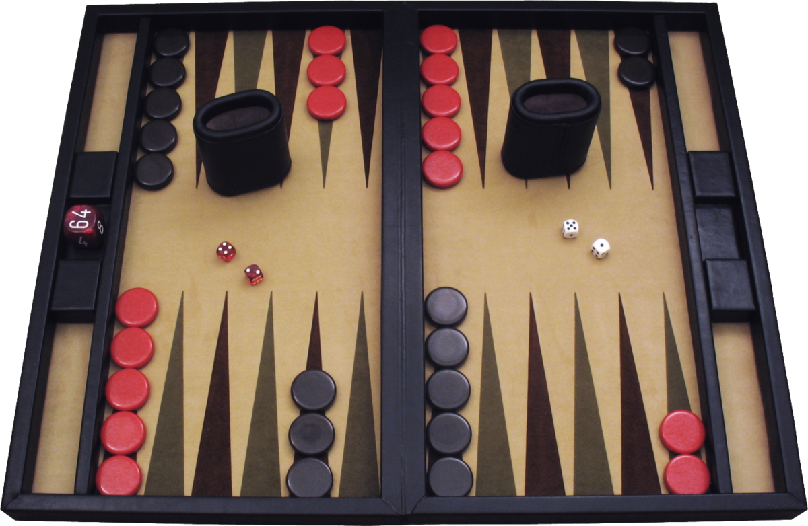
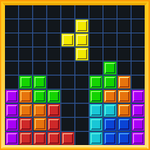
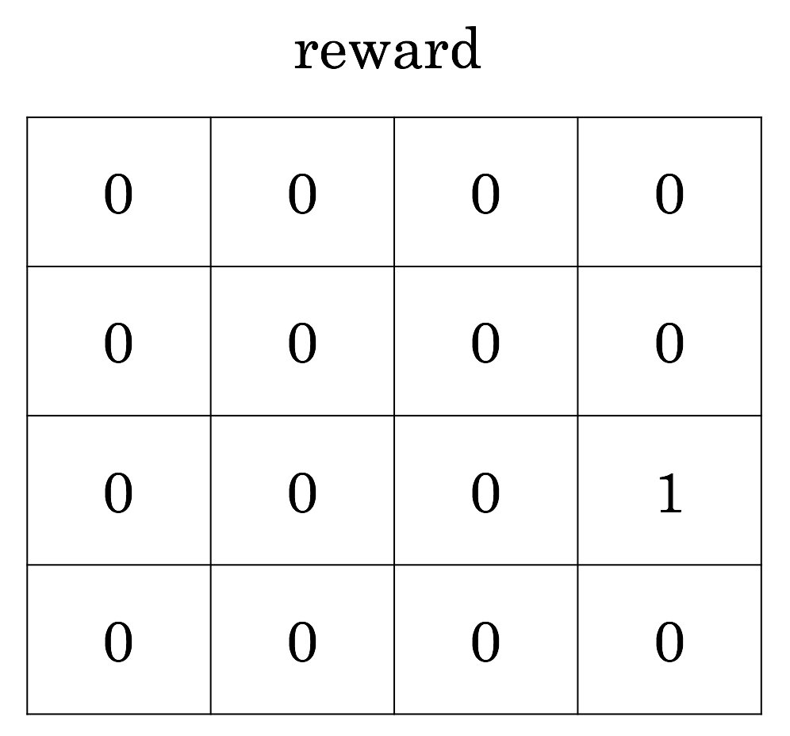
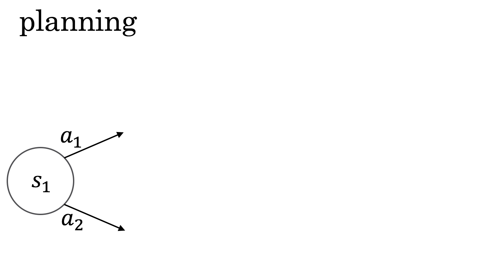
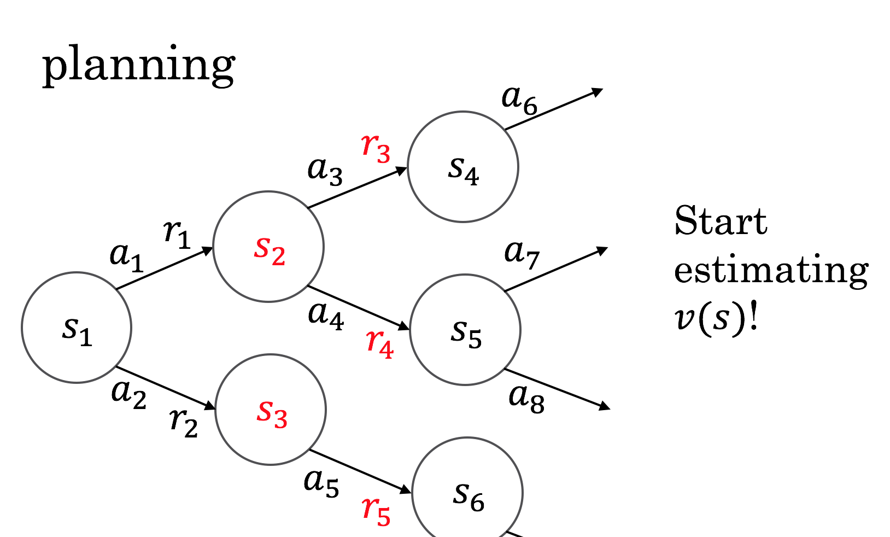
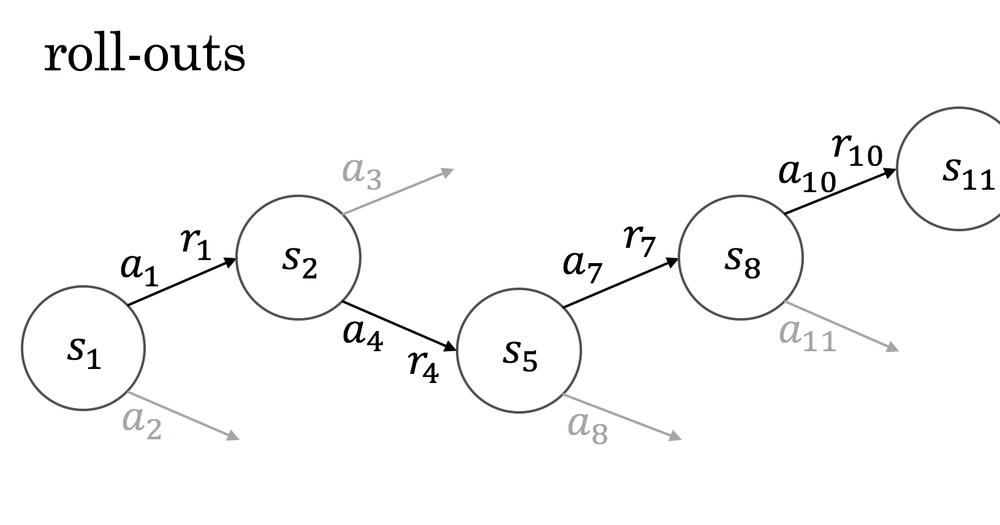
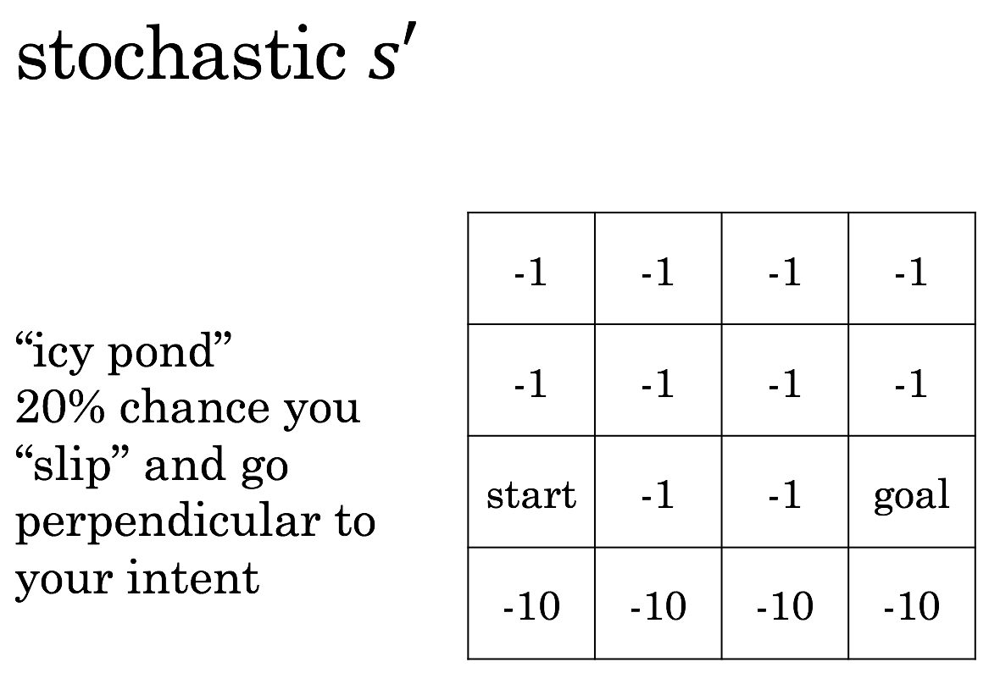

# Deep Reinforcement Learning

*This is a presentation given for [Data Science DC](https://www.meetup.com/Data-Science-DC/) on [Tuesday November 14, 2017](https://www.meetup.com/Data-Science-DC/events/244145151).*

 * *[PDF slides](deep_rl.pdf)*
 * *[PPTX slides](deep_rl.pptx)*

Further resources up front:

 * [A Brief Survey of Deep Reinforcement Learning](https://arxiv.org/abs/1708.05866) (paper)
 * Karpathy's [Pong from Pixels](http://karpathy.github.io/2016/05/31/rl/) (blog post)
 * [Reinforcement Learning: An Introduction](http://incompleteideas.net/sutton/book/the-book-2nd.html) (textbook)
 * David Silver's [course](http://www0.cs.ucl.ac.uk/staff/d.silver/web/Teaching.html) (videos and slides)
 * [Deep Reinforcement Learning Bootcamp](https://sites.google.com/view/deep-rl-bootcamp/lectures) (videos, slides, and labs)
 * OpenAI [gym](https://github.com/openai/gym) / [baselines](https://github.com/openai/baselines) (software)
 * [National Go Center](http://nationalgocenter.org/) (physical place)
 * [Hack and Tell](http://dc.hackandtell.org/) (fun meetup)

The following goes through all the content of the talk:


-----

Aaron Schumacher

 * planspace.org has these slides

-----

Hi! I'm Aaron. All these slides, and a corresponding write-up (you're reading it) are on my blog (which you're on).


-----


-----

I work at [Deep Learning Analytics](http://www.deeplearninganalytics.com/) (DLA). We do deep learning work for government and commercial customers. DLA is a great place to work, and one of the ways it's great is that it sends us to conferences and such things.


------


------

DLA sent me to the first UC Berkeley [Deep RL Bootcamp](https://www.deepbootcamp.io/) organized by Abbeel, Duan, Chen, and Karpathy. It was a great experience and it largely inspired this talk.

I have a separate [summary write-up](/20170830-berkeley_deep_rl_bootcamp/) about my experience at the bootcamp, and they've since put up all the [videos, slides, and labs](https://sites.google.com/view/deep-rl-bootcamp/lectures), so you can see everything that was covered there.


-----


-----

The other major source for this talk is Sutton and Barto's textbook, which I like a lot.

The picture shows [the first edition](https://mitpress.mit.edu/books/reinforcement-learning), which is not what you want. The second edition is [available free online](http://incompleteideas.net/sutton/book/the-book-2nd.html), and was last updated about a week ago (November 5, 2017).

Sutton and Barto are major figures in reinforcement learning, and they do not follow any [no original research rules](https://en.wikipedia.org/wiki/Wikipedia:No_original_research), making their book really fairly exciting, if you're not put off by the length (over 400 pages).

(The diagrams on the cover are not neural nets, but backup diagrams.)


-----

Plan

 * applications: what
     * theory
 * applications: how
 * onward

-----

The plan for today is to first mention four successful applications of reinforcement learning. Then we'll go through a core of theory. This will let us then understand pretty completely how each of those applications is achieved. Finally, we'll wrap up, looking at a few other applications and thoughts about how things are going.


-----

applications: what

-----

The applications here are all going to be games, not because reinforcement learning is only applicable to games, but because games are fun, and these examples are well known and cover a good range of techniques.


-----



-----

First up, backgammon.


-----


-----

Next, Atari. A lot of Atari games are well played by RL now. The ones shown (Video Pinball, Boxing, Breakout) are some of the ones that RL does the best on.


-----



-----

I'm also including Tetris, mostly because it's a chance to talk about an interesting technique.


-----


-----

And in the last two years, Go has been pretty much conquered by RL, so we'll talk about that.


-----

theory

-----

Let's start to build up the theory of reinforcement learning.

This is going to start very gradually, but I promise that by the end we'll be moving fast.


-----

Yann LeCun's cake

 * cake: unsupervised learning
 * icing: supervised learning
 * cherry: reinforcement learning


-----


Yann LeCun [introduced](https://drive.google.com/file/d/0BxKBnD5y2M8NREZod0tVdW5FLTQ/view) this cake idea for relating three main varieties of machine learning. It's largely based on one view of how much information is used at each training step.

I'm going to use it to build up and relate these three kinds of learning, while introducing reinforcement learning notation.


-----

unsupervised learning

 * \\( s \\)

-----

In unsupervised learning, we have a collection of states, where each individual state can be referred to with \\( s \\).

I'm using "state" without distinguishing "state" from "observation". You could also call these "examples" or "[covariates](https://en.wikipedia.org/wiki/Covariate)" or "data points" or whatever you like.

The symbol "x" is commonly used.


-----

state \\( s \\)

 * numbers
 * text (as numbers)
 * image (as numbers)
 * sound (as numbers)

-----

States can be anything as long as it can be expressed numerically. So that includes text, images, and sound. Really anything.


-----

unsupervised (?) learning

 * given \\( s \\)
 * learn \\( s \rightarrow \text{cluster_id} \\)
 * learn \\( s \rightarrow s \\)

-----

So say we have a set of a thousand images. Each image is an \\( s \\).

We want to learn something, and that tends to mean unsupervised learning starts to resemble supervised learning.

At two ends of a spectrum we have clustering and [autoencoders](https://en.wikipedia.org/wiki/Autoencoder), and all kinds of dimensionality reduction in between.

Unsupervised learning is sort of the [dark matter](https://en.wikipedia.org/wiki/Dark_matter) of machine learning. Even [Yann LeCun](https://www.youtube.com/watch?v=vdWPQ6iAkT4) says "We are missing the principles for unsupervised learning."


-----

deep unsupervised learning

 * \\( s \\) with deep neural nets

-----

Deep unsupervised learning is whenever we do unsupervised learning and somewhere there's a deep neural net.


-----

supervised learning

 * \\( s \rightarrow a \\)

-----

Up next is supervised learning. We're introducing a new entity \\( a \\), which I'll call an "action". It's common to call it a "label" or a "target" and to use the symbol "y". Same thing.


-----

action a

 * numbers
 * "cat"/"dog"
 * "left"/"right"
 * 17.3
 * [2.0, 11.7, 5]
 * 4.2V


-----

Whatever you call it, the action is again a numeric thing. It could be anything that \\( s \\) could be, but it tends to be lower-dimensional.

The cat/dog classifier is a popular example, and a left/right classifier is just the same, but those might feel more like actions.


-----

supervised learning

 * given \\( s, a \\)
 * learn \\( s \rightarrow a \\)

-----

In supervised learning you have a training set of state-action pairs, and you try to learn a function to produce the correct action based on the state alone.

Supervised learning can blur into imitation learning, which can be taken as a kind of reinforcement learning. For example, [NVIDIA's end-to-end self-driving car](https://arxiv.org/abs/1604.07316) is based on learning human driving behaviors. (Sergey Levine [explains](https://www.youtube.com/watch?v=Pw1mvoOD-3A&list=PLkFD6_40KJIxopmdJF_CLNqG3QuDFHQUm&index=13) in some depth.) But I'm not going to talk more about imitation learning, and supervised learning will stand alone.

You can learn this function with linear regression or support vector machines or whatever you like.


-----

deep supervised learning

 * \\( s \rightarrow a \\) with deep neural nets

-----

Deep supervised learning is whenever we do supervised learning and somewhere there's a deep neural net.

There's also semi-supervised learning, when you have some labeled data and some unlabeled data, which can connect to active learning, which has some relation to reinforcement learning, but that's all I'll say about that.


-----

reinforcement learning

 * \\(r, s \rightarrow a\\)

-----

Finally, we reach reinforcement learning.

We're adding a new thing \\( r \\), which is reward.


-----

reward \\( r \\)

 * -3
 * 0
 * 7.4
 * 1

-----

Reward is a scalar, and we like positive rewards.


-----

optimal control / reinforcement learning

-----

I'll mention that [optimal control](https://en.wikipedia.org/wiki/Optimal_control) is closely related to reinforcement learning. It has its own parallel notation and conventions, and I'm going to ignore all that.


-----

\\( r, s \rightarrow a \\)

-----

So here's the reinforcement learning setting.

We get a reward and a state, and the agent chooses an action.


-----

tick

-----

Then, time passes. We're using discrete time, so this is a "tick".


-----

\\( r', s' \rightarrow a' \\)

-----

Then we get a new reward and state, which depend on the previous state and action, and the agent chooses a new action.


-----

tick

-----

And so on.


-----


-----

This is the standard reinforcement learning diagram, showing the agent and environment. My notation is similar.


-----

reinforcement learning

 * "given" \\( r, s, a, r', s', a', ... \\)
 * learn "good" \\( s \rightarrow a \\)

-----

So here's reinforcement learning.

"Given" is in quotes because the rewards and states that we see depend on the actions we choose.

"Good" is in quotes because we haven't defined "good" beyond that we like positive rewards.


-----

Question:

Can you formulate supervised learning as reinforcement learning?

-----

Here's a question to think about.


-----

supervised as reinforcement?

 * reward 0 for incorrect, reward 1 for correct
     * beyond binary classification?
 * reward deterministic
 * next state random

-----

You can re-cast supervised learning as reinforcement learning, but it isn't necessarily as efficient: it's better to be told what the right answer is than to just be told that you're wrong. This is one sense in which Yann LeCun means that reinforcement learning is using fewer bits of information per example.


-----

Question:

Why is the Sarsa algorithm called Sarsa?

-----

Here's a question that you can already figure out!

(Sarsa is an on-policy TD control algorithm due to Sutton, 1996.)


-----

reinforcement learning

 * \\( r, s \rightarrow a \\)

-----

Sarsa: State, Action, Reward, State, Action.

We'll see the closely related Q-learning algorithm in some detail later on.


-----

deep reinforcement learning

 * \\( r, s \rightarrow a \\) with deep neural nets

-----

Deep reinforcement learning is whenever we do reinforcement learning and somewhere there's a deep neural net.

The one twist is that in reinforcement learning, the network(s) may not be in the obvious place. We'll need to develop a few more ideas to see more places to put a neural net.


-----

Markov property

 * \\( s \\) is enough

-----

We're going to assume [the Markov property](https://en.wikipedia.org/wiki/Markov_property), which means that the state we observe tells us as much as we can know about what will happen next.

This is frequently not true, but we'll assume it anyway.


-----

```
                   Make choices?
                   no                        yes
Completely    no   Markov chain              MDP: Markov Decision Process
observable?   yes  HMM: Hidden Markov Model  POMDP: Partially Observable MDP
```

-----

This chart relates a bunch of Markov things, to hopefully help you orient yourself.

We're working with Markov Decision Processes (MDPs). Even though things are frequently not really completely observable, we'll usually just ignore that. Often this is fine (think about blackjack, for example).

It's often easiest to think about finite spaces, but this isn't always necessary.

(The chart is from [POMDP.org](http://www.pomdp.org/faq.html).)


-----

usual RL problem elaboration

-----

We'll introduce some more notation and a few ideas that help us work on reinforcement learning problems.


-----

policy \\( \pi \\)

 * \\( \pi: s \rightarrow a \\)

-----

This thing that takes a state and produces an action we'll call a "policy" \\( \pi \\). This effectively _is_ our reinforcement learning agent, and the name of the game is figuring out how to get a good policy.

But how do we even know whether a policy is good?

(If you don't like spelling in Greek, you can imagine it's a little walker!)


-----

return

 * \\( \sum{r} \\)
     * into the future (episodic or ongoing)

-----

We want a policy that maximizes "return" \\( \sum{r} \\). Return is just the sum of all the rewards we'll get into the future. The symbol "G" is also used, but I'll keep writing the sum.

Reinforcement learning can consider finite-length episodes that always come to an end, or the ongoing setting in which the agent keeps on going. (You can see that there could be a problem with infinity in the ongoing setting.)


-----


-----

Here's a typical toy example for understanding reinforcement learning: a gridworld.

There are sixteen states, each uniquely identifiable to the agent.

There are four actions: go up, down, left, right.

We want the agent to learn to go from the start to the goal.

We'll say this is episodic, with each episode ending after the agent makes it to the goal.

So how do we set up the rewards?


-----



-----

Here's a natural way to set up reward. You get a reward of one when you complete the task. What does the return at each state look like, then?


-----


-----

The return, unfortunately, is just one everywhere. And this means that there isn't any reason to go directly to the goal. We have all the time in the world, so we could just as well meander randomly until we happen to hit the goal. This isn't very good.


-----

Question:

How do we keep our agent from dawdling?

-----

How can we set things up so that going directly to the goal position is incentivized?

Consider changing rewards, or changing how return is calculated, or anything else.

There are at least three approaches that are commonly used.


-----

negative reward at each time step

-----

If we get a negative reward at each time step, the only way to maximize return is to minimize episode length, so we're motivated to end the episode as soon as possible. This certainly makes sense for the episodic setting.

(It's like existing is pain; the agent is like [Mr. Meeseeks](http://rickandmorty.wikia.com/wiki/Mr._Meeseeks)!)


-----

discounted rewards

 * \\( \sum{\gamma^tr} \\)

-----

It's very common to use a "discount factor" \\( \gamma \\), which might be 0.9, for example. Then a reward soon is worth more than a reward later, and again the agent is motivated to do things more directly.


-----

average rate of reward

 * \\( \frac{\sum{r}}{t} \\)

-----

Average rate of reward is also used in some settings, where it can make things more stable.


-----

value functions

 * \\( v: s \rightarrow \sum{r} \\)
 * \\( q: s, a \rightarrow \sum{r} \\)

-----

I already snuck in a value function when we saw green values for every state in the gridworld.

The state value function \\( v \\) tells us the return from any state, and the state-action value function \\( q \\) gives the return from any state-action combination. It might not yet be clear why the two are importantly different, so let's get into that.


-----

Question:

Does a value function specify a policy (if you want to maximize return)?

-----

Here's the relevant question to consider.


-----

trick question?

 * \\( v_\pi \\)
 * \\( q_\pi \\)

-----

Is it a trick question? Really, values depend on what you do, on your policy. But let's assume I just give you a value function and you trust it. Can you use it to induce a policy?


-----

value functions

 * \\( v: s \rightarrow \sum{r} \\)
 * \\( q: s, a \rightarrow \sum{r} \\)

-----

The state-action value function \\( q \\) certainly implies a policy. For whatever state we're in, we check the return for all available actions, and choose the action that's best.

For the state value function \\( v \\), we can get a policy in a similar way, but only if we know what state we'll be in after taking an action. That may or may not be true.


-----

environment dynamics

 * \\( s, a \rightarrow r', s' \\)

-----

The next state and reward depend on the previous state and action, and that's determined by the environment. We don't necessarily know what's going on inside the environment.


-----


-----

When you, a smart human with lots of ideas about physics, look at this picture of a gridworld, you assume that going "right" will do what you expect.

But in general, we don't know in advance how the environment behaves. Maybe going "right" always takes you to the upper left state, for example.

Sometimes you do know the environment dynamics, like with games with well-defined rules. But sometimes you don't. You could try to learn the environment dynamics with a model.


-----

model

 * \\( s, a \rightarrow r', s' \\)

-----

Reinforcement learning uses "model" to refer to a model that you learn for the environment dynamics. (Often, just the next state is predicted.)

This model is something that the agent has to learn, and depending on whether the agent is learning a model determines whether you're said to be doing model-based vs. model-free reinforcement learning.

(In adaptive control this "model learning" is called "system identification".)


-----

learning and acting

-----

Everything to this point has been elaborating the problem setup for reinforcement learning. Now we get into how we actually learn and go forth with RL.


-----

learn model of dynamics

 * from experience
 * difficulty varies

-----

As mentioned, you could try to learn your environment's dynamics. If you can do this well, it's great, but it may not be easy. Model-based RL is an exciting area of research.


-----

learn value function(s) with planning

 * assuming we have the environment dynamics or a good model already

-----

To introduce value function learning, let's consider the situation where you know nothing yet but you have the environment dynamics, so you can make decisions by looking ahead. This is a familiar thought process, conceptually.


-----



-----

You're in state \\( s_1 \\) and you have to choose between \\( a_1 \\) and \\( a_2 \\).

Because you have the environment dynamics, you can see what would happen next.


-----


-----

Looking one time step ahead, you can already start to evaluate your action choices by the rewards you'd get immediately. This is the state-action value view, \\( q \\): you're evaluating the value of the _actions_ directly.


-----



-----

Looking two time steps ahead, you can similarly start to evaluate how good the states you would get to are. This is the state value view, \\( v \\).

This example is simple and assumes states and actions never recur. We also haven't introduced a couple more wrinkles. You can think about differences between thinking in terms of \\( v \\) and \\( q \\) later, for example in the case of backgammon.

This kind of planning can happen continuously in the background, or it can be done on demand at decision time. The search space can get quite large.


-----

connections

 * Dijkstra's algorithm
 * A* algorithm
 * minimax search
     * two-player games not a problem
 * Monte Carlo tree search

-----

The graph structure on the previous slide might make you think of a range of algorithms that you could already be familiar with.

You can think of these as smart ways of exploring the possibly very large branching structures that can spring up. [Monte Carlo tree search](https://en.wikipedia.org/wiki/Monte_Carlo_tree_search) is particularly clever, and it will appear again later.


-----



-----

One way of dealing with all the possible tree paths is just to sample from it and try to make estimates on the basis of these.


-----


-----

I thought it was interesting to learn that the term "roll-out" comes from work on backgammon, where you literally roll dice to move a game along.


-----

everything is stochastic

-----

Backgammon has randomness in the environment, from the dice, but randomness can enter all over the place.


-----



-----

The next state can be random.


-----


-----

And the next reward can be random, as in the case of [multi-armed bandits](https://en.wikipedia.org/wiki/Multi-armed_bandit).


-----

exploration vs. exploitation

 * \\( \epsilon \\)-greedy policy
     * usually do what looks best
     * \\( \epsilon \\) of the time, choose random action

-----

This can always be an issue in unknown environments, but especially with randomness, we encounter the issue of exploration vs. exploitation. The \\( \epsilon \\)-greedy approach is one well-known way to ensure that an agent keeps exploring.


-----

Question:

How does randomness affect \\( \pi \\), \\( v \\), and \\( q \\)?

 * \\( \pi: s \rightarrow a \\)
 * \\( v: s \rightarrow \sum{r} \\)
 * \\( q: s, a \rightarrow \sum{r} \\)

-----

Now acknowledging that there's randomness all over the place, I can show another way that my notation is shorthand.


-----

Question:

How does randomness affect \\( \pi \\), \\( v \\), and \\( q \\)?

 * \\( \pi: \mathbb{P}(a|s) \\)
 * \\( v: s \rightarrow \mathbb{E} \sum{r} \\)
 * \\( q: s, a \rightarrow \mathbb{E} \sum{r} \\)

-----

I haven't been hiding too much. A policy is a probability distribution over possible actions, and value functions give expectations. No problem.


-----

Monte Carlo returns

 * \\( v(s) = ? \\)
 * keep track and average
 * like "planning" from experienced "roll-outs"

-----

Here's our first pass at a model-free learning algorithm. We interact with the environment, and use our experiences in the past just like model-based roll-outs.


-----

non-stationarity

 * \\( v(s) \\) changes over time!

-----

The environment may change, and we want our methods to be able to deal with this.


-----

moving average

 * new mean = old mean + \\( \alpha \\)(new sample - old mean)

-----

This kind of moving average is used all over the place.

The parameter \\( \alpha \\) is a learning rate, and the whole thing can be seen to be a case of stochastic gradient descent, which is a nice early connection to neural nets which start turning up.

(Sutton and Barto use \\( \alpha \\) for learning rate, not the otherwise popular \\( \eta \\). This is a sensible choice for them especially since they sometimes have multiple learning rates in the same algorithm, and the second learning rate can then be \\( \beta \\).)


-----


-----

We can think about this question, which is not a trick: the difference is \\( r' \\).


-----

Bellman equation

 * \\( v(s) = r' + v(s') \\)

-----

That relation gives rise to a bunch of Bellman equations, which are quite useful.

[Bellman](https://en.wikipedia.org/wiki/Richard_E._Bellman) came up with a couple neat things. [Dynamic programming](https://en.wikipedia.org/wiki/Dynamic_programming) (despite being [poorly named](http://arcanesentiment.blogspot.com/2010/04/why-dynamic-programming.html)) is great for lots of problems, including those involving Bellman equations.

Bellman also introduced the phrase "[curse of dimensionality](https://en.wikipedia.org/wiki/Curse_of_dimensionality)".


-----

temporal difference (TD)

-----

Bellman equations give rise to temporal difference (TD) learning (Sutton, 1988).

It's sometimes described as "bootstrap" learning.


-----

Q-learning

 * \\( \text{new } q(s, a) = q(s, a) + \alpha (r' + \gamma \max_{a} q(s', a) - q(s, a)) \\)

-----

Q-learning is a temporal difference method that combines a lot of the things we've just seen.

You can see in the equation that Sarsa is closely related.


-----

on-policy / off-policy

-----

Reinforcement learning differentiates between on-policy and off-policy learning. On-policy learning is when you're learning about the policy that you're currently following, and it's generally easier than off-policy learning.

Importance sampling is one way to achieve off-policy learning.

Q-learning is off-policy, which is nice. You can look at the equation and see why.


-----

estimate \\( v \\), \\( q \\)

 * with a deep neural network

-----

We've sort of implicitly been doing what's called tabular learning, where each state or state-action has its own estimated return. But we can plug in any kind of supervised learning algorithm, including deep learning. We'll see this in applications.


-----

back to the \\( \pi \\)

 * parameterize \\( \pi \\) directly
 * update based on how well it works
 * REINFORCE
     * REward Increment = Nonnegative Factor times Offset Reinforcement times Characteristic Eligibility

-----

Stepping back from value functions, we can work with a parameterized policy directly.

REINFORCE is not necessarily a great acronym.


-----

policy gradient

 * \\( \nabla \log (\pi(a|s))\\)

-----

This is the gradient that you use.

You may see the connection to score functions and the so-called [log-derivative trick](http://blog.shakirm.com/2015/11/machine-learning-trick-of-the-day-5-log-derivative-trick/), but we can interpret without all that.

If an action contributes to high return, you can encourage it, and if it contributes to low return, you can discourage it.


-----

actor-critic

 * \\( \pi \\) is the actor
 * \\( v \\) is the critic
 * train \\( \pi \\) by policy gradient to encourage actions that work out better than \\( v \\) expected

-----

Actor-critic algorithms combine policy gradient and value function methods to reduce variance, and are pretty popular.


-----

applications: how

-----

We now know enough to understand a lot of the details of big reinforcement learning applications!


-----

TD-gammon (1992)

 * \\( s \\) is custom features
 * \\( v \\) with shallow neural net
 * \\( r \\) is 1 for a win, 0 otherwise
 * \\( TD(\lambda) \\)
     * eligibility traces
 * self play
 * shallow forward search

-----

Backgammon was dealt with pretty completely about 25 years ago already.

We know what state the board will be in after any move, and the state of the board is what matters, so it makes sense to use a state value function \\( v \\) here.


-----

DQN (2015)

 * \\( s \\) is four frames of video
 * \\( v \\) with deep convolutional neural net
 * \\( r \\) is 1 if score increases, -1 if decreases, 0 otherwise
 * Q-learning
     * usually-frozen target network
     * clipping update size, etc.
 * \\( \epsilon \\)-greedy
 * experience replay

-----

Deep Q-Networks (DQN) is a well-known algorithm that works well for many Atari games. See:

 * [Playing Atari with Deep Reinforcement Learning](https://arxiv.org/abs/1312.5602) (2013)
 * [Human-level control through Deep Reinforcement Learning](https://deepmind.com/research/dqn/) (2015)


-----

evolution (2006)

 * \\( s \\) is custom features
 * \\( \pi \\) has a simple parameterization
 * evaluate by final score
 * cross-entropy method

-----

Surprise! Tetris is well-solved by evolutionary methods, which I didn't mention at all. These methods are sneaky that way. They can work better than you'd think. See:

 * [Learning Tetris Using the Noisy Cross-Entropy Method](http://citeseerx.ist.psu.edu/viewdoc/download?doi=10.1.1.81.6579&rep=rep1&type=pdf) (2006)
 * [Evolution Strategies as a Scalable Alternative to Reinforcement Learning](https://blog.openai.com/evolution-strategies/)


-----

AlphaGo (2016)

 * \\( s \\) is custom features over geometry
     * big and small variants
 * \\( \pi_{SL} \\) with deep convolutional neural net, supervised training
 * \\( \pi_{rollout} \\) with smaller convolutional neural net, supervised training
 * \\( r \\) is 1 for a win, -1 for a loss, 0 otherwise
 * \\( \pi_{RL} \\) is \\( \pi_{SL} \\) refined with policy gradient peer-play reinforcement learning
 * \\( v \\) with deep convolutional neural net, trained based on \\( \pi_{RL} \\) games
 * asynchronous policy and value Monte Carlo tree search
     * expand tree with \\( \pi_{SL} \\)
     * evaluate positions with blend of \\( v \\) and \\( \pi_{rollout} \\) rollouts

-----

AlphaGo surprised a lot of people by reaching super-human levels of Go play. It was a bit complicated. See:

* [Mastering the game of Go with deep neural networks and tree search](https://storage.googleapis.com/deepmind-media/alphago/AlphaGoNaturePaper.pdf)


-----

AlphaGo Zero (2017)

 * \\( s \\) is simple features over time and geometry
 * \\( \pi, v \\) with deep residual convolutional neural net
 * \\( r \\) is 1 for a win, -1 for a loss, 0 otherwise
 * Monte Carlo tree search for self-play training and play

-----

AlphaGo Zero improved on AlphaGo in performance and by requiring no human training data. It reaches incredibly good performance with only its self-play learning method. See:

 * [Mastering the game of Go without human knowledge](https://www.nature.com/articles/nature24270.epdf?author_access_token=VJXbVjaSHxFoctQQ4p2k4tRgN0jAjWel9jnR3ZoTv0PVW4gB86EEpGqTRDtpIz-2rmo8-KG06gqVobU5NSCFeHILHcVFUeMsbvwS-lxjqQGg98faovwjxeTUgZAUMnRQ)
     * Interesting quote on reach/limitations: "Our approach is most directly applicable to Zero-sum games of perfect information."

(AlphaGo Zero can only play legal moves, but stupid moves (like filling eyes) aren't forbidden, so it is less constrained than the original AlphaGo.)


-----

onward

-----

Let's look at some more applications to paint out more of the area that reinforcement learning can influence.


-----

Neural Architecture Search (NAS)

-----

Neural Architecture Search (NAS) uses policy gradient where the actions design a neural net. The reward is validation set performance. See:

 * [AutoML for large scale image classification and object detection](https://research.googleblog.com/2017/11/automl-for-large-scale-image.html)
 * [Learning Transferable Architectures for Scalable Image Recognition](https://arxiv.org/abs/1707.07012)
 * [Neural Architecture Search with Reinforcement Learning](https://arxiv.org/abs/1611.01578)


-----


-----

A lot of people are interested in natural language processing. A lot of chatbots are still big nests of `if` statements, but there is interest in using RL for language. See:

 * [A Deep Reinforcement Learning Chatbot](https://arxiv.org/abs/1709.02349)
     * [Amazon Alexa Prize](https://developer.amazon.com/alexaprize)
 * [Emergence of Grounded Compositional Language in Multi-Agent Populations](https://arxiv.org/abs/1703.04908)

(In particular in the multi-agent setting, there might be some connection to [evolutionary game theory](https://en.wikipedia.org/wiki/Evolutionary_game_theory) and the work of [Peyton Young](https://en.wikipedia.org/wiki/Peyton_Young).)


-----


-----

Lots of people think using RL for robot control is pretty neat.

(left to right: Chelsea Finn, Pieter Abbeel, [PR2](http://www.willowgarage.com/pages/pr2/overview), Trevor Darrell, Sergey Levine)

Pieter Abbeel, Peter Chen, Rocky Duan, and Tianhao Zhang [founded Embodied Intelligence](https://nyti.ms/2hLYbGQ) to work on robot stuff, it seems.


-----

self-driving cars

 * interest
 * results?

-----

People seem to want to use RL for self-driving cars.


-----


-----

OpenAI has [beaten](https://blog.openai.com/dota-2/) top human players in one-on-one DotA 2. This is pretty neat. They haven't released details of their methods as they say they're working on the full five-on-five game. We'll see!


-----

conclusion

-----

Wrapping up!


-----


-----

There are [a lot of RL algorithms](/20170830-berkeley_deep_rl_bootcamp/) with horrible acronyms.


-----

reinforcement learning

 * \\( r,s \rightarrow a \\)
 * \\( \pi: s \rightarrow a\\)
 * \\( v: s \rightarrow \sum{r} \\)
 * \\( q: s,a \rightarrow \sum{r} \\)

-----

But the core ideas are pretty concise, and lots of work in the field can be quickly understood to a first approximation by relating it back to these core ideas.


-----

network architectures for deep RL

 * feature engineering can still matter
 * if using pixels
     * often simpler than state-of-the-art for supervised
     * don't pool away location information if you need it
 * consider using multiple/auxiliary outputs
 * consider phrasing regression as classification
 * room for big advancements

-----

Lots of exciting developments in RL are coming from the use of deep neural nets, and I wanted to say a few things specific to doing these applications of deep learning.


-----

the lure and limits of RL

 * seems like AI (?)
 * needs so much data

-----

There's progress in RL now. The limits of that progress are not yet known.

One hot take [from Denny Britz](https://twitter.com/dennybritz/status/925028640001105920): "Ironically, the major advances in RL over the past few years all boil down to making RL look less like RL and more like supervised learning."


-----

Question

 * Should you use reinforcement learning?

-----

It's for you to decide!


-----

Thank you!

-----

Thank you for coming!

Thanks again to [DLA](https://www.deeplearninganalytics.com/) for supporting me in learning more about reinforcement learning, and in being the audience for the earliest version of this talk, providing lots of valuable feedback.

Thanks to the [DC Deep Learning Working Group](https://www.meetup.com/DC-Deep-Learning-Working-Group/) for working through the second iteration of this talk with me, providing even more good feedback.

Thanks to [Eric Haengel](https://twitter.com/EricHaengel) for help with Go and in thinking about the [AlphaGo Zero paper](https://www.nature.com/articles/nature24270.epdf?author_access_token=VJXbVjaSHxFoctQQ4p2k4tRgN0jAjWel9jnR3ZoTv0PVW4gB86EEpGqTRDtpIz-2rmo8-KG06gqVobU5NSCFeHILHcVFUeMsbvwS-lxjqQGg98faovwjxeTUgZAUMnRQ).


-----

further resources

-----

 * [A Brief Survey of Deep Reinforcement Learning](https://arxiv.org/abs/1708.05866) (paper)
 * Karpathy's [Pong from Pixels](http://karpathy.github.io/2016/05/31/rl/) (blog post)
 * [Reinforcement Learning: An Introduction](http://incompleteideas.net/sutton/book/the-book-2nd.html) (textbook)
 * David Silver's [course](http://www0.cs.ucl.ac.uk/staff/d.silver/web/Teaching.html) (videos and slides)
 * [Deep Reinforcement Learning Bootcamp](https://sites.google.com/view/deep-rl-bootcamp/lectures) (videos, slides, and labs)
 * OpenAI [gym](https://github.com/openai/gym) / [baselines](https://github.com/openai/baselines) (software)
 * [National Go Center](http://nationalgocenter.org/) (physical place)
 * [Hack and Tell](http://dc.hackandtell.org/) (fun meetup)

Here are my top resources for learning more about deep reinforcement
learning (and having a little fun).

The content of [A Brief Survey of Deep Reinforcement Learning](https://arxiv.org/abs/1708.05866) is similar to this talk. It does a quick intro to a lot of deep reinforcement learning.

Karpathy's [Pong from Pixels](http://karpathy.github.io/2016/05/31/rl/) is a readable introduction as well, focused on policy gradient, with readable code.

If you can afford the time, I recommend all of Sutton and Barto's [Reinforcement Learning: An Introduction](http://incompleteideas.net/sutton/book/the-book-2nd.html). The authors are two major reinforcement learning pioneers, to the extent that they sometimes introduce new concepts in the pages of their textbook.

David Silver's [course](http://www0.cs.ucl.ac.uk/staff/d.silver/web/Teaching.html) is quite good. It largely follows Sutton and Barto's text, and also references Csaba Szepesvári's [Algorithms for Reinforcement Learning](https://sites.ualberta.ca/~szepesva/papers/RLAlgsInMDPs.pdf).

The [Deep Reinforcement Learning Bootcamp](https://sites.google.com/view/deep-rl-bootcamp/lectures) that inspired this talk has lots of materials online, so you can get the full treatment if you like!

If you want to get into code, [OpenAI](https://openai.com/)'s [gym](https://github.com/openai/gym) and [baselines](https://github.com/openai/baselines) could be nice places to get started.

If you want to have fun, you can play Go with humans at the [National Go Center](http://nationalgocenter.org/), and I always recommend the [Hack and Tell](http://dc.hackandtell.org/) meetup for a good time nerding out with people over a range of fun projects.

Juergen Schmidhuber's [Deep Learning in Neural Networks: An Overview](http://citeseerx.ist.psu.edu/viewdoc/download?doi=10.1.1.81.6579&rep=rep1&type=pdf) didn't make my top list, but it has an interesting section specific to using LSTMs in RL.
