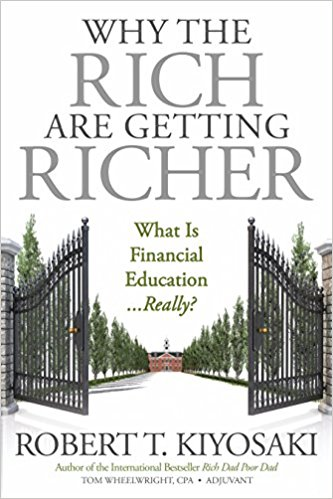

# Why the Rich are Getting Richer

The local public [library](https://www.dclibrary.org/westend) reopened, and this [title](https://www.amazon.com/Why-Rich-Are-Getting-Richer/dp/1612680887/) caught my eye. It turned out to be the opposite of what I expected: a window into Trump philosophy.

[Robert Kiyosaki](https://en.wikipedia.org/wiki/Robert_Kiyosaki#Criticism_and_controversy), also author of [Rich Dad Poor Dad](https://en.wikipedia.org/wiki/Rich_Dad_Poor_Dad#Criticism), is a Trump man. Their names appear together on [two](https://en.wikipedia.org/wiki/Why_We_Want_You_to_Be_Rich) [books](https://en.wikipedia.org/wiki/Midas_Touch_(book)), and they have ideas that don't come naturally to me.

For example, Kiyosaki doesn't like [the Fed](https://en.wikipedia.org/wiki/Federal_Reserve_System) or taxes. He thinks "Not paying taxes is patriotic." He also says "Taxes Are Fair." He explains that rich people pay little in taxes because "He who has the gold makes the rules." He also says it's because the government wisely incentivizes things the rich do. It's a little dizzying.

> "The good news is that with _real_ financial education, almost everyone can be in the 10% who earn 90% of money."

I'm reminded of Flynn's [downward spiral destructive of civic virtue](/20170821-downward_spiral_destructive_of_civic_virtue/). To Kiyosaki, it isn't a _problem_ that the rich are getting richer, because you too can get rich, if only you buy his books, come to his seminars, invest like him. You're a smart one.

Kiyosaki has a generalized concern about the dollar not being backed by gold. He recommends cash flow, for example by taking out loans to become a landlord. He's repeatedly dismissive of employees–of the very idea of work–but praises job creators.

I wonder which of his contradictions he has in mind when he quotes Fitzgerald's praise of "the ability to hold two opposing ideas in mind at the same time" at the close of the book.

Maybe Kiyosaki really does believe it's wrong to help the poor in ways other than the financial education he sells. Certainly, like Trump, he's most focused on image, on selling.

Maybe the lesson of this book is that some people really do believe all these things.

