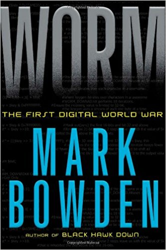

# Worm by Mark Bowden

[This](https://www.amazon.com/Worm-First-Digital-World-War/dp/0802119832) was the only book on computer security that I could find at my local library, which is a little surprising for DC. It's about the [Conficker worm](https://en.wikipedia.org/wiki/Conficker). It's [not](http://www.nytimes.com/2011/10/04/books/mark-bowdens-worm-about-conficker-review.html) a great book.

I had hoped for more expertise. Even I know that [TCP](https://en.wikipedia.org/wiki/Transmission_Control_Protocol) packets are not "packets of code" and that [DDoS](https://en.wikipedia.org/wiki/Denial-of-service_attack#Distributed_attack) is not "Dedicated Denial of Service." That second error appears once, with later expansions being correct, but it is symptomatic of generally weak quality control.

A scan through the Wikipedia page for [Conficker](https://en.wikipedia.org/wiki/Conficker) shows that Worm leaves out a number of interesting technical details: dictionary attacks are not mentioned at all, for example.

I did enjoy learning about the involvement of [SRI](https://www.sri.com/) in connection with Conficker and with the development of the internet in general.

Bowden focuses on social aspects, and these mostly ring true: Lots of computers aren't updated, and hackers take advantage of them. Coordination, especially with government, can be difficult. Mischel Kwon in particular is not portrayed glowingly, but many of the cast of characters appear infantile in their own words.

The book succeeds in making security seem pretty inane. Microsoft makes a crummy product, so people get hacked. To stop the hacked machines from doing anything, the good guys try to buy a lot of domain names, and eventually fail. All our technology is both amazing and pitiful.

