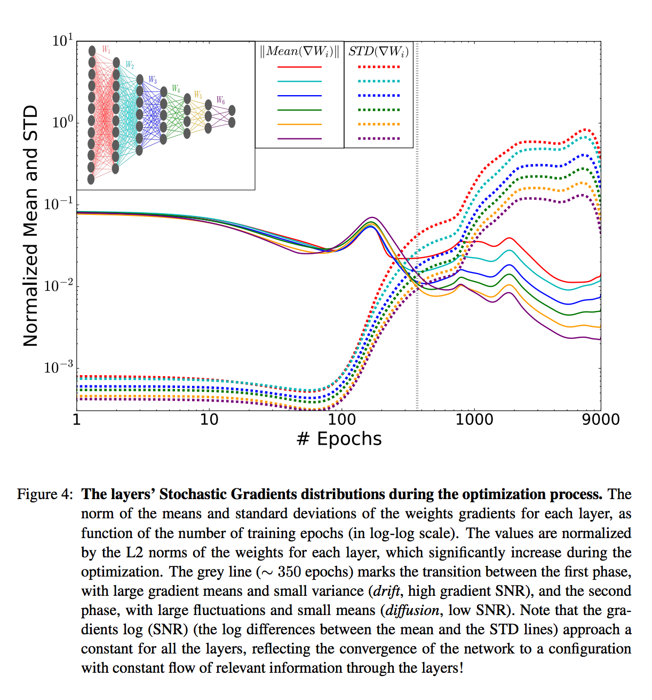
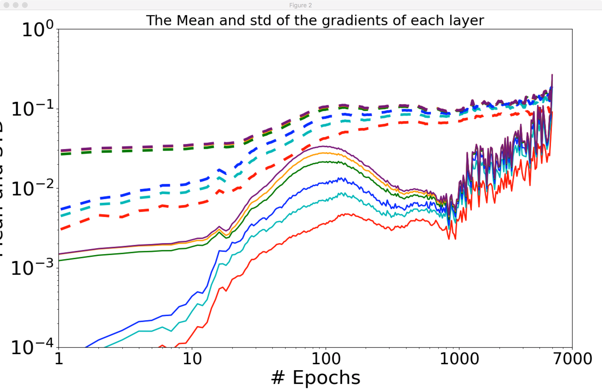
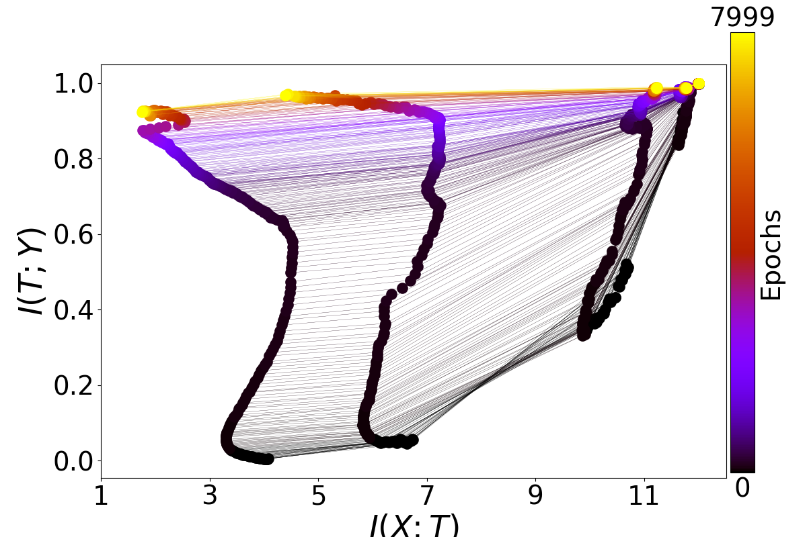
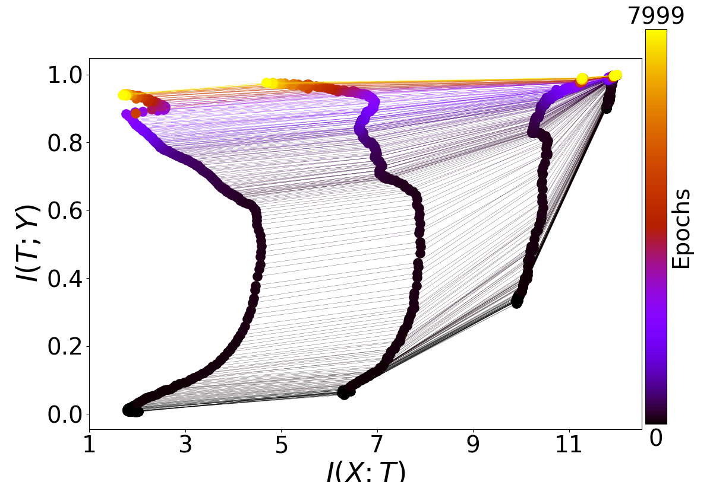
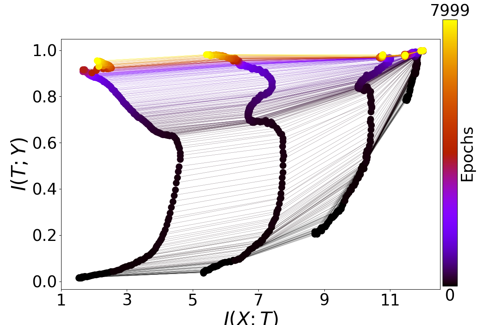
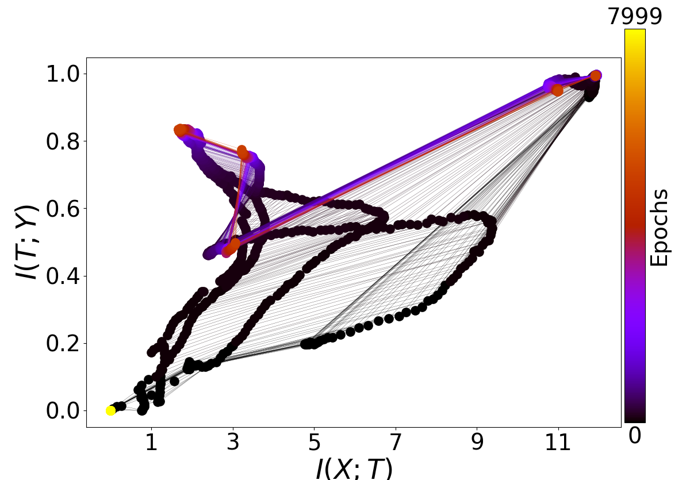
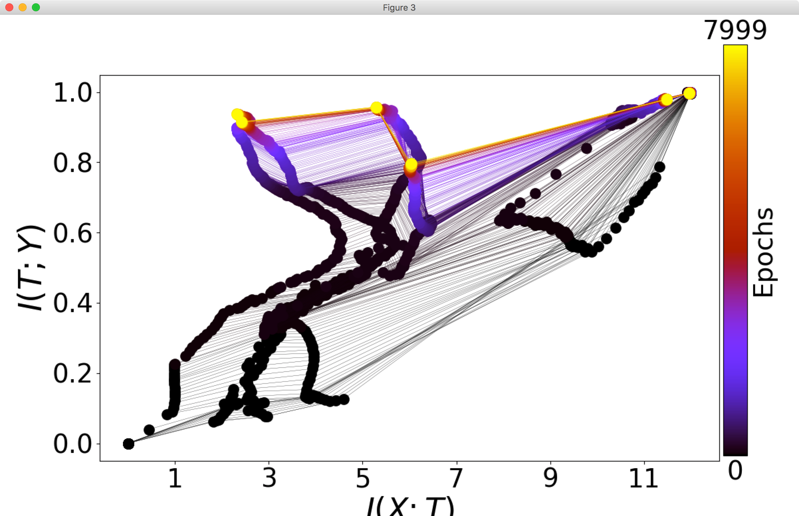

# Failure to replicate Schwartz-Ziv and Tishby

[Opening the Black Box of Deep Neural Networks via Information](https://arxiv.org/abs/1703.00810) didn't appear at any conferences, to my knowledge, but it still built up some [buzz](https://www.quantamagazine.org/new-theory-cracks-open-the-black-box-of-deep-learning-20170921/). It has been difficult to replicate, for both [bloggers](https://severelytheoretical.wordpress.com/2017/09/28/no-information-bottleneck-probably-doesnt-open-the-black-box-of-deep-neural-networks/) and [academics](https://openreview.net/forum?id=ry_WPG-A-). I attempted to replicate some aspects, and emailed the authors with the message below in an attempt to resolve difficulties. As there has been no response after many weeks, I present the below as an open letter. I hope it can serve as a reference for others who might try to explore these ideas.

---

Hi Ravid! I was intrigued by your paper, [Opening the Black Box of Deep Neural Networks via Information](https://arxiv.org/abs/1703.00810), so I wanted to replicate your results. I was particularly interested in your Figure 4; I thought that if I could see these kinds of patterns, maybe they could be used to identify when a network is well-trained, for example.

Here is the figure I mean:

I started by trying to work with a simple ReLU network with two hidden layers, on MNIST, and what I found was that the sizes of gradients decrease through training, and so do differences or variances of those gradients. I couldn't see two distinct phases, or indeed any interesting crossing of two metrics.

At first, I wasn't sure about how to interpret the "mean" and "standard deviation" of your Figure 4. So I was happy to find your [code](https://github.com/ravidziv/IDNNs), which I've been using at the 2017-11-02 [c4abb1d commit](https://github.com/ravidziv/IDNNs/tree/c4abb1dad4fbb262315eb8b96eb85dc5c3e98e5c).

Unfortunately, using the definitions of "mean" and "standard deviation" as found in your `idnns/plots/plot_gradients.py` file, I didn't get results that matched those of your paper any better.

I started to use your code directly, running `main.py` with default arguments, adding only `-save_grads true` so I could then use `plot_gradients.py`. Here is the result:

As you can see, there are differences from your published Figure 4.

Can you help me to replicate your results? What should I be doing differently? I would appreciate your feedback. I also posted comments about my process of trying to understand your work on a ["severely theoretical" blog post](https://severelytheoretical.wordpress.com/2017/09/28/no-information-bottleneck-probably-doesnt-open-the-black-box-of-deep-neural-networks/); if you would like to add public context there as well it would also be appreciated.

One thing that I noticed is that in your published Figure 4, one of the solid "mean" lines crosses the others. With the current calculation of "mean" in your code, in which the value for a layer is the sum of an always-positive calculation on each layer up to and including itself, it doesn't seem possible for lines to ever cross. Does this shine any light on what's going on?

Another thing I noticed is that the caption for your published Figure 4 says "values are normalized by the L2 norms of the weights for each layer" but in the current code, I don't see this happening. Is this perhaps part of what's going on?

I also noticed that the y axis labels in the plot don't seem to correspond to the values being plotted. For example, the first (leftmost) value for the last layer's "standard deviation" is calculated by your code as 0.49 (I check by inserting `print` messages) but it appears in the plot as less than 0.1. I think this issue doesn't affect the shapes of the curves but only the labeling, as far as I can tell.

More generally, is the cumulative sum approach to calculating statistics over layers appropriate? It strikes me that the pattern of the first layer dominates the plotted results, and it's then difficult to see what's happening uniquely in the higher layers.

I also tried running your `main.py` with the activation changed to ReLU, using `-activation_function 1`.

The result here is mostly the same as the previous one, qualitatively, except that the gradient means seem to increase overall through the training process. Naftali Tishby has [said](https://severelytheoretical.wordpress.com/2017/09/28/no-information-bottleneck-probably-doesnt-open-the-black-box-of-deep-neural-networks/#comment-183) that "results [showing non-decreasing mean gradients] are clearly incorrect as the gradients must decease eventually when the training error saturates." How should this be interpreted?

Let me lay out my understanding of the "mean" and "standard deviation" of your Figure 4, as based on reading your code. Both metrics are calculated for every layer and epoch, so I'll take just one as an example.

Let's say a network has a first layer with two weights, and there are two batches per epoch. Let's say the gradients for the first layer in the first epoch are `[2, 3]` and `[4, 5]`.

To get the "mean" we calculate the element-wise mean (`[3, 4]`) and take the norm, so the "mean" is `5`.

To get the "standard deviation" we calculate the element-wise variance (`[1, 1]`) and take the square root of its sum (`1.414`; call this the "variance") and then take the square root, so the "standard deviation" is `1.189`.

To show the cumulative sum aspect of the calculation, say there is a second layer with two weights and identical first-epoch gradients. Then for the second layer, first epoch, the "mean" is `5+5=10` and the "standard deviation" is the square root of the sum of the "variances" `sqrt(1.414+1.414)=1.682`.

This understanding is based on reading and experimenting with your `plot_gradients.py`. Does it seem right to you? Am I misinterpreting something? Is the intent other than this?

I would love to replicate the core result of your Figure 4, which I summarize as being "at first, gradients are large but don't vary much, and then later, gradients are small but vary a lot." What's the best way to find this result? I have seen that usually _both_ gradients and the amount they vary decrease through training, but I have been unable to observe the two phases described in your paper.

While my main focus has been on finding the two phases by statistics on the gradients, I am also interested in the mutual information parts of your paper as well. Here are four plots generated by running your `main.py` (all default arguments) four times:

As you can see, I have not been able to consistently replicate the beautiful plots you have in your paper as Figure 3. In fact, the higher layers consistently fail to show the patterns described in your paper, and the lower layers behave somewhat irregularly. Am I doing something wrong?

One thing I noticed is that in the caption for Figure 3, the architecture is described as "input=12-10-8-6-4-2-1=output". This is somewhat different from the current default in your code, and in particular it doesn't seem possible to have a single output unit with your code in its current version, because for binary classification it uses a softmax over two output nodes. Is this an important difference? Could it be causing the difficulty in seeing compression phases?

I also kept the information plots from two runs of `main.py` with `-activation_function 1` for ReLU activations. Here they are:

I'm not sure if anything can be interpreted from these; maybe the code as I found it doesn't support ReLU at present? I know I've read that there are some different issues concerning binning when calculating mutual information involving ReLUs.

I would appreciate your insight on all these specific issues, but also more broadly: if the phenomena of your paper are general to neural networks, how should I understand the apparent difficulty in seeing similar results with other networks, code, and datasets? How should I understand the apparent difficulty even when using the same dataset, and your code?

Thank you very much for your help with all this,

~ Aaron

---

I should add for completeness that I am aware of Saxe et al.'s Figure 1A, which seems to replicate Schwartz-Ziv and Tishby's information plane result better than Schwartz-Ziv's code does for me. I would like to know how they achieve that, but the point Saxe et al. make is that the information plane result doesn't hold for most neural nets that are used in practice, so it's kind of beside the point. I haven't seen anyone replicate the result on mean and variance of gradients during training, which is what I am most interested in.
