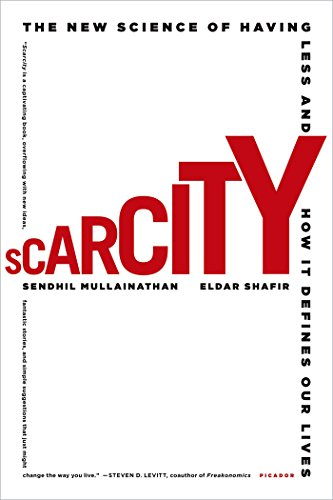

# Scarcity by Sendhil Mullainathan and Eldar Shafir

The promise of [Scarcity](https://scholar.harvard.edu/sendhil/scarcity) is an uplifting unified [theory](/20170825-characteristics_of_good_theories/) that "accounts for a diverse set of phenomena" (page 162) and has social policy implications. It's a research-based rationale for compassion rather than blame, encapsulated on page 144:

> 'Scarcity creates a mindset that perpetuates scarcity. If all this seems bleak, consider the alternative viewpoint: the poor are poor because they lack skills. The lonely are lonely because they are unlikable; dieters lack willpower; and the busy are busy because they lack the capacity to organize their lives. In this alternative view, scarcity is the consequence of deep personal problems, very difficult to change.

> 'The scarcity mindset, in contrast, is a contextual outcome, more open to remedies. Rather than a personal trait, it is the outcome of environmental conditions brought on by scarcity itself, conditions that can often be managed.'

The book expands and applies some ideas that were present in [Thinking, Fast and Slow](/2011/12/17/selections-from-and-thoughts-on/):

> 'Imagine that you are asked to retain a list of seven digits for a minute or two. While your attention is focused on the digits, you are offered a choice between two desserts: a sinful chocolate cake and a virtuous fruit salad. The evidence suggests that you would be more likely to select the tempting chocolate cake when your mind is loaded with digits.'

The book is about how scarcity, like (or as) a distracting mental task, makes it harder to make good decisions, which makes it harder to escape scarcity.

The biggest new contributions are probably from the authors' [Science](http://www.sciencemag.org/) paper, [Poverty Impedes Cognitive Function](http://science.sciencemag.org/content/341/6149/976.long). They found, for example, that farmers did better on an IQ test shortly after being paid for their yearly harvest, compared to before.

The authors grant that some scarcity, like shortness of time before a deadline, can improve performance by increasing focus. They call this the "focus dividend." But focusing can mean other things are neglected; they speak of "tunneling" and a "bandwidth tax."

They praise the "slack" time and money that some people enjoy. If you're operating without slack, a surprise can do a lot of damage, for example starting a downward spiral of payday loans. If you don't have slack you also need to really trade off in making decisions, which might prevent you from making certain cognitive errors of scale, but requires bandwidth.

Some of the organizational applications remind me of [The Mythical Man-Month](https://en.wikipedia.org/wiki/The_Mythical_Man-Month). For example, they describe a NASA project that was behind, so they skipped integration tests, and eventually failed catastrophically.

> 'The truly efficient laborer will be found not to crowd his day with work, but will saunter to his task surrounded by a wide halo of ease and leisure.' (Henry David Thoreau, quoted page 194)

I particularly appreciated that the authors made a noticeable effort to anticipate and address readers' possible objections, but I was already largely in agreement, so it may have been hard for me to judge their success in this regard. They also got me curious about [Portfolios of the Poor](http://www.portfoliosofthepoor.com/), which seems like it could be a good window into how the global poor live. Mullainathan and Shafir inspire one to understand more.

