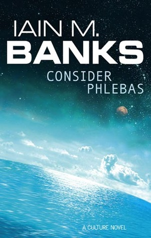

# Consider Phlebas by Iain M. Banks

Amazon [is](http://variety.com/2018/tv/news/consider-phlebas-iain-m-banks-amazon-novel-dennis-kelly-1202706327/) making a sci-fi TV show based on the 1987 [Consider Phlebas](https://en.wikipedia.org/wiki/Consider_Phlebas). Focusing on certain cultural aspects would be interesting, or it could be just another space opera.

There's a war between [The Culture](https://en.wikipedia.org/wiki/The_Culture) and the [Idirans](https://en.wikipedia.org/wiki/List_of_civilisations_in_the_Culture_series#Idirans). They could stand in for modern American society: The Culture is liberal, the Idirans are conservative. In one paragraph Banks uses the word "contempt" eight times, which reminded me of [The Politics of Resentment](https://www.amazon.com/Politics-Resentment-Consciousness-Wisconsin-American/dp/022634911X). The comparison isn't perfect, but it could be explored.

Unfortunately, the bulk of the 514 pages is given to the details of who punched who, and how. Some ideas infiltrate a chapter about a cannibalistic cult, or poker for human lives. The chapters, especially early ones, are very episodic, and I could imagine Amazon following the material closely if they wanted to.

The Culture has sentient artificial Minds that participate in and even guide their society. This is the kind of thing I was hoping to read about, but it's largely swamped by swashbuckling. It would be neat to see Amazon produce a slightly more conceptual adventure based on the source material.

Why the weird title? It's from [T. S. Eliot](https://en.wikipedia.org/wiki/T._S._Eliot)'s poem, [The Waste Land](https://en.wikipedia.org/wiki/The_Waste_Land). The relevant section:

---

<pre>
IV. Death by Water

Phlebas the Phoenician, a fortnight dead,
Forgot the cry of gulls, and the deep sea swell
And the profit and loss.
                                   A current under sea
Picked his bones in whispers. As he rose and fell
He passed the stages of his age and youth
Entering the whirlpool.
                                  Gentile or Jew
O you who turn the wheel and look to windward,
Consider Phlebas, who was once handsome and tall as you.
</pre>

---

[The Waste Land](https://www.poetryfoundation.org/poems/47311/the-waste-land) overflows with allusion; just to read the words as written requires six languages or so. [Consider Phlebas](https://en.wikipedia.org/wiki/Consider_Phlebas), in comparison, is much less dense.

