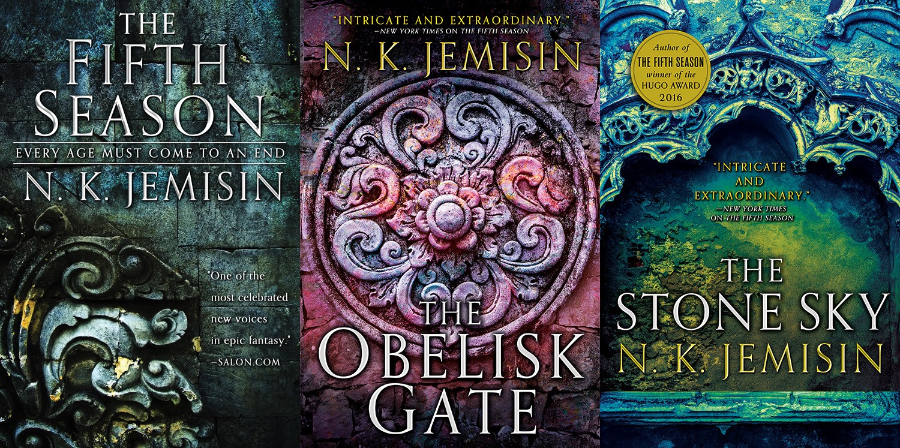

# The Broken Earth trilogy

[N. K. Jemisin](https://en.wikipedia.org/wiki/N._K._Jemisin)'s three-book tale is both enjoyable and sufficiently deep to support a lot of conversation. The first [Hugo](https://en.wikipedia.org/wiki/Hugo_Award)-winning book, [The Fifth Season](https://en.wikipedia.org/wiki/The_Fifth_Season_(novel)), was the first book I read for a book club. I couldn't stop, and finished [The Obelisk Gate](https://en.wikipedia.org/wiki/The_Obelisk_Gate) and [The Stone Sky](https://en.wikipedia.org/wiki/The_Stone_Sky) as well.

Here some aspects of the trilogy that I found interesting:

 * Revolution vs. gradual change or "working within the system": What
   is possible, and when is revolutionary change justified/necessary?
 * Science fiction vs. fantasy (possibly philosophy of science?):
   Arthur C. Clarke's "Any sufficiently advanced technology is
   indistinguishable from magic" is relevant, but also, what if some
   sufficiently advanced science turns out to be very different from
   what the current popular scientific view thinks is likely?
 * Gift vs. curse: Having special powers isn't always as great as in
   Harry Potter; this is a little more like X-Men, but more extreme.
 * Race and slavery: There's a lot to think about; one aspect is an
   R-word that maps pretty directly to the real-world N-word.

I noted some quotes from each book, though I started saving more after
the first volume:

### The Fifth Season

> "It's a gift if it makes us better. It's a curse if we let it
> destroy us." (p. 418)

### The Obelisk Gate

> "He's never hurt you, though. The world has, but not him. Maybe the
> world deserved to be destroyed." (p. 31)

> "Something else, neither flesh nor stone. Something immaterial, and
> yet it is there for you to perceive. It glimmers in threads strung
> between the bits of him, crossing itself in lattices, shifting
> constantly. A... tension? An energy, shining and streaming.
> Potential. Intention." (p. 101)

> "He showed you-again and again, unrelentingly, he would not let you
> pretend otherwise-that if obedience did not make one feel safe from
> the Guardians or the nodes or the lynchings or the breeding or the
> disrespect, then what was the point? The game was too rigged to
> bother playing." (p. 159)

> "Like those weird cults that crop up from time to time. I heard of one that asks an old man in the sky to keep them alive every time they go to sleep. People need to believe there's more to the world than there is." (p. 166)

> "It isn't fair. You just want your life to matter."

### The Stone Sky

> 'When a slave rebels, it is nothing much to the people who read
> about it later. Just thin words on thinner paper worn finer by the
> friction of history. ("So you were slaves, so what?" they whisper.
> Like it's nothing.)' (p. 7)

> "People who are not tuners can perceive magic only in rudimentary
> ways; they use machines and instruments to do what is natural for
> us." (p. 107)

> "But breathing doesn't always mean living, and maybe... maybe
> genocide doesn't always leave bodies." (p. 179)

> '"Because it must be his choice, first." Harder voice here. A
> reprimand. You flinch. "More importantly, because we are fragile at
> the beginning, like all new creatures. It takes centuries for us,
> the who of us, to...cool. Even the slightest of pressures-like you,
> demanding that he fit himself to your needs rather than his own-can
> damage the final shape of his personality."' (p. 282)

> '"Orogeny," I say, sharply so she will pay attention, "was never the
> only way to change the world."' (p. 396)
