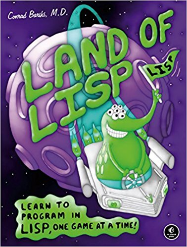
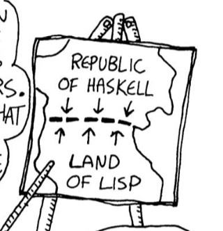
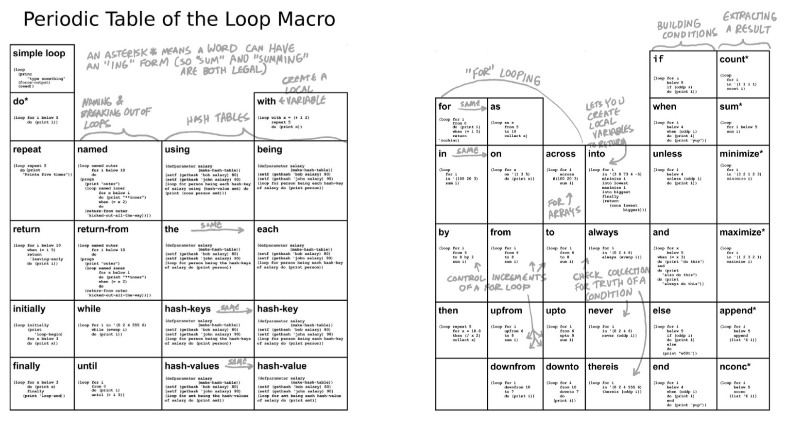

# Land of Lisp

[Land of Lisp](http://landoflisp.com/) is an irresistibly fun [Common Lisp](https://common-lisp.net/) book. The cartoon illustrations and "Learn to program in Lisp, one game at a time" subtitle don't fully suggest the depth of the content. Recursion is in Chapter 2, you write both [Graphviz](https://www.graphviz.org/) and raw [SVG](https://en.wikipedia.org/wiki/Scalable_Vector_Graphics) for graphics, you code up a web server from scratch, and you write your own lazy evaluation and multiple [DSL](https://en.wikipedia.org/wiki/Domain-specific_language)s with macros before the end of the book. With that much material, some glitches sneak in, but it's still a very nice book.

I've done a little bit with [Emacs Lisp](https://en.wikipedia.org/wiki/Emacs_Lisp) and [Clojure](https://clojure.org/), but this was my first time learning anything much about Common Lisp. Thinking about languages through contrast ([one old example of mine](https://planspace.org/20141129-ruby_symbols_are_not_lisp_symbols/)) is fun, and there's a good deal of that in Land of Lisp.

I really liked some of the organization/presentation of material. The Periodic Table of the Loop Macro on pages 200 and 201 was one striking example.

The way the author [memoized](https://en.wikipedia.org/wiki/Memoization) functions, by first defining the un-memoized version and then defining the memoized version with the same name, capturing the original function by [closure](https://en.wikipedia.org/wiki/Closure_(computer_programming)), really tickled me.

There was also reference to a Haskel functional-style "[database](http://happs.org/)" that I thought was interesting. Maybe sort of like [Datomic](https://www.datomic.com/)? And there were occasional references to other neat things; I may now read [Implementation and Use of the PLT Scheme Web Server](https://cs.brown.edu/~sk/Publications/Papers/Published/khmgpf-impl-use-plt-web-server-journal/), for example.

I've thought about good ways to learn to program a little bit, even [suggesting](https://planspace.org/20150101-learn_to_code_with_emacs/) that learning Emacs/Lisp might be good. Then at least you can use Emacs Lisp to customize your editor. I don't think I know of any current Common Lisp projects.

It's nice when learning (and working with) a language to have a handy documentation system. Emacs Lisp [has this](https://planspace.org/20141230-use_info_in_emacs/) in spades. In Python, I think beginners should know about, for example, `help()` and `dir()` very early. There's nothing like this covered in Land of Lisp. The only documentation referenced, as I recall, was the [Common Lisp HyperSpec](http://www.lispworks.com/documentation/HyperSpec/Front/), which doesn't seem very beginner-friendly.

The most extremely anti-didactic bit of the book, however, has to be on page 382: "The only way to understand [these functions] is to stare at them for a long time." I think non-explanations like this are not likely to be helpful to anyone.

Then there are little glitches in the book. I suspect the book kept expanding and editors were overwhelmed:

 * The intro to Chapter 7 claims to include things that don't start until Chapter 8.
 * `sexp` is used in code but never [explained](https://en.wikipedia.org/wiki/S-expression), which I don't think is a good idea.
 * `pushnew` is used on page 149 but not explained until page 368.
 * On page 445 it says "Restarts are discussed in Chapter 14," but they aren't.
 * On page 450 a reference to Chapter 16 should be to Chapter 17.

In the end the book can't cover everything. For example, the [Common Lisp Object System](https://en.wikipedia.org/wiki/Common_Lisp_Object_System) is praised but not explained in enough detail for me to know why it's so great. That was particularly frustrating because I'd still love to see more about managing large projects in languages like Common Lisp or Clojure (with OO concepts or not).

I liked the book a lot; it's great recreational reading for language breadth.
