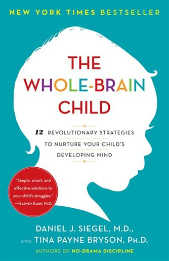

# The Whole-Brain Child

The advice of this book overlaps substantially with that in
[Brain Rules for Baby](/20181209-brain_rules_for_baby/). In
comparison, the science here feels less rigorous, but the advice still
seems reasonable. There's more focus on memory, which I mostly like.

> "... children whose parents talk with them about their experiences
> tend to have better access to the memories of those experiences."
> (page 8)

If there's an overall theme, it is a kind of Western presentation of a
[middle way](https://en.wikipedia.org/wiki/Middle_Way) between logic
and emotion, then between reactive thought and higher executive
function (shades of
[Thinking, Fast and Slow](/2011/12/17/selections-from-and-thoughts-on/)).
There's a kind of meditative concept they call
[mindsight](https://www.drdansiegel.com/about/mindsight/).

The way they think about human development reminds me a little bit of
Montessori's "spontaneous discipline" - people become better.

> "As you create a whole-brain family, you also join a broader vision
> of creating an entire society full of rich, relational communities
> where emotional well-being is nurtured for this and future
> generations." (page 148)

Here are their "12 revolutionary strategies to nurture your child's
developing mind":

1. Connect and redirect: Surfing emotional waves
2. Name it to tame it: Telling stories to calm big emotions
3. Engage, don't enrage: Appealing to the upstairs brain
4. Use it or lose it: Exercising the upstairs brain
5. Move it or lose it: Moving the body to avoid losing the mind
6. Use the remote of the mind: Replaying memories
7. Remember to remember: Making recollection a part of your family's daily life
8. Let the clouds of emotion roll by: Teaching that feelings come and go
9. SIFT (Sensations, Images, Feelings, Thoughts): Paying attention to what's going on inside
10. Exercise mindsight: Getting back to the hub
11. Increase the family fun factor: Making a point to enjoy each other
12. Connect through conflict: Teach kids to argue with a "we" in mind

There's also a one-page (front and back) "refrigerator sheet" at the
back of the book, which is cute.

