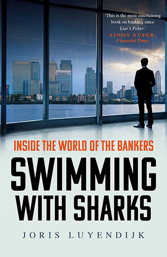

# Swimming with Sharks, by Joris Luyendijk

"Inside the world of the bankers,"

> "You see a cluster of islands in the fog, staffed by mercenaries."
> (page 145)

[Luyendijk](https://twitter.com/JORISLUIJENDIJK) wrote
[a 2011-2013 banking blog](https://www.theguardian.com/commentisfree/joris-luyendijk-banking-blog)
for the Guardian based on interviews with bankers in London. It became
this 2015 book. It's quite late to the "What happened in 2008?"
party, and even makes the observation that

> "the sector has become immune to exposure." (page 252)

It does seem like some things these days are so bad they can hardly be
made to look worse, and yet far from being stopped, some people really
like them.

So Luyendijk writes about how things in finance are complicated, and
bad, but it's hard to single out any bad guys by name. His Dutch
perspective is interesting: he identifies lack of job security as a
major cause of problems in finance, for example.

On page 254 he has one paragraph of recommendations for law to change
the system:

 1. Break up banks so nothing is too big or too complex to fail
 2. Don't let units of the same company have conflicts of interest
    with one another
 3. Don't allow the building/selling/owning of overly complex
    financial products
 4. Only allow bonuses that have symmetric risk

No problem, right?

The observation and recommendation that resonated the most for me was
reconnecting reward to risk. With big public companies, a trader has
essentially only upside: good performance means a big bonus, but bad
performance means at worst finding another high-paying job at a
different company.

> "nobody should have more reason to lie awake at night worrying over
> the risks to the bank's capital or reputation than the bankers
> taking those risks." (page 254)

I can get behind the sentiment, at least.

