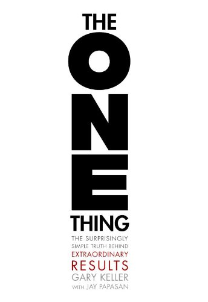

# The One Thing

This book is not all bad. A copy found its way from an airport
bookstore to a [little free library](https://littlefreelibrary.org/)
to me, and I read it. Key points:

 * Do the most important thing(s).
 * Make time to do things, blocking four-hour AM calendar "meetings"
   if need be.

There's some other stuff in there about thinking big, identifying the proximal task, staying healthy, trying to not be a workaholic, etc. The book repeats pop science hits like [the marshmallow experiment](https://en.wikipedia.org/wiki/Stanford_marshmallow_experiment) unquestioningly and without more recent [updates](https://www.theatlantic.com/family/archive/2018/06/marshmallow-test/561779/). There are ample cute turns of phrase that seem designed to play well in motivational speaking. It's not a great book, but it's quick to read, and it does sort of pump you up.

I think the core idea is not so bad. Two important aspects:

 * **Just _completing_ anything.** There are so many distractions and
   ways to waste time, it's possible to "work" a lot and not actually
   get things done. It's helpful to identify a thing to do and then
   focus on completing it. The book mentions the inefficiency of
   multitasking, which rings true to me.
 * **Doing the _right_ thing.** There are many paths to not
   accomplishing anything. You can work on a problem for a long time,
   even get a lot of things done, without actually making real
   progress. You might end up with everything to show for your work
   except what you actually needed.

