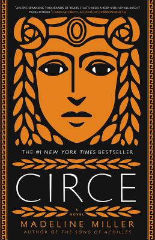

# Circe by Madeline Miller

I didn't know anything about
[the Circe of mythology](https://en.wikipedia.org/wiki/Circe), so to
me Miller's book was mostly fan fiction for classics majors, sort of
like Twilight but backward. Then I learned there's a whole history of
misogynist vs. feminist versions of Circe, which gives the book a bit
more gravitas. I think it's a fine book regardless of how deeply into
the history you go.

I frequently liked the writing, which was obviously wrought but rarely
overwrought. Here are a couple lines I pulled out, in retrospect more
for their sentiment than their language per se:

> "Beneath the smooth, familiar face of things is another that waits
> to tear the world in two." (p. 16)

> "_Bold action and bold manner are not the same._" (p. 21, italics in
> original)

Miller's Circe is on the feminist side. Here's one small example,
drawing attention to a false dichotomy that probably has a name:

> "Would I be skimmed milk for crying, or a harpy with a heart of
> stone? There was nothing in between." (p. 98)

This book loves foreshadowing, from the very first line: "When I was
born, the name for what I was did not exist." (She's a witch.)
Foreshadowing is everywhere. In particular, I thought I noticed a
couple instances before the reveal that Circe is pregnant.

This first selection is arguably just sexual, but "belly" made me
start to wonder whether Circe was starting to think about a child:

> "My smooth belly glowed beneath my hand, the color of honey shining
> in the sun. I drew him down to me." (p. 215)

I think this one is clearer. It follows a discussion of another mother
(with "a thousand wiles") and her child:

> "I cupped my own hands in the dark. I did not have a thousand wiles,
> and I was no fixed star, yet for the first time I felt something in
> that space. A hope, a living breath, that might yet grow between."
> (p. 226)

I'm not sure if this one counts as foreshadowing because it's so
explicit:

> "And last of all, still in its cedar box: silphium ground with
> wormwood, the draught I had taken each moon since the first time I
> lay with Hermes. Each moon except the last." (p. 234)

[Silphium](https://en.wikipedia.org/wiki/Silphium) is an extinct
natural contraceptive.

In addition to all the foreshadowing, there's explicit prophecy from
the gods.

> "It was [the Fates'] favorite bitter joke: those who fight against
> prophecy only draw it more tightly around their throats." (p. 291)

As with [Oedipus](https://en.wikipedia.org/wiki/Oedipus), the
realization of prophecy is independent of whether you know it in
advance. I hadn't thought about this before, but it's not so different
from [Ted Chiang](/20190613-exhalation_by_ted_chiang/)'s
single-timeline time travel. Maybe the ancient Greek's didn't like
paradoxes?

As you read, there are also references to earlier parts of the book,
which ask you to remember it pretty well. On page 358, it says "_Then,
child, make another,_" and you have to remember that the giant fish
god said that back on page 282, and that in context it meant "make
another world" (as in, take bold steps to change your situation).

Madeline Miller has made another world in Circe: a world humane to
both the goddess and the reader.

