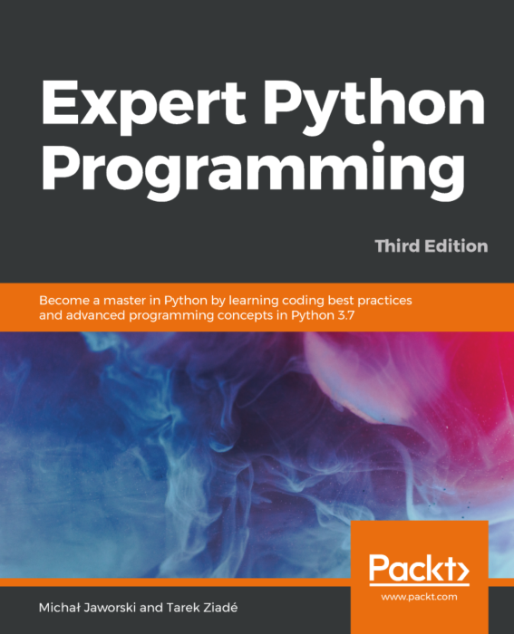

# Expert Python Programming by Jaworski and Ziadé

The authors use "half a loaf is better than none" on page 545 in reference to [`run_in_executor`](https://docs.python.org/3/library/asyncio-eventloop.html#asyncio.loop.run_in_executor), and that saying is also applicable to their book. [Expert Python Programming](https://www.packtpub.com/application-development/expert-python-programming-third-edition) is not a good book, but it's also not entirely without value.

The editing could be better. Either no native English speakers were involved, or they didn't have enough time to work with the Polish and French authors' prose. A next section promised on page 391 never appears. On page 546 there are two different next chapters. There's even a code block on page 576 that is printed with all the newlines stripped out.

Beyond simple issues, explanation is sometimes poor or missing. The [token bucket](https://en.wikipedia.org/wiki/Token_bucket) explanation is particularly unclear. They say that Python string concatenation is quadratic, but they don't explain [why](https://stackoverflow.com/questions/44487537/why-does-naive-string-concatenation-become-quadratic-above-a-certain-length/44487738#44487738). On page 496 they suggest that non-deterministic caching has been solved numerous times, so the reader can just go look on PyPI.

The publication date of this third edition is April 2019, and yet there's no mention of [Pipenv](/20190629-using_pipenv/). They [still](https://github.com/pytest-dev/pytest/issues/1629#issue-161422224) say py.test rather than pytest. They mention nose but not nose2. Chunks of the book refer to Python 3.5, while the cover promises 3.7.

The perspective of the authors is unfamiliar to me, as when they say on page 187 that "Using binary bit-wise operations to combine options is common in Python."

I'd like to be able to trust the completeness of a book like this. If it doesn't know about Pipenv, what else is it missing that should really be included?

But it isn't all bad. I don't recall seeing the Python 3.7 `asyncio.run()`, but the larger-scale explanations of [`asyncio`](https://docs.python.org/3/library/asyncio.html) weren't awful. If I'm understanding properly, the interesting thing about `await` is that it _doesn't_ wait, in the sense of blocking.

So I'm not upset that I read the book. I suspect the authors are technically competent people who did the best they could with limited resources from [Packt](https://www.packtpub.com/). The book contains their take on things, and it broadened what I was aware of.

