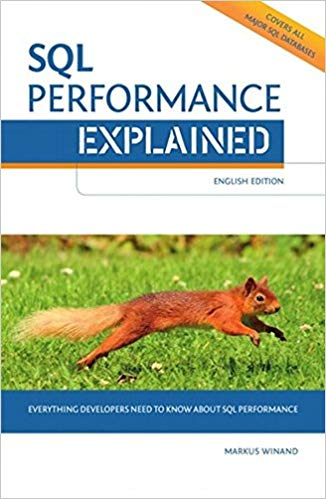

# SQL Performance Explained, by Winand

This is the printed version of "[Use the index, Luke](https://use-the-index-luke.com/)." It avoids the Jedi goofiness—and the author's [unsettling gaze](https://winand.at/static/markus_winand.Y-sfxgk9.jpg). It's pretty good, especially for a self-published book, and it delivers on the promise of explaining, very accessibly, how SQL engines run.

The mental model offered goes beyond just "index means \\(O(log(n))\\)," though there are the obligatory graphs showing linear vs. log growth. Winand describes tree traversal of indexes, but then also (depending on data and query) linked-list traversal, and how this relates to accessing data that isn't in the index, and connected trade-offs.

The material starts rudimentary, but reaches details such as this, on page 140:

> "The Oracle database cannot read an index backwards in order to execute a pipelined `group by` that is followed by an `order by`."

One of the most interesting things for me turned out to be the frequent comparisons and notes specific to SQL implementations. Very often the notes were explaining that MySQL didn't offer a particular feature, or that a feature was only available in Postgres. MS SQL Server and Oracle seem to be somewhere in the middle.

The level of detail was also sufficient to make clear that declarative languages like SQL are not the panacea that they are sometimes made out to be. I hadn't realized, for example, that SQL engines make execution choices based on statistics they keep about the data they store, and that those statistics can be incorrect, leading to bad choices.

Winand is also critical of [ORM](https://en.wikipedia.org/wiki/Object-relational_mapping)s that can lead to bad SQL. Though I didn't find these examples particularly compelling, I do think it's a related case of trading control for convenience.

Also, the book comes with a bookmark, which is a laminated miniature of the cover.

