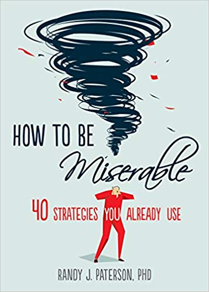

# How to be Miserable, by Paterson

CGP Grey recommended this [book][] in his [video][] highlighting seven
of its "40 strategies you already use" to increase misery. It's a fun,
quick read, during which occasionally some things may hit close to
home and force you to remind yourself that the advice is deliberately
bad. I especially liked "Lesson 20: Work Endlessly on Your
Self-Esteem."

[book]: https://www.newharbinger.com/how-be-miserable
[video]: https://www.youtube.com/watch?v=LO1mTELoj6o

---

### Lesson 20: Work Endlessly on Your Self-Esteem

Do you have a cat? If so, does it seem to think well of itself, or
does it appear to slink around in deep shame at being an inferior sort
of feline?

Most people sense that the cats they know have perfectly high
self-esteem⁠—despite never having had psychotherapy, attending no
esteem-building workshops, and reading very few self-help books. How
do they do it?

We live in a culture with a deep and abiding faith in the concept of
self-esteem. To follow this particular path downward, all you have to
do is go along with the crowd. Like them, view self-esteem as
something that you are born without and must build up, brick by brick,
into a tall and sturdy structure. Assume that self-esteem is something
separate from confidence in your ability to perform any particular
task, like juggling or changing the oil in your car. This makes it
vague and amorphous enough that constructing it becomes a futile⁠—and
thus misery-inducing⁠—effort.

But wait. Isn't self-esteem real? You've been taught about it since
birth. It can't possibly be just another Easter Bunny, can it?

Let's find out. Imagine a person with terrible self-esteem visiting
the bank and then walking to a café for lunch. What's he thinking
about?

> _I probably looked like an idiot when I dropped my pen back there,
> and the teller could see my bank balance—she probably thought I'm a
> complete failure. Even now, these people on the sidewalk can see
> what a loser I am, and my hair is sticking up everywhere. When I get
> lunch, I'll probably spill it on myself and look even worse._

Sound plausible?

Now imagine a person with great self-esteem doing the same thing.
What's he thinking about?

> _Wow, I really impressed them all at the bank back there—when I bent
> over to pick up my pen they could see how toned my rear end is,
> after all that work at the gym, and my balance probably made the
> teller drool. Look at all these lucky people sharing the sidewalk
> with me, envying me for my great hair. And when I get to the café,
> they'll put me at the table in the front window to attract other
> customers. Hey, I know: let me recite positive affirmations to
> myself on the way._

You think?

Or is he more likely to be wondering, _Do I want the soup or just a
chicken sandwich?_

The truth is, people with good self-esteem are not constantly
evaluating themselves. It's the ones without it who do this. Our
culture teaches us that having self-esteem is an active process of
building ourselves up. It isn't. Cats, three-year-olds, and adults
with self-esteem aren't doing much of anything—they're just focused on
the task at hand.

The active process is to have _low_ self-esteem, to be constantly
tearing ourselves down. When we wake up in the morning, before our
mind starts going, our self-esteem is fine. We only begin feeling
inadequate when we start rehearsing the negative story that we tell
ourselves. By focusing on self-esteem, we cleverly divert attention
from the real issue.

Self-esteem, in other words, _does not exist._ Self-loathing, however,
is very real.

In the classic French film _Jean de Florette,_ townspeople in Provence
conspire to trick a man out of the property he has inherited by
capping the farm's only source of water, thus starving his crops and
ensuring his downfall. Jean strives mightily to haul water to the
farm, unaware that it already has an inexhaustible supply just
underground.

Similarly, believers in self-esteem strive to import a sense of
self-worth, neglecting the fact that no such efforts are really
necessary: all they need to do is remove the plug that prevents
self-worth from flowing. That plug is the relentless self-criticism in
which they engage.

Your mission, then, is to affirm your faith in the concept of
self-esteem. Strive to build it up within yourself. Attend workshop
after workshop, recite affirmations, invite friends and therapists to
exalt your achievements. In doing so, you will reinforce both the
hidden conviction that there is much to make up for and the
corresponding belief in your inherent faultiness.

Sisyphus found an ideal path to misery: endlessly rolling a stone up a
hill, only to have it repeatedly escape his grasp and tumble to the
bottom. Trying to create self-esteem is like trying to construct a
ladder out of water. Futility leads to unhappiness, and seeing
yourself as lacking something that does not actually exist is a
perfect example.

---

