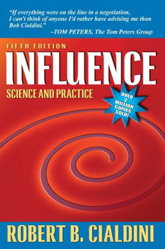

# Influence, by Cialdini

[Influence: Science and Practice](https://en.wikipedia.org/wiki/Influence:_Science_and_Practice) is a sort of cross between [How to Win Friends and Influence People](/2011/03/05/how-to-win-friends-and-influence-people/) and [Thinking, Fast and Slow](/2011/12/17/selections-from-and-thoughts-on/). Originally published well before Kahneman's popular book, it cites some of his earlier work. _Influence_ describes six principles used by "compliance professionals," a category rather broader than "marketers."

1. Reciprocation
2. Commitment/Consistency
3. Social proof
4. Liking
5. Authority
6. Scarcity

I believe it was this book that popularized the term "social proof"—_Influence_ has been influential. I heard about the book in [The $100 Startup](/20190824-100_startup/).

The tone can be militant. The principles are called "weapons of influence" and the examples include the Jonestown Massacre and techniques used on American prisoners during the Korean War. Referring to "boycott, threat, confrontation, censure, tirade, nearly anything to retaliate," Cialdini says "I don't consider myself pugnacious by nature, but I actively advocate such beligerent actions because in a way I am at war with the exploiters."

> I have recently become impressed by evidence suggesting that the
> form and pace of modern life is not allowing us to make fully
> thoughtful decisions, even on many personally relevant topics. That
> is, sometimes the issues may be so complicated, the time so tight,
> the distractions so intrusive, the emotional arousal so strong, or
> the mental fatigue so deep that we are in no cognitive condition to
> operate mindfully.

Largely a collection of anecdotes and research results presented as stories, _Influence_ plays hard into the tendency of readers to reason from the specific to the general. This includes at least one example I know to be at least partially debunked in connection with [the bystander effect](https://en.wikipedia.org/wiki/Murder_of_Kitty_Genovese).

In connection with the "Liking" principle, I was interested to learn something I hadn't been aware of previously about the [jigsaw](https://en.wikipedia.org/wiki/Jigsaw_(teaching_technique)) teaching technique: that it was designed "to help weaken racial cliques in forcibly integrated schools." I feel like I should have known that earlier!

One other fun connection was to the machine learning idea of [overfitting](https://en.wikipedia.org/wiki/Overfitting). Kahneman's automatic "[system one](https://en.wikipedia.org/wiki/Thinking,_Fast_and_Slow#Two_systems)" thinking is helpful but can lead to errors, often because it focuses on just one feature of a situation. Biological intelligence is sometimes held up as not having any drawbacks of ML, but it's interesting to draw this parallel.

This book was first published in 1984. I read the fifth edition, which has been updated so that on page 219 there's a picture of an Apple store with a caption about "the china department of Harrod's." [Cialdini](https://en.wikipedia.org/wiki/Robert_Cialdini) is 74 now. His book has been successful.

