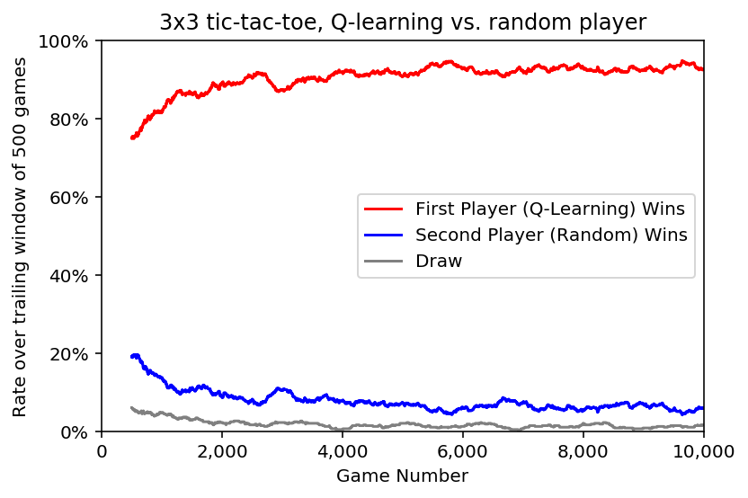
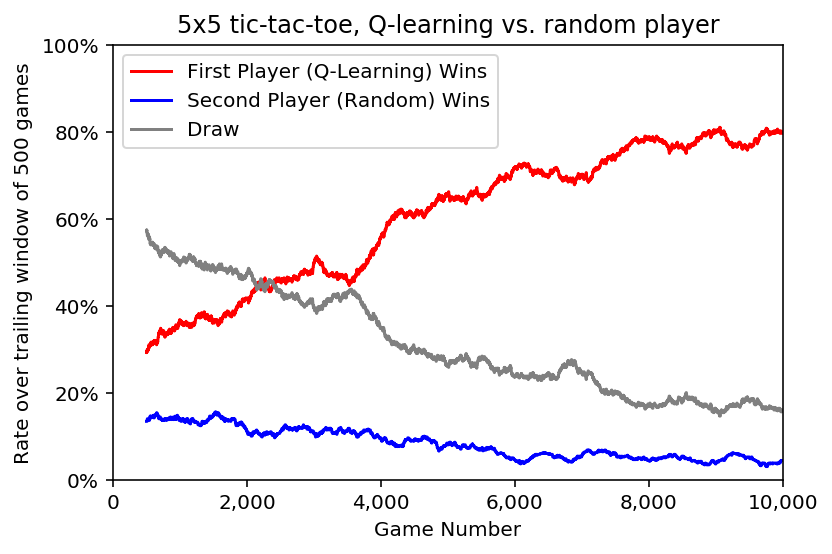

# Q-Learning Tic-Tac-Toe, Briefly

[Tic-tac-toe][] doesn't call for [reinforcement learning][], except as
an exercise or illustration. Recently, I saw several examples
implementing [Q-learning][], all of which were rather long. I thought
I'd give tic-tac-toe with Q-learning a [try][] myself, using Python
and TensorFlow, aiming for brevity.

[Tic-tac-toe]: https://en.wikipedia.org/wiki/Tic-tac-toe
[reinforcement learning]: /20171114-deep_rl/
[Q-learning]: https://en.wikipedia.org/wiki/Q-learning
[try]: https://github.com/ajschumacher/ajschumacher.github.io/blob/master/20191103-q_learning_tic_tac_toe_briefly/q_learning_tic_tac_toe.ipynb

The board is represented with a matrix, where zero means empty.

```python
def new_board(size):
    return np.zeros(shape=(size, size))
```

Moves are represented by their coordinates, like `[0, 0]` for the
upper left.

```python
def available_moves(board):
    return np.argwhere(board == 0)
```

The first player is `+1` and the second player is `-1`, so having
three in a row means getting a row, column, or diagonal to sum to `+3`
or `-3`, respectively.

```python
def check_game_end(board):
    best = max(list(board.sum(axis=0)) +    # columns
               list(board.sum(axis=1)) +    # rows
               [board.trace()] +            # main diagonal
               [np.fliplr(board).trace()],  # other diagonal
               key=abs)
    if abs(best) == board.shape[0]:  # assumes square board
        return np.sign(best)  # winning player, +1 or -1
    if available_moves(board).size == 0:
        return 0  # a draw (otherwise, return None by default)
```

Q-learning will require some state, so a player will be an object with
a `move` method that takes a board and returns the coordinates of the
chosen move. Here's a random player:

```python
class RandomPlayer(Player):
    def move(self, board):
        return random.choice(available_moves(board))
```

This is sufficient for the game loop, starting from any initial board:

```python
def play(board, player_objs):
    player = +1
    game_end = check_game_end(board)
    while game_end is None:
        move = player_objs[player].move(board)
        board[tuple(move)] = player
        game_end = check_game_end(board)
        player *= -1  # switch players
    return game_end
```

So this plays out a game between two random players and gives the
result:

```python
play(new_board(3), {+1: RandomPlayer(), -1: RandomPlayer()})
```

Playing out 10,000 games, it's clear that the first random player is
more likely to win, and also that results can vary a good deal even
when averaging over 500 games.


Here's a boring player that chooses the first available move from left
to right, top to bottom:

```python
class BoringPlayer(Player):
    def move(self, board):
        return available_moves(board)[0]
```

Games between boring players always end the same way. The comparison
with the random player is more interesting. This table give results
for 10,000 games per row:

```
| Size | First Player | Second Player | Draw |
|------|--------------|---------------|------|
| 3x3  | Random: 59%  | Random: 29%   | 12%  |
| 3x3  | Boring: 78%  | Random: 18%   |  4%  |
| 3x3  | Random: 52%  | Boring: 44%   |  4%  |
```

The boring player does better than a random player whether it plays
first or second. Now we have multiple "baselines." A learning agent
should do better than the baselines.

The Q-learning player starts with a neural network that takes a board
as input and produces an estimate of how good each move is from that
position: Q-values.

```python
class Agent(Player):
    def __init__(self, size):
        self.size = size
        self.model = tf.keras.Sequential()
        self.model.add(tf.keras.layers.Dense(size**2))
        self.model.compile(optimizer='sgd', loss='mean_squared_error')
```

A couple helper methods make the interface nicer for using and
training the neural net. (There may be a better way of achieving
this.)

```python
    def predict_q(self, board):
        return self.model.predict(
            np.array([board.ravel()])).reshape(self.size, self.size)

    def fit_q(self, board, q_values):
        self.model.fit(
            np.array([board.ravel()]), np.array([q_values.ravel()]), verbose=0)
```

The Q-learning agent preserves some history, which is reset when a new
game starts.

```python
    def new_game(self):
        self.last_move = None
        self.board_history = []
        self.q_history = []
```

The `move` method uses the Q-network to choose the best available move
and then calls the `reward` method to operationalize Q-learning's
[Bellman equation][].

[Bellman equation]: https://en.wikipedia.org/wiki/Bellman_equation#The_Bellman_equation

```python
    def move(self, board):
        q_values = self.predict_q(board)
        temp_q = q_values.copy()
        temp_q[board != 0] = temp_q.min() - 1  # no illegal moves
        move = np.unravel_index(np.argmax(temp_q), board.shape)
        value = temp_q.max()
        if self.last_move is not None:
            self.reward(value)
        self.board_history.append(board.copy())
        self.q_history.append(q_values)
        self.last_move = move
        return move
```

The `reward` method trains the Q-network, updating a previous estimate
of Q-values with a new estimate for the last chosen move.

```python
    def reward(self, reward_value):
        new_q = self.q_history[-1].copy()
        new_q[self.last_move] = reward_value
        self.fit_q(self.board_history[-1], new_q)
```

Using a `play` function that resets games and delivers a reward of
`+1` for wins and `-1` for losses and draws (see the full
[notebook][]), a Q-learning agent plays a random agent:

[notebook]: https://github.com/ajschumacher/ajschumacher.github.io/blob/master/20191103-q_learning_tic_tac_toe_briefly/q_learning_tic_tac_toe.ipynb



The Q-learning player quickly achieves much stronger play than the
baselines.

```
| Size | First Player | Second Player | Draw |
|------|--------------|---------------|------|
| 3x3  | Random:  59% | Random:  29%  | 12%  |
| 3x3  | Boring:  78% | Random:  18%  |  4%  |
| 3x3  | Random:  52% | Boring:  44%  |  4%  |
| 3x3  | Q-Learn: 93% | Random:   6%  |  1%  |
| 3x3  | Random:  21% | Q-Learn: 78%  |  1%  |
```

(For Q-learning players, they play 10,000 games while learning and
then another 10,000 games while frozen to evaluate their performance
level after learning, which is what's shown in the table.)

And that's it! Tic-tac-toe with a Q-learning agent, comfortably under
100 lines of code.


---

### Ideas for doing more

 * The Q-learning player didn't achieve a "perfect" strategy in which
   it never loses. Why not? Can you fix it? Further ideas below may
   contribute to a solution.
 * You can write your own perfect tic-tac-toe player, or use a package
   like [xo][]. How does the Q-learning player do against a perfect
   player?
 * The initialization of the network and the play of the random
   opponent vary from run to run. How consistent are results? How do
   they vary? What source of randomness matters more?
 * Draws require nine moves, but it's possible to win in five. How
   does game length vary by player strategy and over the course of
   training the Q-learning player?
 * The Q-learning algorithm here is simplified, with no reward decay,
   for example. Can you re-complicate the algorithm and perhaps
   achieve shorter game lengths?
 * There is no explicit exploration mechanism in the Q-learning
   algorithm here. Can you add one and improve performance?
 * What happens when the Q-learning player plays against the boring
   player, and what does this suggest?
 * What happens when a Q-learning player plays against one type of
   player, and then faces a different player? How can this vary and
   what does it suggest?
 * None of the players in these implementations are ever told which
   player they are, and none of them explicitly work it out for
   themselves, though this is possible. How does a Q-learning player
   that has played as first player do when made to play as second
   player instead? Can you improve this?
 * How effective is self-play (Q-learning player vs. another
   Q-learning player)?
 * Can you quantify the sample efficiency of the Q-learning algorithm,
   which should capture how many games or moves the algorithm needs to
   learn a good strategy?
 * There are lots of enhancements to Q-learning, for example
   [experience replay][]. Can you improve sample efficiency using such
   a mechanism?
 * There are symmetries in the tic-tac-toe board; can you take
   advantage of these?
 * The neural network used here is very simple. It is not at all
   "deep," for example. Does a more sophisticated network architecture
   give better results?
     * Convolutional filters are useful in neural networks for
       computer vision. Can this kind of domain-specific approach
       inform an architecture design specialized for tic-tac-toe?
 * Lots of defaults are used in the implementation here, for example
   for the neural network's learning rate. Can you find better values?
 * The rewards for a loss and a tie are both `-1` in the
   implementation here. What happens when ties aren't as bad as
   losses? Is zero a good reward for a tie?
 * The code shown here aims to be brief. Is this good or bad for
   readability, maintainability, and extensibility? Are other
   characteristics also important? How can you improve the code?
 * Experiment with different board sizes:

[xo]: https://github.com/dwayne/xo-python
[experience replay]: https://www.cs.toronto.edu/~vmnih/docs/dqn.PDF

```
| Size | First Player | Second Player | Draw |
|------|--------------|---------------|------|
| 3x3  | Random: 59%  | Random: 29%   | 12%  |
| 4x4  | Random: 31%  | Random: 27%   | 42%  |
| 5x5  | Random: 25%  | Random: 15%   | 60%  |
```

As the board gets bigger, the advantage of going first decreases and
the probability of a draw goes up considerably.

It also takes a good deal more games to learn a good strategy:



For the implementations here, some results are as follows:

```
| Size | First Player | Second Player | Draw |
|------|--------------|---------------|------|
| 4x4  | Random:  31% | Random:  27%  | 42%  |
| 4x4  | Q-Learn: 83% | Random:  10%  |  7%  |
| 4x4  | Random:  11% | Q-Learn: 80%  |  9%  |
| 5x5  | Random:  25% | Random:  15%  | 60%  |
| 5x5  | Q-Learn: 79% | Random:   5%  | 16%  |
| 5x5  | Random:  18% | Q-Learn: 53%  | 29%  |
```

What is optimal for these larger boards? How well can you do? At what
point is a Q-learning approach more effective (considering the trade
with compute time) than exhaustive minimax search, if ever?
