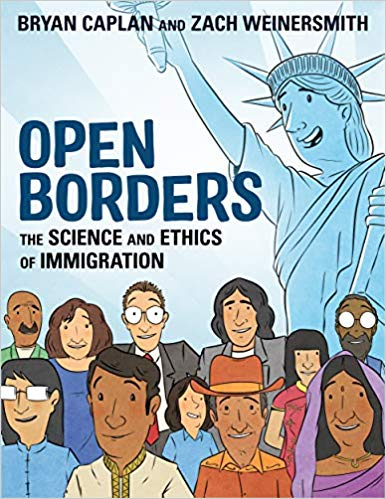

# Open Borders, by Caplan and Weinersmith

I'd heard about some of [Caplan][]'s books, but I hadn't read any
until the guy who does [SMBC][] advertised the one he worked with
Caplan on. It's a comic book that reads in an evening. I'm glad it's
out there, but I'm not sure the book will change many minds.

[Caplan]: http://www.bcaplan.com/
[SMBC]: http://smbc-comics.com/

The first chapter is called "Global Apartheid," which seems to be
typical of Caplan's flare for the provocative. I don't think the
current system of national borders is quite the same as [apartheid][].
I didn't think it was a good choice to start the book with this
heading, which risks destroying the appearance of arguing in good
faith.

[apartheid]: https://en.wikipedia.org/wiki/Apartheid

The comic medium can probably be persuasive, but this book sometimes
prioritizes cartoon over argument. For example, on page 34 a central
result from [a paper by Clemens][] is mentioned, and the next four
pages illustrate the largeness of an amount of money, while I still
wasn't convinced about how the result was obtained.

[a paper by Clemens]: https://pubs.aeaweb.org/doi/pdfplus/10.1257/jep.25.3.83

It sometimes seems that Caplan isn't aware of how he might sound to
readers. On page 36:

> "Open borders isn't 'trickle-down economics.' It's Niagara Falls
> economics!"

Caplan is pictured going over Niagara Falls in an open barrel. Is this
supposed to be a good thing? If you think trickle-down economics is a
fraud, is this larger version a bigger fraud? The comparison and
imagery are not effective.

On page 39, Caplan jokes (?) that if not for borders being relatively
open for academics, he would work at Harvard rather than George Mason
University. This suggests a "yes, some people won't get their
preferred jobs" discussion, which isn't addressed.

I was hoping to find a compelling book that argues strongly for open
borders. This one does introduce a lot of arguments, and it may even
be correct throughout, but the overall effect is not as coherent and
convincing as I had hoped it would be.

