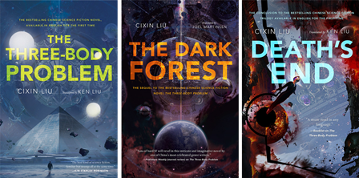

# The Three Body Problem (Remembrance of Earth's Past)

[Liu Cixin][]'s popular trilogy is a problematic page-turner. It's
hard sci-fi fascinated with society but culturally backward and
exceptionally pessimistic. It's kind of fun to play what-if with the
author, but these books feel like artifacts of a bad old world.

[Liu Cixin]: https://en.wikipedia.org/wiki/Liu_Cixin

The main concept of the books' universe is that there's tons of
intelligent life, but life always decides to preemptively annihilate
any other life it can find, and therefore also to hide. This
[Dark Forest][] idea resolves the [Fermi paradox][]. Stephen Hawking
even [co-signs][].

[Fermi paradox]: https://en.wikipedia.org/wiki/Fermi_paradox
[Dark Forest]: https://en.wikipedia.org/wiki/The_Dark_Forest
[co-signs]: https://www.theguardian.com/commentisfree/2010/apr/26/stephen-hawking-issues-warning-on-aliens

Annihilation is typically done by wrecking stars, but also sometimes
by locally reducing the number of spatial dimensions. The universe is
11-dimensional, but war has effectively reduced it to 3D, and most
humans get killed when the solar system is reduced to 2D.

There's a surprising amount of smoking. Two hundred years in the
future, the big advance is that cigarettes are self-lighting. Bad
communication between a father and son is held up as somehow noble.
The character Fraisse is arguably a [Magical Negro][].

[Magical Negro]: https://en.wikipedia.org/wiki/Magical_Negro

The books have a problematic relationship with women. The trilogy
opens with a wife betraying her husband as he's murdered by young
girls in a public display. This couple's daughter goes on to invite
aliens to conquer Earth, like Eve with a backstory.

We meet the protagonist of book two while he's trying to remember the
name of the woman he just slept with. She's immediately killed by an
assassination attempt meant for him. This important man falls in love
with an imaginary woman, until later he describes her and has people
go find a real woman like his imaginary lover, who is brought to live
with him and then marries him and bears him a child.

An initially competent woman is introduced in the third book. She goes
on to allow aliens to conquer Earth because of her "maternal
instinct," and then yet again to doom the Earth further because she
wouldn't let a man do what he wanted.

> "Twice, she had been placed in a position of authority second only
> to God, and both times she had pushed the world into the abyss in
> the name of love." (Death's End, page 641)

The books are deeply pessimistic. There's a lot of suicide, including
humanity-wide:

> "The most surprising aspect of the Earth-Trisolaris Movement was
> that so many people had abandoned all hope in human civilization,
> hated and were willing to betray their own species, and even
> cherished as their highest ideal the elimination of the entire human
> race, including themselves and their children." (The Three Body
> Problem, page 317)

(There actually is a [Voluntary Human Extinction Movement][]. It is
not very popular.)

[Voluntary Human Extinction Movement]: https://en.wikipedia.org/wiki/Voluntary_Human_Extinction_Movement

When people do want to keep living they very quickly turn on one
another. The zero-sum nature of the universe is an axiom of these
books. A little bit of fun comes out of the explorations of deception
in the face of full-information competition, but it's a sad world.

The first book [teases][] that it might explore fun ideas around
foundations or philosophy, but there's no real payoff to these plot
directions. It feels like something from an earlier draft that never
got edited out.

[teases]: http://peterbutler.blog/the-shooter-and-the-farmer/

The first book is a long introduction to the trilogy. The backdrop of
the [Cultural Revolution][] is interesting for the unfamiliar, but
what I most enjoyed hearing from Liu was his sci-fi speculation, and
that really only gets rolling in book two.

[Cultural Revolution]: https://en.wikipedia.org/wiki/Cultural_Revolution

I like science and all, but I didn't need all the pro-STEM pandering,
much less the anti-environmentalism. ([Silent Spring][] helps inspire
a desire to kill all humans, for example.)

[Silent Spring]: https://en.wikipedia.org/wiki/Silent_Spring

I liked Ken Liu's translation of the first and third books, and his
brief notes. He says that translation shouldn't read as if it was
originally written in the target language, which I thought was
interesting. The second book's translator may have taken Ken's advice
too far, stilting the dialogue and having people refer to one another
as "doctor" far too much.

The Remembrance of Earth's Past is unique to me in that while I found
it engrossing, I can't really recommend it. Read [The Broken Earth][]
instead.

[The Broken Earth]: /20180723-broken_earth_trilogy/

> "The era for humanity's degenerate freedom is over. If you want to
> survive here, you must relearn collectivism and retrieve the dignity
> of your race!" (Death's End, page 235)
